본 포스팅은 아래 필자가 MATLAB Community Blog에 투고한 일본어 포스팅의 한국어 버전입니다.

👉[MATLAB Copilotに相談しながら工学問題を設計してみた](https://blogs.mathworks.com/japan-community/2025/11/28/creating-engineering-problems-with-matlab-copilot/?from=kr)


안녕하세요. 매스웍스의 여동훈입니다. 저는 대학교 교수님들, 연구원 분들, 학생분들이 수업과 연구에서 MATLAB, Simulink를 잘 쓸 수 있게 기술적으로 지원하는 업무를 담당하고 있습니다. 오늘은 수업의 평가 과정에서 교육자분들이 도움 받을 수 있을만한 내용을 소개해드리고자 합니다. 특히, 최근 교육 분야에서 실질적인 도구로 자리매김하고 있는 생성형 AI를 이용하여 MATLAB 코드를 활용한 공학 문제를 설계하는 방법을 알아보도록 하겠습니다.

# 평가를 위한 문제나 과제를 만드는 과정의 어려움

학습 코스를 설계할 때, 개념 설명만큼 중요한 요소는 바로 **평가**입니다. 그런데 평가용 문제나 과제를 만드는 건 생각보다 쉽지 않아요. 시간도 많이 들고, 시행착오도 많습니다. 대부분의 교육자분들은 어떤 학생을 대상으로 할지, 어떤 주제를 다룰지, 어떤 데이터를 쓸지에 대한 큰 그림은 갖고 있지만, 그걸 실제 문제로 구현하는 과정에서는 예상보다 많은 고민이 필요합니다. 최근에는 생성형 AI를 활용해 문제를 만들어보려는 시도가 많아졌지만, 내가 원하는 형태의 문제에 잘 맞추어진 프롬프트를 찾아내야 하는 또 다른 과제가 생깁니다.


한편 공학 교육에서는 **학생들이 논리적 흐름을 제대로 이해하고 있는지** 평가하는 것이 중요합니다. 프로그램을 활용한 문제는 이런 점에서 큰 장점이 있어요. 로직이 하나라도 빠지면 흐름이 끊기고 원하는 결과를 얻기 어렵기 때문에, 학생이 문제 해결 과정을 얼마나 정확히 이해했는지 명확하게 드러납니다. 이런 맥락에서 **MATLAB**은 좋은 선택입니다. 하이레벨 언어라서 복잡한 문법에 매달리지 않고 문제의 본질과 논리에 집중할 수 있게 해주거든요.


오늘 소개할 방법은, 단순히 정해진 프롬프트를 쓰는 방식이 아닙니다. **MATLAB Copilot**을 이용하면 생성형 AI와 “상담”하듯 대화하면서, 교육자가 머릿속에 그려둔 큰 그림을 점점 구체화할 수 있습니다. 그 과정에서 잘 정돈된 MATLAB 코드가 포함된 문제까지 자동으로 만들어지니, 시행착오를 줄이고 훨씬 효율적으로 평가를 설계할 수 있죠. 아래 그림에서 볼 수 있는 것 처럼 AI가 여러분에게 질문하고, 여러분은 마음속에 갖고 있는 생각을 답변해나가면서 함께 그림을 그려 나갈 것입니다.

<center><br></center>

# MATLAB Copilot이란?

[MATLAB Copilot](https://kr.mathworks.com/products/matlab-copilot.html)은 MathWorks에서 MATLAB R2025a 출시와 함께 새롭게 선보인 **생성형 AI 기반 도구**입니다. 이 제품은 MATLAB 워크플로를 지원하며 MATLAB 관련 정보에 기반한 답변을 제공합니다. 오늘은  **Copilot Chat** 기능을 활용해 문제 설계에 활용해보도록 하겠습니다. [최근에 MATLAB Copilot은 GPT\-5 mini 엔진을 탑재하게 되면서](https://blogs.mathworks.com/matlab/2025/11/13/matlab-copilot-gets-a-new-llm-november-2025-updates/?from=kr) Copilot Chat은 더 확장된 컨텍스트 윈도우를 갖게 되어 긴 대화가 가능하게 되었습니다. 

# MATLAB Copilot으로부터 문제 제작 상담 받기

제가 보여드리고자 하는 접근법은 단순한 “프롬프트 엔지니어링”과는 조금 다릅니다.  핵심은 ‘상담’입니다. 머릿속에 있는 어렴풋한 아이디어를 Copilot과 대화하며 구체화하는 과정이죠. MATLAB을 구동하여 아래 그림에서 표시한 것과 같은 Copilot Chat 버튼을 눌러 MATLAB Copilot Chat을 구동시킬 수 있습니다. 

<center>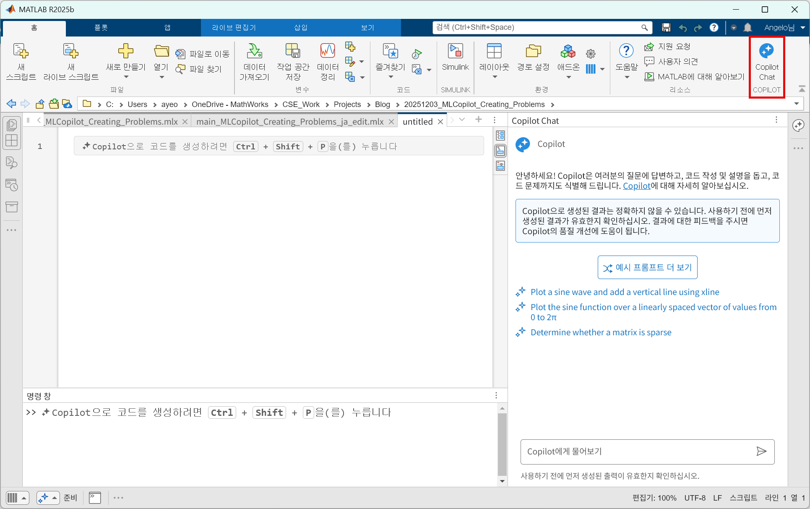<br></center>

오늘 내용에서 아래의 프롬프트가 가장 중요한 열쇠입니다. 하기의 트리거링 프롬프트로 대화를 시작해봅시다.

> *You are an AI expert. I want to get your help and advice. I am planning to use the examples from MathWorks (mathworks.com) to create teaching materials and exercises that students can use for their studies. The MathWorks examples cover a variety of domains and use cases. How can I utilize AI to do this kind of work? Please ask me the questions I need in order to set the right direction for creating these exercises. Ask me one question at a time, and when I feel I am sufficiently organized, I will ask you to start generating problems. Please speak in Korean.*


맨 처음에 "You are an AI expert"라고 말하며 시작하는 것은 많은 LLM들이 여러 전문 모듈의 통합체로 구성되어 있기 때문에 넣은 시작 문구입니다. GPT의 내부에서도 AI 활용과 관련한 모듈을 활용해달라고 명시적으로 요청하는 것입니다.


이번에 저는 머신러닝의 Support Vector Machine (SVM) 이라는 알고리즘을 이용한 기초 문제를 학부 2\-3학년 대상으로 만들고자 합니다. 실제 데이터보다는 쉽게 분류 가능한 인공 데이터셋을 활용해보고자 하는 것이 목표입니다만, 그 외에는 구체적인 계획은 없는 상황이라고 가정하면서 MATLAB Copilot의 안내를 따라가 보겠습니다.


아래 그림에서처럼 제일 먼저 물어보는 것은 대상 학생들을 설정하는 것이네요. 저는 학부 2\-3학년의 매트랩에 대한 지식을 갖고 있는 초심자라고 답해보겠습니다.

<center>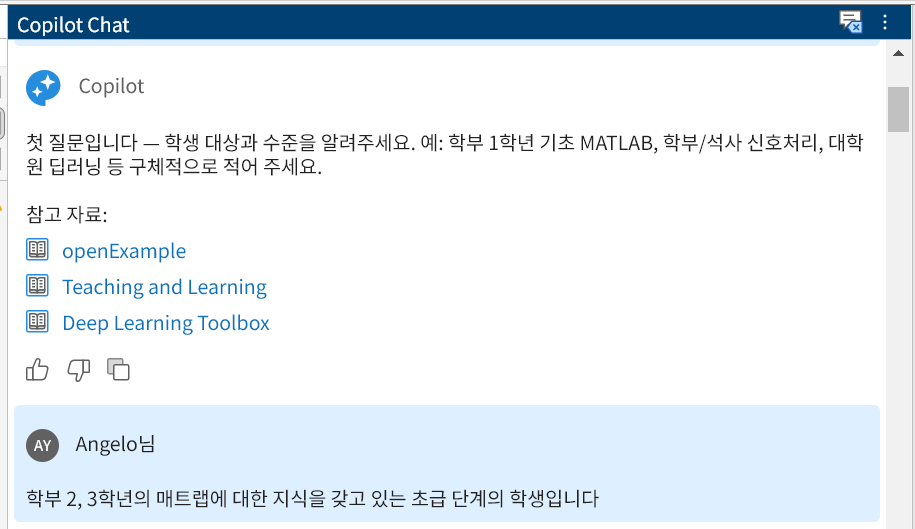<br></center>

다음 질문으로는 좀 더 구체적인 토픽에 대해 묻게 되었습니다. 저는 머신 러닝의 SVM을 중심으로 데이터 분석과 가시화, 그리고 매트랩으로부터 제공 받는 함수를 잘 활용하는 것을 목표로 두도록 하겠습니다.

<center>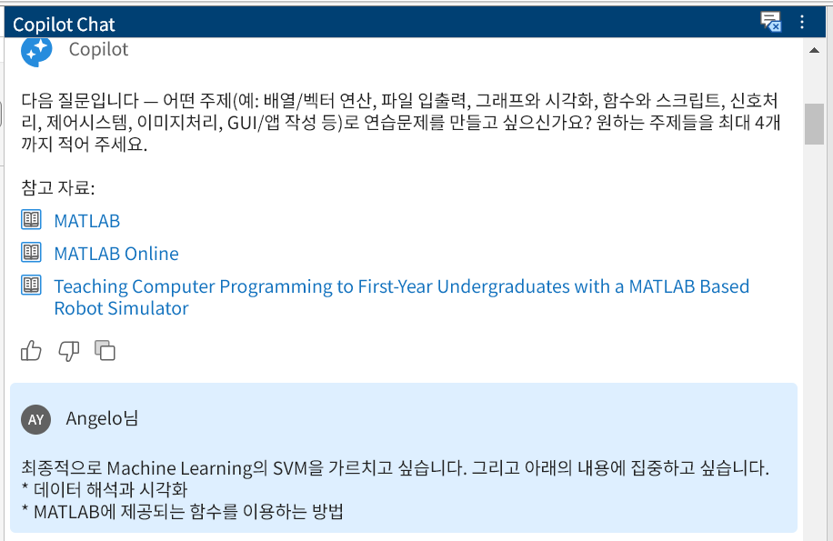<br></center>

이번에는 어떤 데이터셋을 사용할지 물어보는군요. 이쯤에서 알 수 있는 점은 MATLAB Copilot이 여러가지 옵션들을, 답변하기 쉬운 형태로 제공해준다는 점입니다. 저는 복사 붙여넣기로 답변하는 것이 가능하다는 점도 좋지만, 제가 여태껏 생각하지 못한 새로운 아이디어를 던져준다는 점도 마음에 드네요. 저는 두 번째 선택지인 합성 데이터를 사용하도록 답변해보겠습니다.


<center>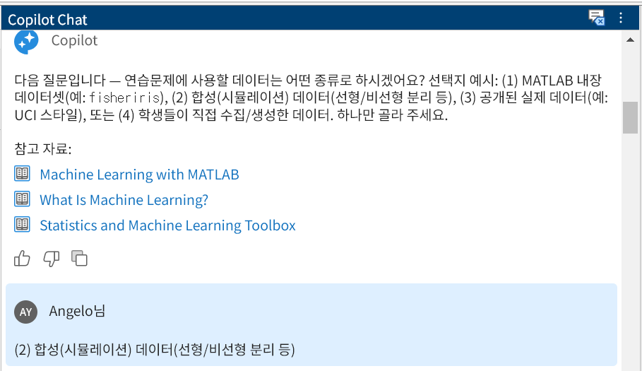<br></center>

좀 더 구체적으로 답변해줬어야 했나봅니다. 합성 데이터셋을 쓸려고 하니 어떻게 합성할지 물어봅니다. 적당히 심플한 문제를 만들기 위한 데이터 스펙을 적어주도록 하겠습니다. 이 부분도 처음부터 생각해내야 했다면 이만큼 구체적으로 작성하기는 어려웠을지도 모르겠습니다.

<center>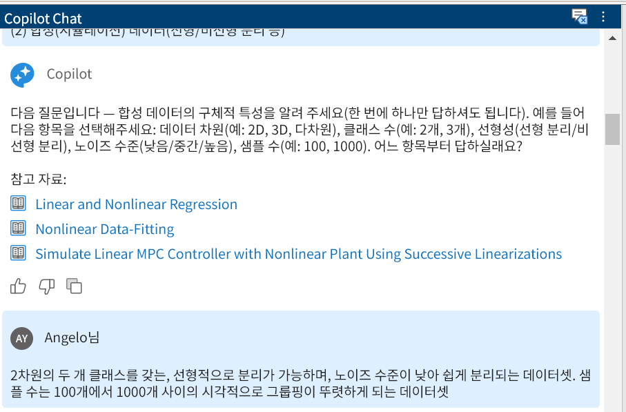<br></center>

이후에 어떤 툴박스를 쓸지 (Statistics and Machine Learning Toolbox), 문제는 몇 개를 만들지 (1개)에 대해 질문 받아 답변했습니다. 그러고나서 좀 더 구체적인 학습 목표에 대해 질문하는군요. 제시해준 옵션들 중 몇 가지를 복사/붙여넣기해서 제공하겠습니다.

<center>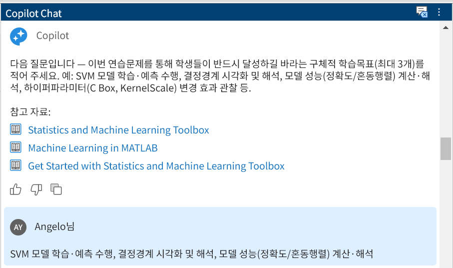<br></center>

그 후에도 몇 가지 간단한 질문들 (가령, rng 함수의 난수 시드는 몇번으로 할까요?)과 시각화 방법등에 대해 논의하였습니다. 이제 MATLAB Copilot이 충분히 정보를 모았다고 판단했는지 목표, 조건, 그리고 MATLAB 코드를 생성해주었습니다. 빨간색 화살표로 표시한 버튼을 누르면 생성된 코드를 복사할 수 있습니다. 우선, 정답 코드를 복사해서 정상적으로 실행되는지 알아보겠습니다.

<center>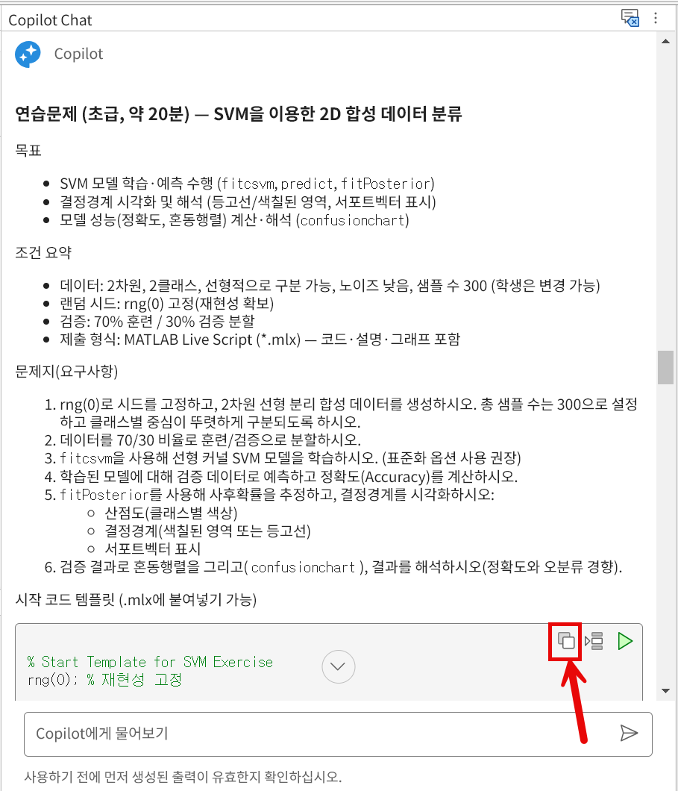<br></center>

실제로 생성된 코드는 아래와 같았습니다.

```matlab
% Full Solution Example
rng(0);

% 데이터 생성
N = 300;
N1 = N/2; N2 = N - N1;
mu1 = [1,1]; mu2 = [4,4];
Sigma = 0.3 * eye(2);
X1 = mvnrnd(mu1, Sigma, N1);
X2 = mvnrnd(mu2, Sigma, N2);
X = [X1; X2];
Y = [ones(N1,1); 2*ones(N2,1)];

% 분할
cv = cvpartition(Y, 'HoldOut', 0.30);
XTrain = X(training(cv),:);
YTrain = Y(training(cv),:);
XTest  = X(test(cv),:);
YTest  = Y(test(cv),:);

% 학습
SVMModel = fitcsvm(XTrain, YTrain, 'KernelFunction','linear','Standardize',true);

% 서포트벡터 표시를 위해 참조
SVs = SVMModel.SupportVectors;

% 예측 및 정확도
[label, score] = predict(SVMModel, XTest);
accuracy = mean(label == YTest);
fprintf('Validation accuracy: %.2f%%\n', accuracy*100);

% Posterior 추정 (선택적)
SVMModel = fitPosterior(SVMModel, XTrain, YTrain);
% [~, scoreGrid] = predict(SVMModel, xGrid); % 재사용 xGrid 정의 필요

% 결정경계 계산 (그리드)
d = 0.1;
[x1Grid,x2Grid] = meshgrid(min(X(:,1))-1:d:max(X(:,1))+1, ...
                          min(X(:,2))-1:d:max(X(:,2))+1);
xGrid = [x1Grid(:), x2Grid(:)];
[~, scoreGrid] = predict(SVMModel, xGrid);
scoreGrid = reshape(scoreGrid(:,2), size(x1Grid)); % 클래스2에 대한 점수

% 시각화
figure; hold on;
% 결정영역 색칠
contourf(x1Grid, x2Grid, scoreGrid, 20, 'LineColor','none');
colormap(parula);
% 산점도 (클래스별)
gscatter(X(:,1), X(:,2), Y, 'rb', 'o', 8, 'off');
% 서포트벡터
plot(SVs(:,1), SVs(:,2), 'ko', 'MarkerSize',10, 'LineWidth',1.5);
% 등고선으로 경계 강조 (score=0 수준이 결정경계)
contour(x1Grid, x2Grid, scoreGrid, [0 0], 'k', 'LineWidth', 2);
legend({'Decision surface','Class 1','Class 2','Support Vectors'}, 'Location','best');
title(sprintf('SVM Decision Boundary (Accuracy = %.2f%%)', accuracy*100));
hold off;

% 혼동행렬
figure;
confusionchart(YTest, label);
title('Confusion Matrix (Validation)');
```

최종적으로 아래와 같은 두 개의 Figure가 출력되는군요. 인공데이터를 이용해서 쉽게 분리되는 데이터셋을 요청한 대로 잘 활용해준 것 같습니다. 코드에도 보면 매트랩에서 제공해주는 fitcsvm 함수를 요청한 대로 잘 활용하고 있는 것을 볼 수 있네요. 상당히 성공적인 것 같습니다.

<center>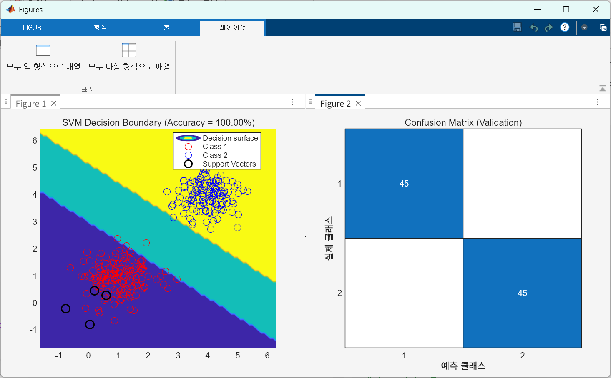<br></center>

그런데, 저는 지금의 과제와 배점과 같은 방식보다는 문제에 대한 설명과 학습자들이 채워넣을 수 있는 템플릿, 그리고 정답으로 사용할만한 레퍼런스 코드와 같은 형식을 갖추면 좋겠군요. 그런데 MATLAB Copilot은 기본적으로 MATLAB에 관한 질문만 받기 때문에 모든 리퀘스트에 자연스럽게 응답하진 않습니다.  간혹 MATLAB Copilot은 아래와 같이 답변하기도 합니다. (똑똑하긴 한 것 같습니다...)


*"해당 요청을 도와드릴 수 없습니다. MATLAB에 관한 다른 질문에 대해서는 기꺼이 도와드리겠습니다."*


따라서, 출력된 MATLAB 코드에 기반하여 [MATLAB Grader](https://kr.mathworks.com/products/matlab-grader.html) 에서 활용할 문제 설명, 학습자의 템플릿, 그리고 레퍼런스 코드가 필요하니 요청한다고 얘기해봅시다. MATLAB Grader는 MathWorks에서 제공하는 학습자 평가를 위한 문제 출제 및 자동채점 플랫폼이므로 MATLAB Copilot이 기꺼이 도와줍니다.  


<center>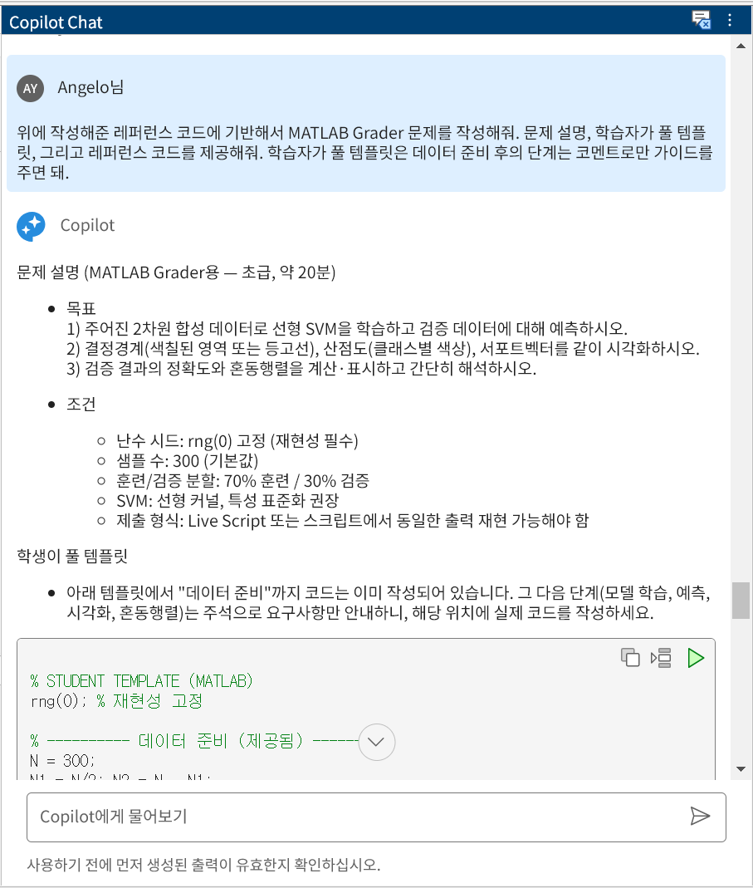<br></center>


학습자 대상의 템플릿은 아래와 같이 생성해주었습니다. 난이도 조정을 위해서 코드의 일부분만 언더스코어 등으로 치환해달라고 요청하는 것도 가능합니다.

```matlab
% STUDENT TEMPLATE (MATLAB)
rng(0); % 재현성 고정

% ---------- 데이터 준비 (제공됨) ----------
N = 300;
N1 = N/2; N2 = N - N1;
mu1 = [1, 1];
mu2 = [4, 4];
Sigma = 0.3 * eye(2);

X1 = mvnrnd(mu1, Sigma, N1);
X2 = mvnrnd(mu2, Sigma, N2);
X = [X1; X2];
Y = [ones(N1,1); 2*ones(N2,1)]; % 레이블 1,2

% 70/30 홀드아웃 분할
cv = cvpartition(Y, 'HoldOut', 0.30);
XTrain = X(training(cv), :);
YTrain = Y(training(cv), :);
XTest  = X(test(cv), :);
YTest  = Y(test(cv), :);

% ---------- 여기에 코드 작성 (아래 요구사항을 모두 만족) ----------
% 1) 선형 커널 SVM 학습 (fitcsvm, Standardize 권장)
% 2) 검증 데이터에 대해 예측 (predict) 및 정확도 계산 (accuracy)
% 3) fitPosterior로 사후확률 추정 (선택적이나 권장)
% 4) 결정경계 그리기:
%    - meshgrid로 입력 공간 그리드 생성
%    - 그리드 위에서 모델로 예측(또는 확률)하여 영역을 채움(contourf 또는 imagesc)
%    - 원래 데이터 산점도 표시 (클래스별 색상)
%    - 서포트벡터를 강조하여 표시 (SVMModel.SupportVectors)
%    - 결정경계는 등고선(contour)로 표시 (score = 0 수준)
% 5) 검증 결과의 혼동행렬 표시 (confusionchart) 및 정확도/오분류 경향 간단히 출력
%
% 참고: 변수 이름은 자유롭게 사용 가능. 결과 재현성을 위해 rng(0)을 유지하세요.
```

아래는 MATLAB Copilot이 만들어준 채점용 레퍼런스 솔루션입니다. 서포트 벡터 머신을 학습하고 학습된 모델을 이용해 예측하고 평가하는 정통적인 플로우를 충실히 따르는 결과를 확인할 수 있습니다.

```matlab
% REFERENCE SOLUTION (MATLAB)
rng(0);

% 데이터 생성 (같음)
N = 300;
N1 = N/2; N2 = N - N1;
mu1 = [1,1]; mu2 = [4,4];
Sigma = 0.3 * eye(2);
X1 = mvnrnd(mu1, Sigma, N1);
X2 = mvnrnd(mu2, Sigma, N2);
X = [X1; X2];
Y = [ones(N1,1); 2*ones(N2,1)];

% 분할 (70/30)
cv = cvpartition(Y, 'HoldOut', 0.30);
XTrain = X(training(cv),:);
YTrain = Y(training(cv),:);
XTest  = X(test(cv),:);
YTest  = Y(test(cv),:);

% 1) SVM 학습 (선형, 표준화)
SVMModel = fitcsvm(XTrain, YTrain, 'KernelFunction', 'linear', 'Standardize', true);

% 서포트벡터
SVs = SVMModel.SupportVectors;

% 2) 예측 및 정확도
[label, score] = predict(SVMModel, XTest);
accuracy = mean(label == YTest);
fprintf('Validation accuracy: %.2f%%\n', accuracy*100);

% 3) 사후확률 추정 (권장)
SVMModel = fitPosterior(SVMModel, XTrain, YTrain);

% 4) 결정경계 계산 (그리드)
d = 0.05;
[x1Grid,x2Grid] = meshgrid(min(X(:,1))-1:d:max(X(:,1))+1, ...
                          min(X(:,2))-1:d:max(X(:,2))+1);
xGrid = [x1Grid(:), x2Grid(:)];
[~, scoreGrid] = predict(SVMModel, xGrid); % scoreGrid(:,2): 클래스2 점수
scoreGrid = reshape(scoreGrid(:,2), size(x1Grid));

% 5) 시각화
figure('Name','SVM Decision Boundary'); hold on;
% 결정영역 색칠
contourf(x1Grid, x2Grid, scoreGrid, 30, 'LineColor', 'none');
colormap(parula);
alpha(0.6);
% 산점도 (원 데이터, 클래스별)
gscatter(X(:,1), X(:,2), Y, 'rb', 'o', 8, 'off');
% 서포트벡터 강조
plot(SVs(:,1), SVs(:,2), 'ko', 'MarkerSize', 10, 'LineWidth', 1.5);
% 결정경계(등고선 level = 0)
contour(x1Grid, x2Grid, scoreGrid, [0 0], 'k', 'LineWidth', 2);
legend({'Decision surface','Class 1','Class 2','Support Vectors'}, 'Location','best');
xlabel('Feature 1'); ylabel('Feature 2');
title(sprintf('SVM Decision Boundary (Accuracy = %.2f%%)', accuracy*100));
axis tight; hold off;

% 6) 혼동행렬
figure('Name','Confusion Matrix');
confusionchart(YTest, label);
title('Confusion Matrix (Validation)');

% 간단 해석 출력
fprintf('Accuracy = %.2f%%\n', accuracy*100);
numMis = sum(label ~= YTest);
fprintf('Misclassified samples (validation): %d of %d\n', numMis, numel(YTest));
```

참고로, MATLAB Copilot에서는 assert문 등을 이용한 프로그램 방식으로 자동 테스트 할 수 있는 코드도 생성할 수 있습니다. 이를 이용하면 채점을 자동화할 수 있습니다.


<center>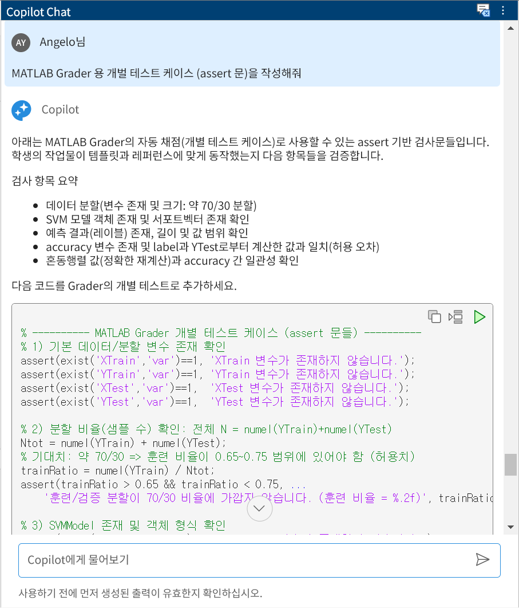<br></center>


만약, MATLAB Grader에의 통합을 염두해두고 있다면 MATLAB Grader에서 문제 채점에 활용하는 [assessVariableEqual](https://kr.mathworks.com/help/matlabgrader/ug/assessvariableequal.html) 같은 함수를 이용한 테스트 케이스 생성을 부탁하는 것도 가능합니다. 자세한 내용은 링크의 MATLAB Grader에 관한 문서에서 확인해보시는 것을 추천드립니다. 

<center>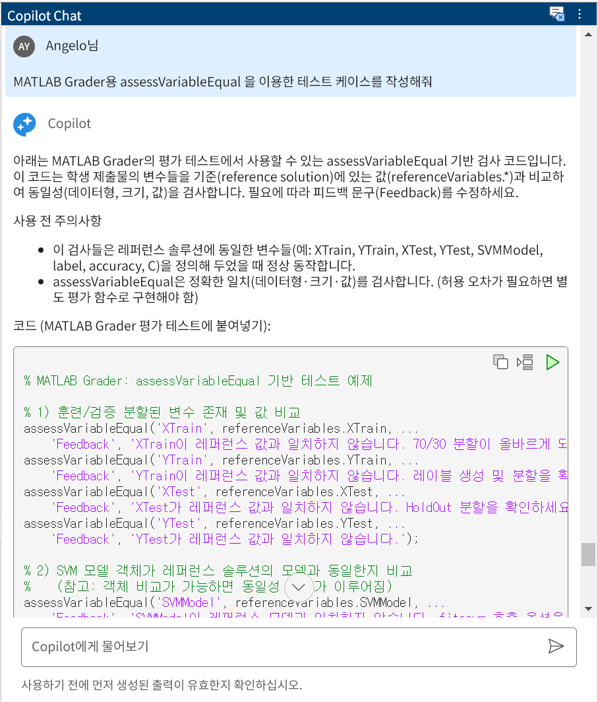<br></center>

# 마무리

교육자들에게 MATLAB Copilot은 단순한 코드 생성 도구가 아닌, **아이디어를 구체화하고, 평가 문제를 효율적으로 설계할 수 있도록 돕는 파트너** 입니다. 특히, 문제 제작 과정에서 가장 많은 시간을 소모하는 **아이디어 정리 → 코드 구현 → 시각화 → 채점 로직 설계**를 MATLAB Copilot과의 대화로 빠르게 완성할 수 있다는 점은 큰 장점입니다.


이번 예시에서 보셨듯, MATLAB Copilot은

-  학습자 수준에 맞는 문제 구조를 제안하고, 
-  MATLAB Grader와 연계 가능한 템플릿과 레퍼런스 코드를 자동으로 생성하며, 
-  시각화와 평가까지 포함한 완성도 높은 결과물을 제공합니다. 

MATLAB Copilot과 함께라면, 문제 제작 과정이 단순화되고 아이디어를 신속하게 코드로 전환할 수 있습니다. 

