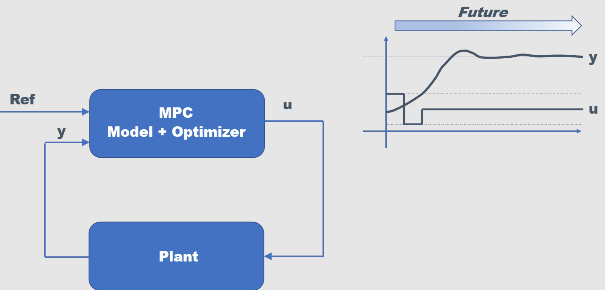
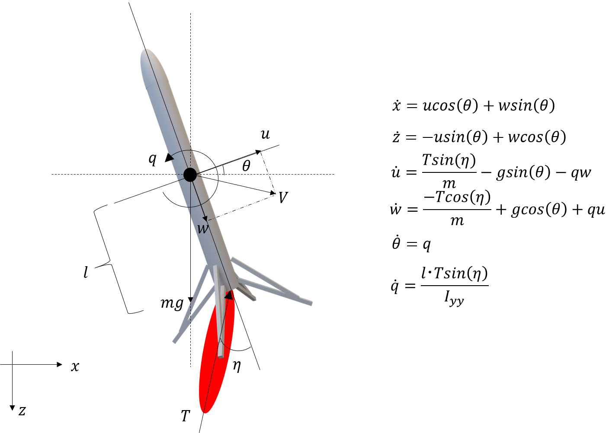
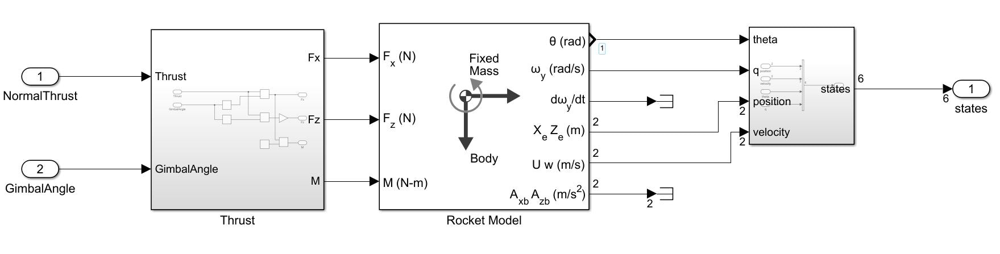
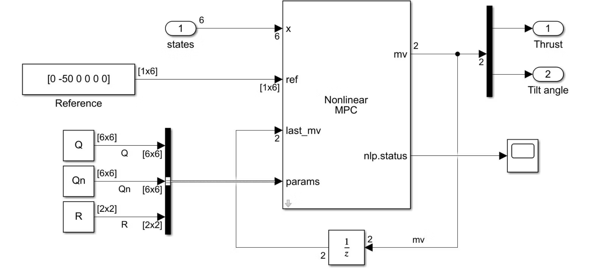
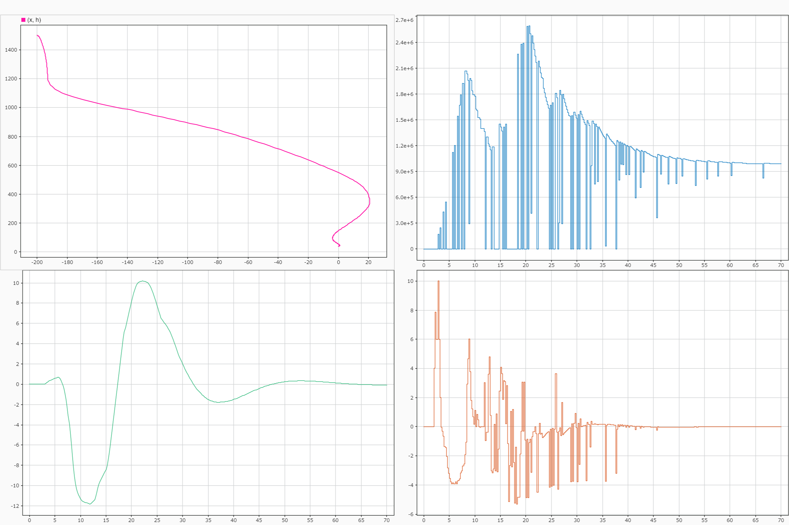
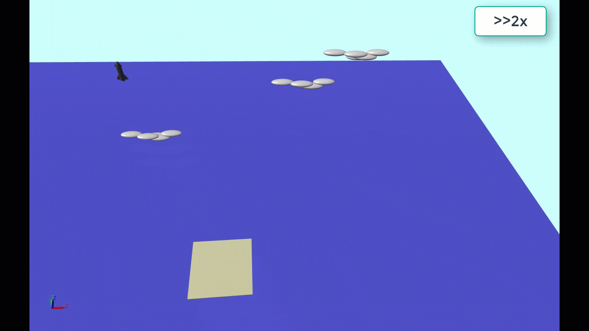

본 포스트의 원문은 아래의 링크에서 확인할 수 있습니다.

[モデル予測制御を使ってロケットを垂直着陸させてみた](https://qiita.com/getBack1969/items/2cb2dbebe36953d7c07e)

---

# 서론

요즘은 민간 우주 개발이 활발해지면서 SpaceX나 Blue Origin처럼 획기적인 우주 수송 시스템을 개발하는 기업들이 크게 떠오르고 있죠. 이러한 기업들이 개발하는 로켓의 가장 큰 특징은 뭐니 뭐니 해도 **재사용이 가능하다**는 점입니다!!

기존 로켓은 대부분 일회용이었던 반면, 재사용 로켓은 발사에 사용한 1단 로켓이나 2단 로켓을 제어를 통해 지구로 귀환시켜 다시 사용합니다. 처음 영상을 봤을 때는 제어 기술로 이런 것까지 가능한가 싶어 정말 깜짝 놀랐습니다.

<iframe height="400px" src="https://www.youtube.com/embed/GrP3jHuLQ9o" title="YouTube video player" frameborder="0" allow="accelerometer; autoplay; clipboard-write; encrypted-media; gyroscope; picture-in-picture" allowfullscreen></iframe>

[https://youtu.be/GrP3jHuLQ9o](https://youtu.be/GrP3jHuLQ9o)
*인용: SpaceX Channel 영상*

사실 이 로켓 제어에는 최적화 기술이 사용되고 있다는 이야기가 있습니다. 아래는 SpaceX에서 로켓 착륙 제어를 담당하는 엔지니어가 작성한 기사로, 본문 중에 CVXGEN을 이용하여 실시간 볼록 최적화(Convex Optimization)를 풀고 있다는 내용이 언급되어 있습니다.

[Autonomous precision landing of space rockets](https://www.researchgate.net/publication/316547389_Autonomous_precision_landing_of_space_rockets)

논문으로는 아래가 해당 정보에 가까울 것 같습니다. (2차 추 계획 문제(Second-Order Cone Problem, SOCP)를 풀게 한다는 점이 흥미롭습니다.)

[Minimum-Landing-Error Powered-Descent Guidance for Mars Landing Using Convex Optimization](http://larsblackmore.com/BlackmoreEtAlJGCD10.pdf)

또한, 일본 국내에서도 JAXA가 재사용 로켓 연구에 힘쓰고 있으며, 착륙 제어에 MPC를 이용하고 있다는 문헌이 있었습니다.

* [1단 재사용 비행 실험(CALLISTO) 프로젝트](https://www.kenkai.jaxa.jp/research/callisto/callisto.html)
* [비선형 모델 예측 제어를 이용한 재사용 로켓 착륙 유도 검토](https://www.jstage.jst.go.jp/article/jacc/60/0/60_1092/_pdf/-char/ja)

서론이 길어졌습니다만, "로켓을 제어로 날려보고 싶다(책상 위에서)!"라는 순수한 탐구심으로, 최근 유행하는 **MPC(모델 예측 제어)**를 사용해 보고자 합니다.

# 모델 예측 제어

**모델 예측 제어(MPC: Model Predictive Control)**는 실시간으로 제어 모델을 사용해 응답을 예측하면서, 사양(비용 함수나 제약 조건)을 만족하도록 최적의 조작량을 결정하는 실시간 최적 제어 기술입니다.



최근에는 플랜트 등의 프로세스 제어 이외에도 자율 주행이나 로봇 제어 등 폭넓은 분야에서 적용하려는 움직임이 보이고 있습니다.
MPC에 대해서는 이미 훌륭한 기사를 써 주신 분들이 계십니다.

* [@taka_horibe 모델 예측 제어(MPC)에 의한 궤도 추종 제어](https://qiita.com/taka_horibe/items/47f86e02e2db83b0c570)
* [@MENDY 비선형 모델 예측 제어에서 CGMRES법을 python으로 구현하기](https://qiita.com/MENDY/items/4108190a579395053924)

최근 MPC의 경향이라고 하면, 역시 비선형적인 대상을 베이스로 얼마나 빨리 최적화 문제를 풀 수 있는가 하는 점에 있다고 생각합니다.

그렇게 되면 비선형 모델 예측 제어(NLMPC: Nonlinear MPC)를 사용하게 됩니다만, 그것을 풀기 위한 방법으로서 요즈음은 이하의 2가지 패러다임으로 크게 나뉘어 있다고 생각합니다. (아마도요...)

1. SQP(Sequential Quadratic Programming)나 내점법(Interior Point Method, IPM)을 이용한 비선형 계획 문제를 푸는 직접법
2. C/GMRES와 같은 변분법에 의한 경계값 문제의 해법을 베이스로 한 간접법

각각 일장일단이 있습니다만, 이번에는 MathWorks의 제품군인 Model Predictive Control Toolbox™에서 제공되는 Simulink 블록 기능을 이용하려고 합니다.

Toolbox에서는 선형 MPC부터 적응형 MPC, 그리고 NLMPC까지 지원하고 있습니다.
그리고 이 NLMPC는 1번의 SQP를 솔버로 이용한 직접 해법에 의해 아래의 최적 제어 문제를 매 제어 주기마다 실시간으로 풀어 나갑니다.

비용 함수

$$min_{x,u} J=\varphi \left(x\left(N\right)\right)+\sum_{i=1}^{N-1} L\left(x\left(i\right),u\left(i\right),i\right)$$

제약 조건

$$
\begin{align}
x\left(k+1\right)&=f\left(x\left(k\right),u\left(k\right),k\right)\ \ k=1,2,...,N\\
x\left(1\right)&=x_0 \\
C\left(x,u\right)&\le 0
\end{align}
$$

# 시뮬레이션 모델

이번에 소재로 삼을 로켓 모델은 간단한 2D 모델(X-Z 평면)로 합니다.
또한 공기력의 영향 및 추진제를 소비함에 따른 질량 변화는 무시합니다.
로켓의 제어 자체는 Thrust Vectoring(추력 편향 제어)에 의해 실현하는 것으로 하고, 제어 입력으로는 부스터에서 발생하는 추력(T) 및 짐벌 각도($\eta$)의 2가지로 합니다.



Simulink에 의한 플랜트 모델은 큰 고민 없이 space Blockset™에서 제공되는 3DOF(Body Axes) 블록을 이용합니다. 본 블록은 질량 고정 3자유도 모델로 되어 있으며, 입력 단자로서 X, Z축에 가해지는 힘과 무게 중심축 주위의 피칭 모멘트를 받아들입니다.



# 비선형 모델 예측 제어의 설계

NLMPC의 설계에는 Model Predictive Control Toolbox™의 함수인 nlmpc 명령어를 이용합니다.
nlmpc 명령어의 인수에 예측 모델의 상태량, 출력, 입력의 수를 지정함으로써 nlmpc 객체를 생성합니다.

```
lander = nlmpc(6,6,2);
```

그리고 샘플링 주기나 예측 호라이즌, 제어 호라이즌, 예측 모델, 제약 조건 등을 객체의 프로퍼티로서 설정해 나갑니다.

```
lander.Ts = Ts;
lander.PredictionHorizon = 20;
lander.ControlHorizon = 2;
```

NLMPC에서 이용하는 예측 모델(비선형)은 상태 전이 함수, 출력 함수의 2가지입니다.
프로퍼티에 지정하기 위해서는 함수 핸들이나 함수명을 사용합니다.
그 밖에도 상태 전이 함수 및 출력 함수의 자코비안(구배)을 지정하면 NLMPC의 계산 효율을 높일 수 있습니다.
(자코비안을 지정하지 않는 경우는 기능 내부에서 차분 근사 처리에 의해 매 주기 계산되므로 오버헤드가 됩니다)

```
% Model
lander.Model.StateFcn = 'RocketStateFcn';
lander.Model.OutputFcn = 'RocketOutputFcn';
lander.Jacobian.OutputFcn = 'RocketOutputJacobianFcn';
```

```
function xdot = RocketStateFcn(x,u,Q,Qn,R)
    % x:states
    % u:inputs
    % Q,Qn,R:Additional parameters (weights)
    
    % parameters
    m = 100000; %Mass[kg]
    g = 9.81;   %Gravity[m/s^2]
    L = 70;     %Length[m]
    r = 9;      %Radius[m]
    Iyy = (r^2/4+L^2/12)*m; % Inertia

    % states
    xe = x(1);
    ze = x(2);
    vx = x(3);
    vz = x(4);
    theta = x(5);
    q = x(6);
    
    % inputs
    T = u(1);
    eta = u(2);
    
    Fx = T*sin(eta);
    Fz = -T*cos(eta);
    M = T*sin(eta) * L/2;

    xdot = [vx*cos(theta) + vz*sin(theta);
            -vx*sin(theta) + vz*cos(theta);
            Fx/m - g*sin(theta) - q*vz;
            Fz/m + g*cos(theta) + q*vx;
            q;
            M/Iyy];
end
```
```
function y = RocketOutputFcn(x,u,Q,Qn,R)
    % x:states
    % u:inputs
    % Q,Qn,R:Additional parameters (weights)
    y = x;
end
```
```
function C = RocketOutputJacobianFcn(x,u,Q,Qn,R)
    % x:states
    % u:inputs
    % Q,Qn,R:Additional parameters (weights)
    C = eye(length(x));
end
```

그리고 커스텀 비용 함수를 nlmpc 오브젝트로 설정하여 푸는 것이 가능합니다. 아무것도 지정하지 않은 경우에는 표준적인 2차 형식의 평가함수가 됩니다.

```
% Custom Cost Function
lander.Optimization.CustomCostFcn = 'landerCostFunction';
```

```
function J = landerCostFunction(X,U,e,data,Q,Qn,R)
    % X:states
    % U:inputs
    % e:slack variable
    % data:structured parameters
    % Q,Qn,R:additional parameters (weights)

    % Custom Cost Function
    p = data.PredictionHorizon;
    ref = data.References;
    err = X(2:p+1,:) - ref;

    scaleFactor_X = [10 100 10 10 10*pi/180 10*pi/180 ];
    scaleFactor_U = [3e6 10*pi/180];
    err = bsxfun(@rdivide,err,scaleFactor_X);
    U = bsxfun(@rdivide,U,scaleFactor_U);

    J = 0;
    for i = 1:p
        if i < p
            % Stage cost
            J = J + 0.5*(err(i,:)*Q*err(i,:)' + U(i,:)*R*U(i,:)');
        else
            % Terminal cost
            J = J + 0.5*(err(i,:)*Qn*err(i,:)');
        end
    end
    J = J + 0.5*1e6*e^2;
end
```

설계한 nlmpc 오브젝트는 Nonlinear MPC Controller 블록으로 지정하여 시뮬링크에서 사용할 수 있습니다.



nlmpc 오브젝트의 설계 스크립트의 내용은 아래와 같습니다.

```
% Nonlinear MPC
Ts = 0.2; % Sampling time [s]
lander = nlmpc(6,6,2);
lander.Ts = Ts;
lander.PredictionHorizon = 20;
lander.ControlHorizon = 2;

% Model
lander.Model.StateFcn = 'RocketStateFcn';
lander.Model.OutputFcn = 'RocketOutputFcn';
lander.Jacobian.OutputFcn = 'RocketOutputJacobianFcn';

% Custom Cost Function
lander.Optimization.CustomCostFcn = 'landerCostFunction';

% Thrust Power [N]
lander.MV(1).Min = 0;
lander.MV(1).Max = 3e6;

% Gimbal angle [rad]
lander.MV(2).Min = -10*pi/180;
lander.MV(2).Max = 10*pi/180;
lander.MV(2).RateMin = -20*pi/180*Ts;
lander.MV(2).RateMax = 20*pi/180*Ts;

% OV physical limits
lander.OV(5).Min = -10*pi/180;
lander.OV(5).Max = 10*pi/180;
lander.OV(5).MinECR = 0.1;
lander.OV(5).MaxECR = 0.1;

% Weights for cost function
Q = diag([1000 5000 2000 2000 2000 2000]);      % Stage cost of state
Qn = 10*diag([1000 5000 2000 2000 2000 2000]);   % Terminal cost
R = diag([0.1 0.1]);                            % Stage cost of input 
lander.Model.NumberOfParameters = 3;
```

# 시뮬레이션

고도 1500[m], 착륙 지점에서 다운레인지 방향으로 -200[m] 떨어진 상공에서 착륙 지점을 향해 제어를 개시하는 것을 상정합니다.
또한 입력 제약 조건(하드 제약)으로서 추력의 최댓값은 3[MN], 짐벌 각도는 크기 ±10[deg], 변화율 ±20[deg/s]로 하고, 또한 출력 제약 조건(소프트 제약)으로서 자세각 $\theta$를 ±10[deg]로 억제하는 것을 목표로 합니다.



그림 중 왼쪽 위는 X-H(고도)의 플롯입니다만, 스타트 위치에서 착륙 지점을 향해 강하하고 있는 모습을 알 수 있습니다.
왼쪽 아래는 자세각 $\theta$이며, ±10[deg]의 범위에서 최대한 자세를 유지하고 있습니다.
그리고 오른쪽 위는 추력, 오른쪽 아래는 짐벌 각도이며, 둘 다 제약 조건의 범위 내에 있음을 알 수 있습니다.

그런 이유로 잘 제어하여 착륙시킬 수 있었습니다.
또한 비행 모습을 애니메이션으로 묘사한 것이 아래입니다.
(애니메이션에는 Simscape Multibody™라는 물리 모델링 도구를 이용하고 있습니다)




# 마지막으로

이번에는 MPC를 이용하여 재사용 로켓의 수직 착륙 제어를 시도해 보았습니다~
본래는 훨씬 복잡한 대상이라 장난 정도의 모델이지만, 그래도 어려움의 단편을 체감할 수 있었습니다.
MPC의 제어성을 결정하는 것은 뭐니 뭐니 해도 비용 함수입니다.
기대하는 것과 같은 결과가 되도록 비용 함수를 설계하는 것은 물론, 가중치 조정, 예측 호라이즌 조정 등 복수의 조정 파라미터가 있기 때문에 시뮬레이션으로 결과를 보면서 시행착오를 거쳐 결정할 필요가 있습니다.
실제로 시뮬레이션 중에서 몇 번이나 로켓을 추락시켰는지 모르겠습니다(웃음)

또한 영상은 2배속으로 보내고 있습니다만, 본래의 시뮬레이션 속도는 조금 더 느립니다.
NLMPC의 계산 부분이 무겁기 때문에 인터프리터인 MATLAB 코드로는 실시간으로 실행할 수 없습니다.
(고속화를 위해 mex를 생성하여 실행을 빠르게 하는 등의 옵션은 있습니다)

MPC에 대해 부정적인 부분만을 써 버렸습니다만, 긍정적인 부분도 있습니다.

그것은 뭐니 뭐니 해도 제약 조건을 가미할 수 있다는 점입니다.
이번 예제처럼 입력 이외에도 출력 제약도 유연하게 고려할 수 있기 때문에, 잘 맞아떨어지면 PID 등의 기존 제어보다 높은 제어성을 발휘할 수 있습니다.

또한 MIMO나 간섭이 강한 플랜트, 비선형적인 플랜트에 대해 모델을 베이스로 직접 컨트롤러 개발에 임할 수 있다는 점은 PID 등과 비교하여 우위에 있는 점입니다.

PID 등의 선형 제어에서는 아무래도 비선형성이 강한 대상에 대해 게인 스케줄링을 수행할 필요가 있어 번잡한 해석 프로세스를 거쳐야만 하지만, MPC, 특히 NLMPC는 플랜트의 수식 모델이 있으면 그것을 직접 컨트롤러에 이용할 수 있기 때문에 간단하게 비선형 제어에 임하는 것이 가능합니다.

그런 고로 마지막까지 봐 주셔서 감사합니다.

또 제어 내용으로 무언가 재미있는 내용을 투고할 수 있었으면 좋겠습니다~