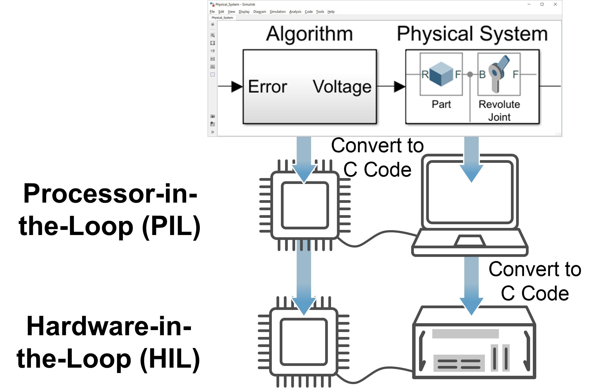

# Simscape Multibody 101 Hands-On Workshop
### 3D 기계 시스템을 모델링하고 시뮬레이션하는 첫걸음

기계 시스템을 설계하고 해석할 때, 우리는 종종 “이 시스템이 실제로 어떻게 움직일까?”라는 질문에 부딪힌다.  
단순한 수식 기반 모델은 이해하기 쉽지만, 구조가 복잡해질수록 실제 거동을 직관적으로 파악하기는 쉽지 않다.  
이런 고민에서 출발한 것이 바로 **Simscape Multibody**다.

이번 글에서는 *Simscape Multibody 101 Hands-On Workshop*의 내용에 기반하여 워크숍의 전체적인 목적과 Simscape Multibody가 어떤 도구인지 소개하고자 한다. 이후 연재되는 글을 통해서 여러분들은 직접 Simscape Multibody를 실행해보면서 익혀볼 수 있게 될 것이다.

---

## 워크숍 개요: 무엇을, 왜 배우는가?

**Simscape Multibody 101 Hands-On Workshop**은 MATLAB®과 Simulink® 환경에서 **3D 기계 시스템을 어떻게 모델링하고 시뮬레이션하는지**에 대한 큰 그림을 제공하는 실습 중심 워크숍이다.

### 워크샵 자료

워크샵의 실습 자료는 아래 링크에서 받을 수 있다.
👉[Simscape Multibody Workshop Material](https://tinyurl.com/MultibodyWorkshop)

워크샵의 발표 자료는 아래 링크에서 받을 수 있다.
👉[Simscape Multibody Workshop Presentation](https://tinyurl.com/multibody101slide)

### 워크샵의 목적 및 개요

이 워크숍의 핵심 목적은 다음과 같다.

- 3차원 기계 시스템을 **수식 유도 없이** 모델링하는 방법 이해  
- 기구학(Kinematics)과 동역학(Dynamics)을 동시에 다루는 모델링 경험  
- CAD 데이터와 시뮬레이션 모델을 연결하는 실제적인 워크플로 학습  
- 제어, 전기, 기계 요소가 결합된 시스템을 하나의 모델로 다루는 감각 익히기  

워크숍은 단순한 이론 설명이 아니라,

- 질량–스프링–댐퍼 시스템  
- 단진자 및 이중 진자  
- CAD 파일 기반 매니퓰레이터  

와 같은 예제를 직접 만들어 보면서 개념을 체득하는 방식으로 구성되어 있다. 마지막 매니퓰레이터 모델링의 결과는 아래와 같다.

<video width = "100%" loop autoplay muted controls>
  <source src = "../../images/Multibody101/no00_IntroToSimscapeMultibody/vid1.mp4">    
</video> 마지막 핸즈온 에제인 매니퓰레이터 모델링 및 구동 결과물 

---

## Simscape Multibody란 무엇인가?

**Simscape Multibody**는 MATLAB 기반의 물리 모델링 환경인 **Simscape** 제품군 중 하나로, **3D 다물체(mechanical multibody) 시스템을 시뮬레이션**하기 위한 도구다.

가장 큰 특징은 다음 한 문장으로 요약할 수 있다.

> *운동 방정식을 직접 유도하거나 코딩하지 않아도,  
> 물체와 조인트를 조립하듯 연결하면 시스템의 동작을 시뮬레이션할 수 있다.*

### Simscape Multibody의 활용 에시

Simscape Multibody를 활용하면 아래와 같은 기계 모델링 및 시뮬레이션을 수행할 수 있다.

<video width = "50%" loop autoplay muted controls>
  <source src = "../../images/Multibody101/no00_IntroToSimscapeMultibody/vid2.mp4">    
</video> Simscape Multibody 어플리케이션 예시 1 - 피스톤 운동 모델링 및 시뮬레이션 

<video width = "50%" loop autoplay muted controls>
  <source src = "../../images/Multibody101/no00_IntroToSimscapeMultibody/vid3.mp4">    
</video> Simscape Multibody 어플리케이션 예시 2 - State Machine (Stateflow®)에 기반한 로봇 팔 모델링 및 시뮬레이션

<video width = "50%" loop autoplay muted controls>
  <source src = "../../images/Multibody101/no00_IntroToSimscapeMultibody/vid4.mp4">    
</video> Simscape Multibody 어플리케이션 예시 3 - 유압 시스템 모델링(Simscape Fluid®)에 기반한 Backhoe 모델링 및 시뮬레이션

<video width = "50%" loop autoplay muted controls>
  <source src = "../../images/Multibody101/no00_IntroToSimscapeMultibody/vid5.mp4">    
</video> Simscape Multibody 어플리케이션 예시 4 - 케이블과 Pulley를 조합한 크레인 모델링 및 시뮬레이션

---

## Simscape Multibody의 핵심 구성 요소

Simscape Multibody 모델은 다음과 같은 기본 요소로 구성된다.

### Body (물체)
- 질량, 관성, 형상 정보를 갖는 3D 객체  

<video width = "50%" loop autoplay muted controls>
  <source src = "../../images/Multibody101/no00_IntroToSimscapeMultibody/vid7.mp4">    
</video> 

- 단순 점 질량부터 CAD 기반 복잡한 형상까지 표현 가능  

<video width = "50%" loop autoplay muted controls>
  <source src = "../../images/Multibody101/no00_IntroToSimscapeMultibody/vid6.mp4">    
</video>

- 일부 유연체에 대한 모델링

<video width = "50%" loop autoplay muted controls>
  <source src = "../../images/Multibody101/no00_IntroToSimscapeMultibody/vid8.mp4">    
</video>

### Joint (조인트)
- 물체 간의 상대 운동을 정의  
- Revolute(회전), Prismatic(병진) 등 다양한 표준 조인트 제공  
  
<video width = "50%" loop autoplay muted controls>
  <source src = "../../images/Multibody101/no00_IntroToSimscapeMultibody/vid9.mp4">    
</video> Revolute joint와 prismatic joint를 이용하여 모델링하는 크랭크-피스톤 모델

### Frame (프레임)
- 물체와 조인트를 연결하는 기준 좌표계  
- “어디에 있고, 어떤 방향을 보고 있는지”를 정의  

### Force & Actuation (힘과 구동)
- 외력, 토크, 스프링, 댐퍼, 모터 구동 등 물리적 상호작용 표현  

<video width = "100%" loop autoplay muted controls>
  <source src = "../../images/Multibody101/no00_IntroToSimscapeMultibody/vid13.mp4">    
</video> 중력이나 충돌의 힘과 상호작용에 대한 모델링 및 시뮬레이션 예시

이 요소들을 블록 다이어그램 형태로 연결하면,  
Simscape Multibody가 내부적으로 시스템의 운동 방정식을 생성하고 시뮬레이션을 수행한다.

---

## 왜 Simscape Multibody를 사용하는가?

### 1. 수식 중심 접근의 한계 극복
복잡한 기계 시스템에서는 자유도와 결합 관계가 늘어나면서 운동 방정식 유도 자체가 큰 부담이 된다.  
Simscape Multibody는 이러한 과정을 자동화해, **수식보다 구조와 물리적 의미에 집중**할 수 있게 해준다.

### 2. CAD 기반 모델링
STEP, STL과 같은 CAD 파일을 불러와 실제 형상을 기반으로 모델을 구성할 수 있다.  
이를 통해 설계 단계에서 기구 간 간섭, 운동 범위, 배치 문제를 조기에 확인할 수 있다.

<video width = "50%" loop autoplay muted controls>
  <source src = "../../images/Multibody101/no00_IntroToSimscapeMultibody/vid15.mp4">    
</video> 

<video width = "50%" loop autoplay muted controls>
  <source src = "../../images/Multibody101/no00_IntroToSimscapeMultibody/vid16.mp4">    
</video> 

### 3. 제어 시스템과의 자연스러운 통합
Simulink와 동일한 환경에서 동작하기 때문에,
- PID 제어기
- 모터 및 액추에이터 모델
- 센서 신호 처리  

를 **하나의 폐루프 시스템**으로 쉽게 결합할 수 있다. 또한, 모델링 결과물을 C코드로 변환할 수 있어 ([Embedded Coder®](https://www.mathworks.com/products/embedded-coder.html) 및 [Simulink Real-Time®](https://www.mathworks.com/products/simulink-real-time.html) 이용) 하드웨어에의 배포 과정에 드는 수고를 절감할 수 있다.

### 4. 3D 시각화 기반 분석
Mechanics Explorer를 통해 시스템의 움직임을 3D로 확인할 수 있어,  
그래프뿐 아니라 **움직임 자체를 보며 결과를 이해**할 수 있다.

<video width = "100%" loop autoplay muted controls>
  <source src = "../../images/Multibody101/no00_IntroToSimscapeMultibody/vid14.mp4">    
</video> 

---

## 워크숍의 전체 흐름

이번 워크숍은 다음과 같은 흐름으로 진행된다.

1. Simulink 기반의 간단한 동역학 모델링  
2. 동일한 시스템을 Simscape Multibody로 재구성  
3. 조인트와 프레임 개념 이해  
4. CAD 파일을 활용한 실제 구조 모델링  
5. 제어 입력을 통한 시스템 구동 및 응답 분석  

이 과정을 통해  
“추상적인 블록 다이어그램”에서  
“현실적인 3D 기계 시스템 모델”로 확장되는 경험을 하게 된다.

---

## 다음 글에서는…

다음 글에서는 워크숍의 첫 번째 실습 예제인  
**질량–스프링–댐퍼 시스템**을 중심으로,

- Simulink 모델과 Multibody 모델의 차이  
- 두 접근 방식이 동일한 물리 현상을 어떻게 표현하는지  
- Multibody 모델의 장점이 어디에서 드러나는지  

를 단계별로 살펴볼 예정이다.