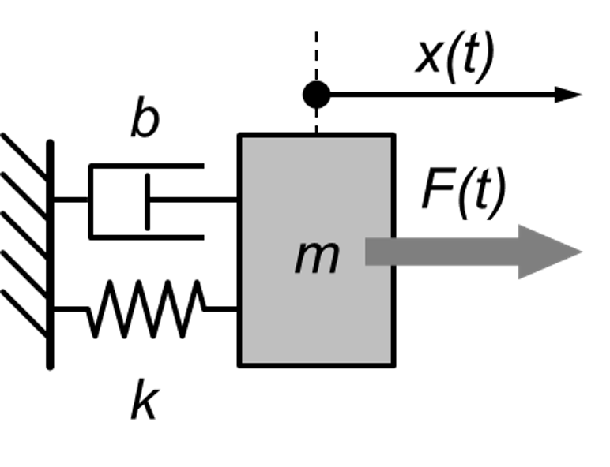
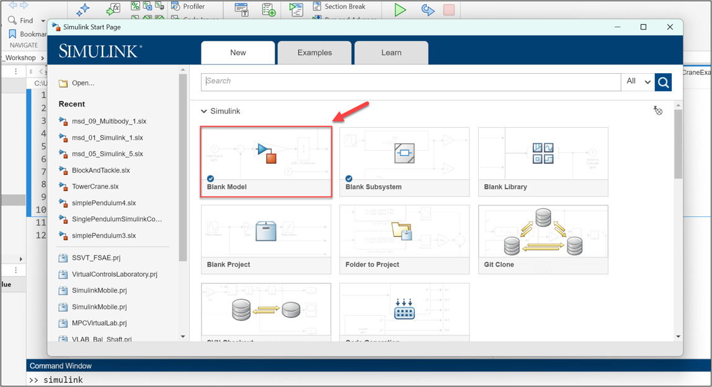
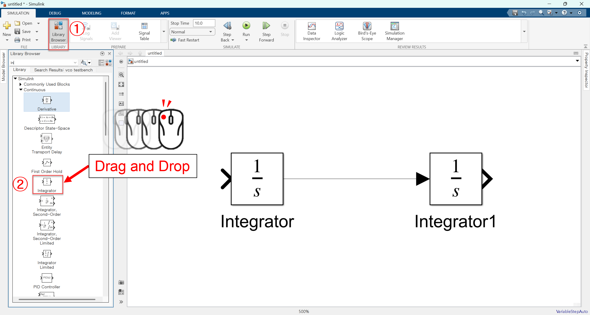
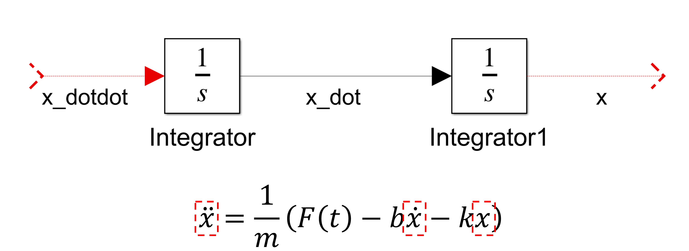
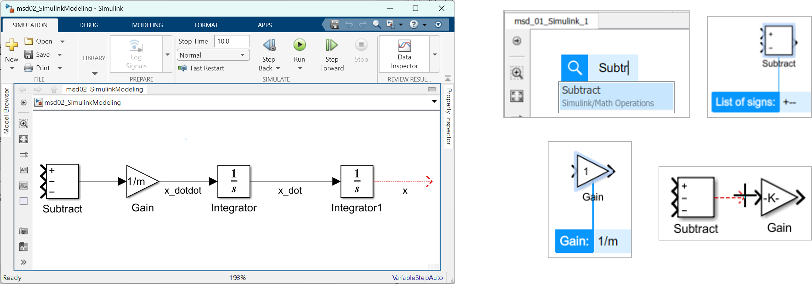
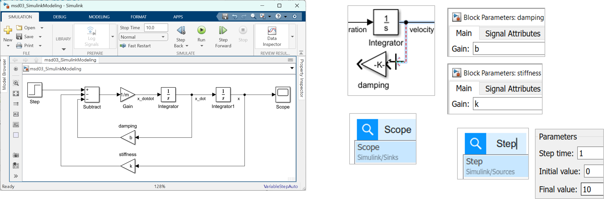
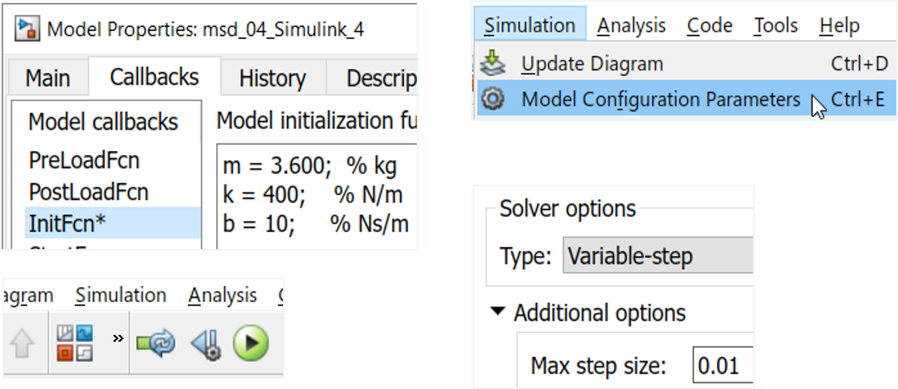
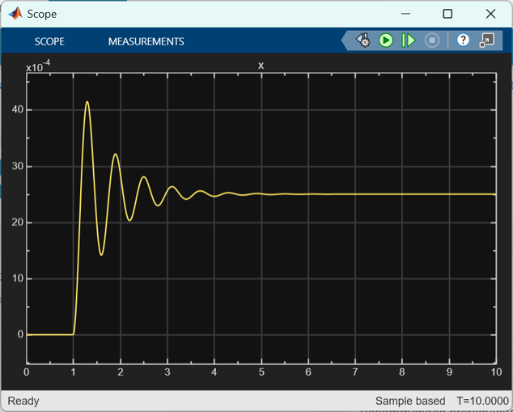

<style>
r { color: Red }
o { color: Orange }
g { color: Green }
</style>

# Mass–Spring–Damper 실습 튜토리얼

### 워크샵 자료

워크샵의 실습 자료는 아래 링크에서 받을 수 있다.
👉[Simscape Multibody Workshop Material](https://tinyurl.com/MultibodyWorkshop)

워크샵의 발표 자료는 아래 링크에서 받을 수 있다.
👉[Simscape Multibody Workshop Presentation](https://tinyurl.com/multibody101slide)

### Simulink 모델에서 Simscape Multibody로 확장하기

이번 튜토리얼에서는 가장 기본적인 동역학 시스템인  
**질량–스프링–댐퍼(Mass–Spring–Damper)** 모델을 예제로 사용해,

1. Simulink 기반 수식 모델링
2. 동일한 시스템의 Simscape Multibody 모델링
3. 두 접근 방식의 차이와 연결점

을 단계적으로 살펴본다.



---

## 1. 문제 정의: 질량–스프링–댐퍼 시스템

질량–스프링–댐퍼 시스템은 다음과 같은 운동 방정식으로 표현된다.

$$m\ddot{x} + b\dot{x} + kx = F(t)$$

여기서  
- \(m\): 질량 (kg)  
- \(b\): 감쇠 계수 (Ns/m)  
- \(k\): 스프링 상수 (N/m)  
- \(F(t)\): 외력. 본 실습에서는 아래와 같은 Step 입력이다.  


이 시스템은 **입력 힘에 대한 위치 응답**을 관찰하기에 적합한 대표적인 예제다.

---

## 2. Simulink로 모델링하기 (Input/Output 접근)

### 2.1 기본 아이디어

식 (1)의 운동 방정식을 가속도에 대해 정리하면 아래와 같다.

$$\ddot{x} = \frac{1}{m}\left(F(t)-b\dot{x}-kx\right)$$

즉,
- 힘의 합 → 가속도
- 가속도를 적분 → 속도
- 속도를 적분 → 위치

라는 흐름으로 모델을 구성할 수 있다.

---

### 2.2 Simulink 모델 구성

우선, 시뮬링크를 실행시키기 위해 MALTAB의 Command Window에서 `simulink`라고 입력하면 아래 그림과 같은 페이지가 뜬다. 여기서 Blank Model을 열어보자. 



#### Integrator 블록 2개
   - 가속도 → 속도 → 위치

우선, 캔버스에 integrator 블록을 두개 놓고 두 블록 사이를 연결하자. 



식 (1) 혹은 식 (2)에서 볼 수 있는 것 처럼 우리가 모델링하기 위한 물리현상의 미분방정식은 2차 미분 계수를 포함하고 있다. 따라서, integrator 블록을 두개 놓고 연결시켜준다. 이를 통해, mass-spring damper 모델의 가속도, 속도, 위치 값을 활용할 수 있게 될 것이다.



#### Subtract 블록
   - 외력 $F(t)$
   - 감쇠력 $b\dot{x}$
   - 복원력 $kx$

(`msd01_SimulinkModeling.slx` 파일을 열어 여기부터 실습해볼 수 있습니다.)



이제 외력 $F(t)$와 $b\dot{x}$, 그리고 $kx$의 덧셈, 뺄셈 관계를 모델링하기 위해서 subtract 블록을 활용할 수 있다. subtract 블록으로 덧셈, 뺄셈 관계를 모델링하자.

#### Gain 블록, Step 블록, Scope 블록
   - 가속도 계산을 위해 gain 값 `1/m`
   - 감쇠 계수 계산을 위해 gain 값 `b`
   - 스프링 상수 계산을 위해 gain 값 `k`
   - 외력 $F(t)$ 계산을 위해 step 블록 활용

(`msd02_SimulinkModeling.slx` 파일을 열어 여기부터 실습해볼 수 있습니다.)



이번에는 gain 블록 및 step 블록을 이용해서 미분방정식의 모델링을 마무리하자. gain 블록은 상수배 모델링을 위해 사용할 수 있다. step 블록을 이용하면 외력 $F(t)$를 모델링할 수 있다. 

마지막으로 Scope 블록을 캔버스에 넣어주고 x 값을 입력시켜주면 위치 값을 그려볼 수 있다.

### 2.3 파라미터 정의

(`msd03_SimulinkModeling.slx` 파일을 열어 여기부터 실습해볼 수 있습니다.)

모델 파라미터는 **Model Callback (InitFcn)** 에서 정의한다. 단축키 `Ctrl + H`를 눌러 Model Properties를 열면 Callback 탭을 확인할 수 있다. 여기서 InitFcn 콜백을 찾고 m, k, b 값을 차례대로 넣어준다.

```matlab
m = 3.6;   % kg
k = 400;  % N/m
b = 10;   % Ns/m
```

그리고 모델 실행 시 솔버의 스텝 사이즈를 최대 0.01로 설정하자. 이는 단축키 `Ctrl + E`를 눌러 Model Configuration을 열어 설정할 수 있다.



### 2.4 Simulink의 시뮬레이션 결과

이제 시뮬레이션을 실행해보면 (단축키 `F5`) Scope에서 아래와 같은 결과물을 얻을 수 있다. 참고로 y축의 값이 10의 -4승 단위로 그려진 것을 알 수 있다. 이것은 입력으로 들어가는 힘은 1초 이후에 10N의 힘이 들어가는데 반해 스프링 계수가 400 N/m나 되므로, 1m를 움직이기 위해서는 400 N의 힘이 필요한 만큼의 강한 스프링이기 때문임을 알 수 있다. 



## 3. Simscape Multibody로 모델링하기

앞서 Simulink에서 수식 기반으로 구성한 질량–스프링–댐퍼 시스템을 이제 **Simscape Multibody**를 사용해 다시 모델링해 보자.

TODO: 여기부터 작업

이 단계의 목표는 다음과 같다.

- 질량을 **강체(Solid)** 로 표현
- 스프링과 댐퍼를 **Prismatic Joint의 내부 메커니즘**으로 모델링
- Simulink 입력/출력을 Multibody 모델과 연결
- Simulink 모델과 **동일한 응답**이 나오는지 확인

---

### 3.1 Multibody 모델의 기본 구성

모든 Simscape Multibody 모델에는 아래 세 블록이 반드시 포함되어야 한다.

- **Solver Configuration**  
- **World Frame**  
- **Mechanism Configuration**

이 세 블록은 Multibody 시뮬레이션의 “기초 환경”을 정의한다.

- *World Frame*: 관성 기준 좌표계  
- *Mechanism Configuration*: 중력 등 전역 물리 설정  
- *Solver Configuration*: Simscape 물리 네트워크 해석 설정  

---

### 3.2 질량(Mass) 모델링

질량은 **Solid 블록**을 사용해 모델링한다.

#### Solid 블록 설정
- **Inertia > Type**: `Point Mass`
- **Mass**: `m`
- **Units**: `kg`

이 예제에서는 형상이나 관성 모멘트가 중요하지 않으므로,  
질량을 **점 질량(Point Mass)** 으로 단순화한다.

> 핵심 포인트  
> - Multibody에서 “질량”은 **형상보다 물리 속성**이 중요하다.

---

### 3.3 스프링–댐퍼 모델링 (Prismatic Joint)

질량–스프링–댐퍼 시스템의 핵심은  
**병진 운동 + 복원력 + 감쇠력**이다.

이를 하나의 블록으로 표현하는 것이 바로 **Prismatic Joint**다.

#### Prismatic Joint 설정

**1) Internal Mechanics**
- **Spring Stiffness**: `k`
- **Damping Coefficient**: `b`

→ 스프링과 댐퍼를 수식 없이 바로 표현할 수 있다.

**2) Actuation**
- **Mode**: `Provided by Input`

→ 외력 \(F(t)\)을 Simulink에서 입력으로 제공

**3) Sensing**
- **Position** 체크

→ 변위 출력을 Simulink로 전달

---

### 3.4 블록 연결 구조

Multibody 서브시스템 내부 연결 구조는 다음과 같다.

- World Frame → Prismatic Joint (Base)
- Prismatic Joint (Follower) → Solid
- Solver Configuration → 물리 네트워크

이 구조는 다음 의미를 가진다.

- World Frame: 기준점
- Prismatic Joint: 질량의 운동을 제한하는 1자유도 조인트
- Solid: 실제로 움직이는 질량

---

### 3.5 중력 제거

이 예제는 **수평 방향 1차원 병진 운동**만을 다루므로  
중력 효과를 제거한다.

#### Mechanism Configuration 설정
- **Uniform Gravity**: `None`

중력을 제거하지 않으면,  
질량에 불필요한 외력이 작용해 결과 해석이 복잡해진다.

---

### 3.6 Simulink와 Multibody 연결

Multibody 모델을 기존 Simulink 모델과 연결한다.

#### 입력 (외력)
- **Simulink-PS Converter**
  - Simulink의 힘 신호 → 물리 신호

#### 출력 (변위)
- **PS-Simulink Converter**
  - 물리 신호 → Simulink 신호

이렇게 하면,
- Simulink에서 힘을 입력하고
- Multibody에서 계산된 변위를
- Scope에서 바로 비교할 수 있다.

---

### 3.7 결과 비교

Scope에 다음 신호들을 동시에 연결한다.

- Simulink 기반 모델의 변위
- Simscape Multibody 기반 모델의 변위

두 결과를 비교하면,
- 파형이 **완전히 일치**
- 시간 지연이나 오차 없음

을 확인할 수 있다.

> 이 결과는  
> **“수식 기반 모델과 구조 기반 모델이 동일한 물리 현상을 표현한다”**  
> 는 것을 명확히 보여준다.

---

## 4. 정리

- Simulink 모델은  
  → **운동 방정식과 신호 흐름**을 이해하는 데 강점이 있다.
- Simscape Multibody 모델은  
  → **물리 구조와 운동 관계**를 직관적으로 표현한다.

질량–스프링–댐퍼 예제는  
이 두 접근 방식을 연결하는 가장 좋은 출발점이다.

이 실습을 통해,
**수식 → 블록 → 3D 물리 시스템**으로 사고가 확장되는 경험을 하게 된다.
``
