

### 워크샵 자료

워크샵의 실습 자료는 아래 링크에서 받을 수 있다.
👉[Simscape Multibody Workshop Material](https://tinyurl.com/MultibodyWorkshop)

워크샵의 발표 자료는 아래 링크에서 받을 수 있다.
👉[Simscape Multibody Workshop Presentation](https://tinyurl.com/multibody101slide)

# Simple Pendulum로 시작하는 Simscape Multibody 사고법

단진자(Simple Pendulum)는 Multibody 모델링을 처음 접할 때 좋은 출발점 중 하나이다. 구조는 단순하지만, 회전 조인트, 프레임, 중력, 그리고 모델에 움직임을 가하는 법을 모두 경험할 수 있기 때문이다.

이 글에서는 단진자를 하나씩 만들어 가면서, 모델을 어떻게 생각해야 하는지에 집중한다. 블록을 많이 아는 것보다, **왜 이런 결과가 나오는지 납득하는 과정**이 더 중요하다.

## 1. Multibody 모델의 출발점은 ‘기준’을 세우는 일이다

Simscape Multibody 모델을 시작하면 가장 먼저 눈에 들어오는 블록들이 있다.  
Solver Configuration, World Frame, Mechanism Configuration이다.

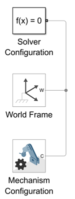

이 세 블록은 모델의 골격을 구성해줄 뿐만 아니라, Multibody 모델링/시뮬레이션을 수행할 때 꼭 필요한 블록들이다.

* World Frame은 모든 물체가 기준으로 삼는 관성 좌표계이다.
* Mechanism Configuration은 중력처럼 “환경 전체에 적용되는 물리 조건”을 정의한다.  
* Solver Configuration은 물리 방정식을 실제로 풀어주는 엔진이다.

이 단계에서 중요한 점은, Multibody 모델은 **물체보다 먼저 기준을 세운다**는 것이다.  
어디를 원점으로 삼을지, 중력이 있는지 없는지 같은 결정이 모델의 일부가 된다.

## 2. 물체를 하나 놓아보고, 눈으로 확인해 본다

이제 Brick Solid 블록 하나를 추가해 진자의 막대를 만든다. 크기는 [20, 2, 1] cm로 하고 색깔은 빨간색 ([1, 0, 0])으로 정해보자.

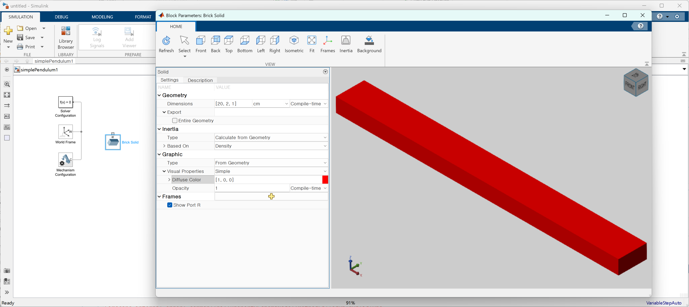

치수와 색상을 먼저 정하는 이유는 단순하다. 눈에 보여야 생각할 수 있기 때문이다.

Brick Solid 블록을 World Frame에 아래 그림과 같이 연결시키고 모델을 컴파일(단축키 Ctrl + D)하면 3D 화면이 나타난다.  

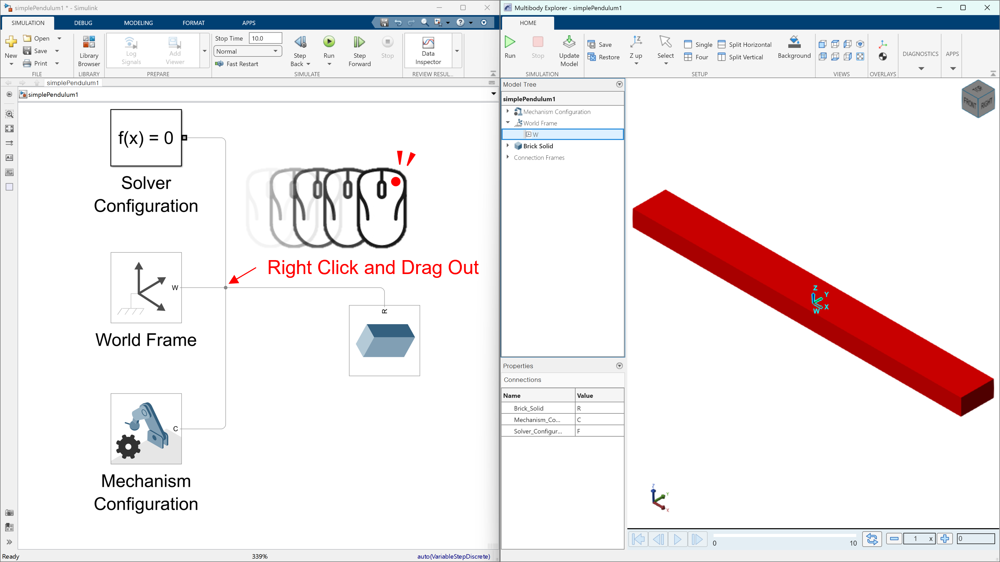

이 순간부터 Multibody 모델은 블록 다이어그램이 아니라, **조립된 구조물**로 인식된다.

여기서 한 번 멈추고 확인해 볼 필요가 있다.

- 이 물체는 어디에 붙어 있는가?
- 기준 좌표계(World Frame)와 어떤 관계를 맺고 있는가?

이 질문에 답할 수 없다면, 다음 단계에서 반드시 길을 잃게 된다.

## 3. Revolute Joint를 붙였는데, 아무 일도 일어나지 않는다

이제 회전을 허용하기 위해 Revolute Joint를 추가한다. 좀 더 구체적으로는 World Frame과 Brick Solid 사이에 조인트를 하나 넣어보자.

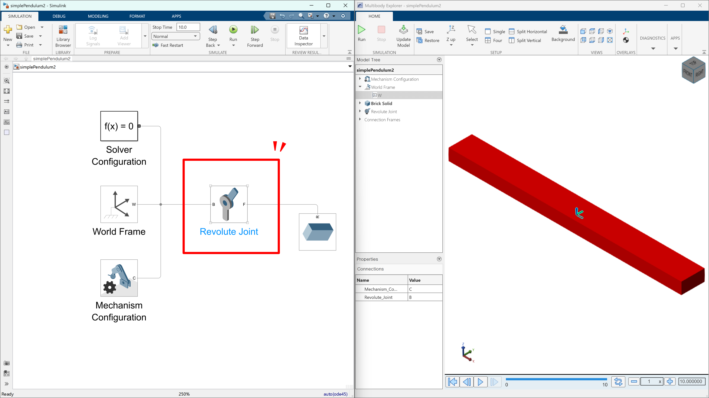

여기서 잠깐 Joint가 무엇이고 Revolute Joint가 무엇인지 설명하자면, Joint는 프레임을 통해 바디들을 연결하는 객체라고 볼 수 있다. 가령, 비행기 기체에 프로펠러를 붙이는 것을 회전 joint를 통해 둘을 연결시킬 수 있다고 볼 수 있다.

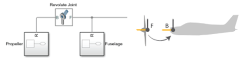

여기서 움직임의 기준이 되는 바디(비행기의 기체)를 "Base"라고 부르고, 움직임을 당하는 바디(프로펠러)를 "Follower"라고 부른다. 

또 하나 중요한 점은 Simscape Multibody에서 revolute joint는 무조건 z축 기준으로만 회전한다.

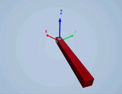

이제 모델의 시뮬레이션을 실행해보자 (단축키 = F5). 대부분 이 시점에서 모델은 **가만히 멈춰 있다**.

이 상황은 실패가 아니라, Multibody 사고의 출발점이다.

조인트는 움직임을 만들어 주는 장치가 아니다. 조인트는 **특정 형식으로 움직일 수 있게 해주는 제약 조건**이다.

즉, “회전해도 된다”는 규칙만 생겼을 뿐, “어떻게 회전해야 하는지”는 아직 정의하지 않았다.

## 4. 움직이지 않는 이유를 ‘프레임’에서 찾는다

이제 시선을 프레임(Frame)으로 옮긴다.

프레임은 위치와 방향을 동시에 가진 좌표계이다. Multibody 모델에서 모든 연결은 프레임과 프레임 사이의 관계로 정의된다. 그리고 body와 joint 모두 프레임을 갖고 있고 이들을 연결시킬 수 있게 되어 있다. 3번 그림 혹은 4번 그림에서 볼 수 있는 것 처럼 우리의 빨간색 막대기 Rigid Body도 Frame을 가지고 있다. 물체의 배꼽 정도에 위치 해 있으며 이 프레임은 "R" 로 이름 붙여져 있다. 

참고로 프레임은 축이 3개가 있는데 각각 x, y, z로 이름 붙으며 색깔은 빨강-초록-파랑 순서로 RGB에서 따온 것으로 생각된다.

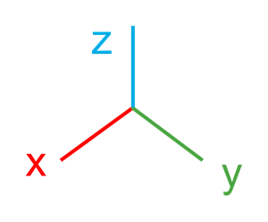

또, Simscape Multibody에서 프레임을 연결한다는 것은, “이 두 좌표계를 완전히 같은 위치와 방향으로 만든다”는 의미이다.

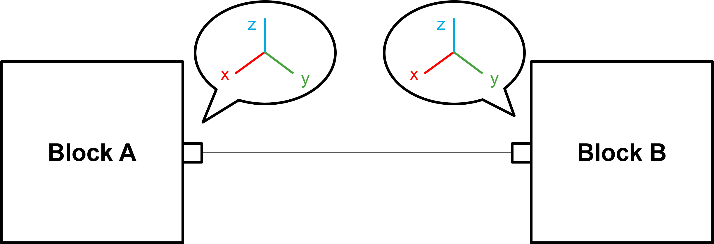

여기서 중요한 사실 하나가 드러난다.

- Revolute Joint는 **자기 프레임 기준으로만 회전**한다.

만약 조인트의 축이 우리가 기대한 방향이 아니라면,
조인트는 제대로 설정된 것처럼 보여도 원하는 움직임이 나오지 않는다.

## 5. Rigid Transform으로 ‘어디에서 어떻게 회전할지’를 정한다

Rigid Transform은 두 프레임 사이의 고정된 위치·회전 관계를 정의한다.

이 블록을 추가하는 순간, 모델링의 성격이 바뀐다. 단순히 블록을 잇는 것이 아니라, **조립 위치를 설계**하게 된다.

- 조인트의 기준 좌표계를 회전시켜 본다.
- 조인트의 원점을 물체에서 조금 이동시켜 본다.

지금까지 만들고 있던 모델에서 revolute joint 왼쪽에 "Rigid Transform" 블록을 연결시켜보자.

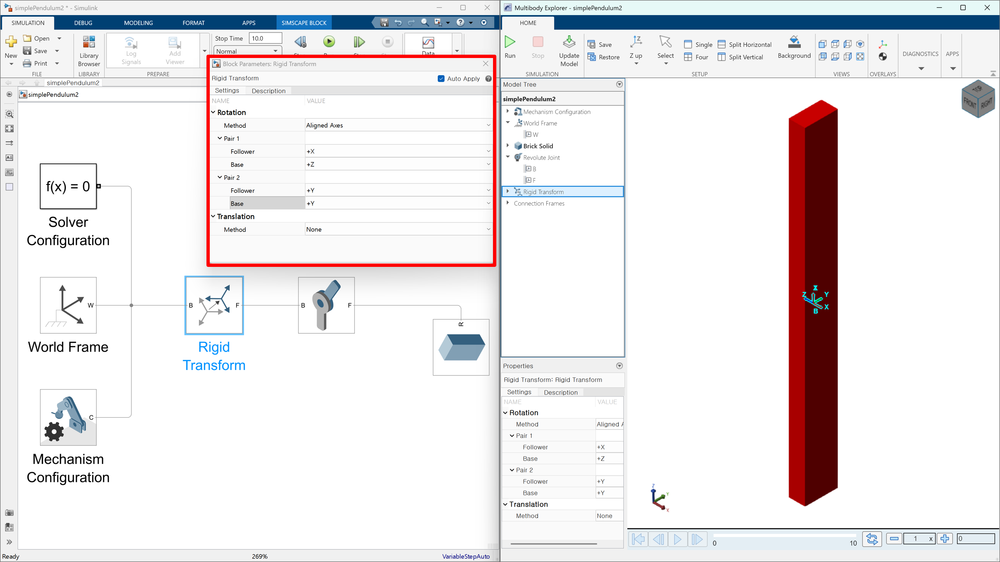

"Rigid Transform" 블록의 구체적인 설정은 아래와 같다.

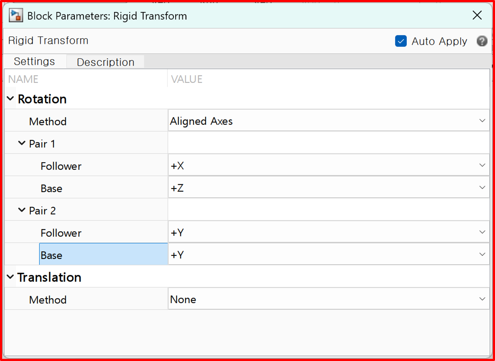

이 파라미터들의 의미를 조금 설명하자면, 우선 첫 번째 Pair에서 기존 Z 축이 X축이 되도록 회전하고, 두 번째 Pair에서 기존 Y 축은 유지하는 식으로 회전시키자는 의미이다. 이렇게 하면 위의 그림 처럼 pendulum 막대기가 똑바로 서는 것을 알 수 있다.

이렇듯 Multibody 모델링을 수행할 땐 **어디에 프레임을 두고, 어떤 프레임을 기준으로 움직이게 할 것인가**를 계속 적용해가는 일련의 작업이라 할 수 있다.

## 6. 이제 회전이 ‘발생’하도록 조건을 준다

프레임이 정리되면, 조인트에 움직임의 조건을 준다. Revolute Joint 블록을 더블 클릭해서 열어주고 "State Targets"에서 "Specify Velocity Target"을 선택한 뒤 36 deg/s로 값을 지정한다.

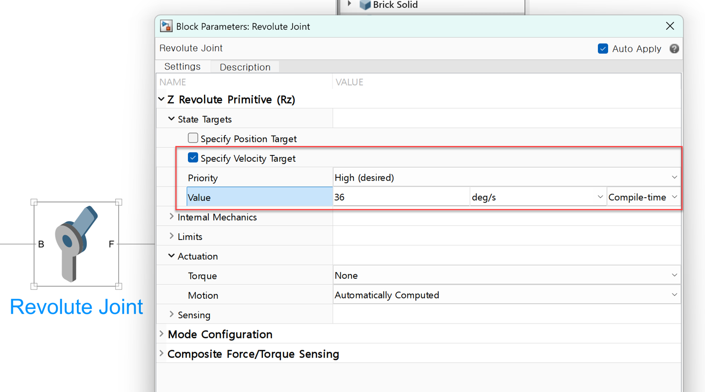

Revolute Joint에 속도나 위치 목표를 설정하면, 이제 모델은 실제로 회전하기 시작한다.

<video width = "100%" loop autoplay muted controls>
  <source src = "../../images/Multibody101/no02_Pendulum_Modeling/Media1.mp4">    
</video>

이때 중요한 것은 결과 그 자체보다도,
다음 질문에 답할 수 있는지 여부이다.

- 이 회전은 어떤 축을 기준으로 발생하는가?
- 회전 속도를 바꾸면 어떤 부분이 영향을 받는가?

이 질문에 답할 수 있다면,
모델을 “본 것”이 아니라 “이해한 것”이다.

## 7. 회전 축을 한번 더 이동시켜 보자.

지금까지 막대기가 회전할 수 있게는 만들었지만 우리가 원하는 것은 진자(pendulum)처럼 움직이는 것이지, 선풍기처럼 돌아가는 것은 아니었다. 다시 말해, 회전할 축을 막대기 배꼽에서 막대기 머리쪽으로 옮겨주어야 한다. 이를 위해서 Rigid Transform을 하나 더 붙이고 오프셋을 부여하자.

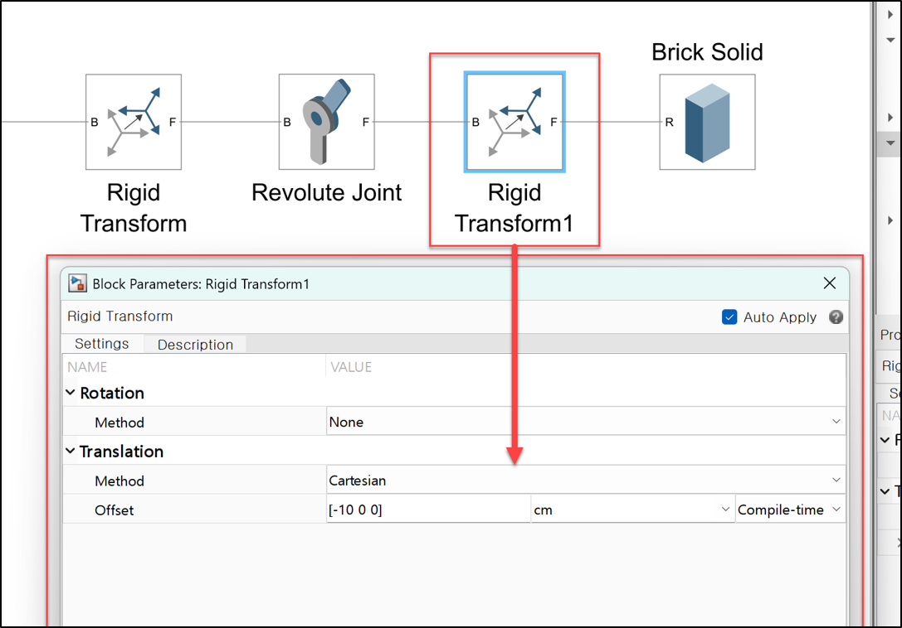

이제 시뮬레이션을 돌리면 진자와 같은 모습으로 움직이는 것을 알 수 있다.

<video width = "100%" loop autoplay muted controls>
  <source src = "../../images/Multibody101/no02_Pendulum_Modeling/Media2.mp4">    
</video>

## 중간 정리

지금까지 어떤 일이 일어나고 있는지 한번 정리하고 가자.

우선 World Frame에서 Rigid Transform으로 연결되면서 회전을 시켰다. 이것은 우리가 만든 막대기를 세우기 위함일 뿐만 아니라 revolute joint가 z 축을 중심으로 회전하도록 설계되어 있기 때문이었다.

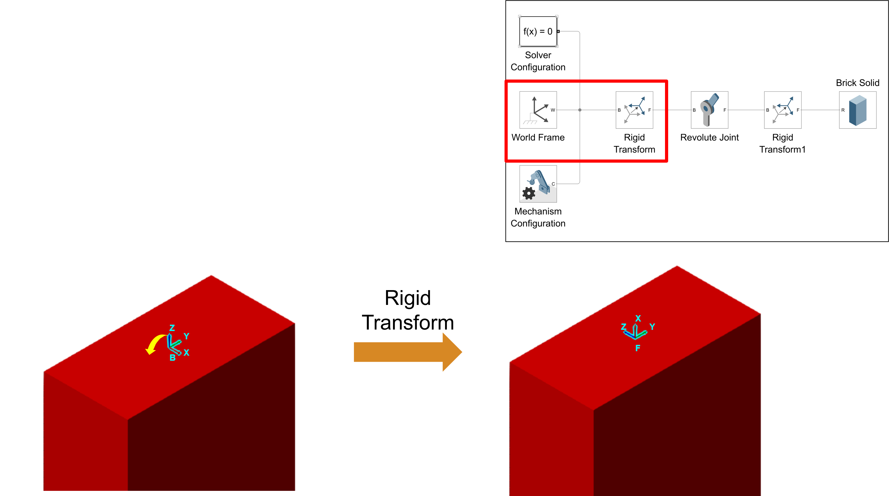

그 뒤에는 revolute joint가 붙어서 z축 중심으로 회전할 수 있는 제약 사항을 걸어주었다. Revolute Joint 기준으로 Follower에 붙어있는 블록이 회전하게 될 것이다. 아래 그림에서는 revolute joint의 follower 프레임을 보고 있는 것이다.

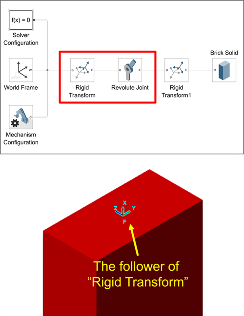

또, Revolute Joint 뒤에 Rigid Transform을 하나 더 넣어주었다. 이를 통해서 Revolute Joint에서 10cmm 아래에 떨어진 곳에 frame을 하나 둘 수 있게 되었고, 이것이 Brick Solid의 배꼽에 있는 Frame과 붙게 될 것이다.

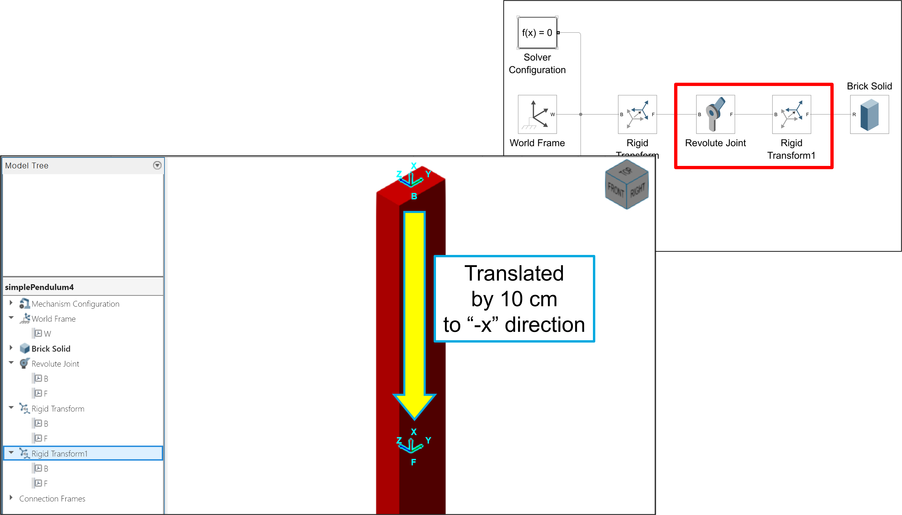

이제, Rigid Transform 1 블록의 Follower 프레임과 Brick Solid 블록의 R 프레임이 연결되어있는 것을 아래 그림에서처럼 확인할 수 있다.

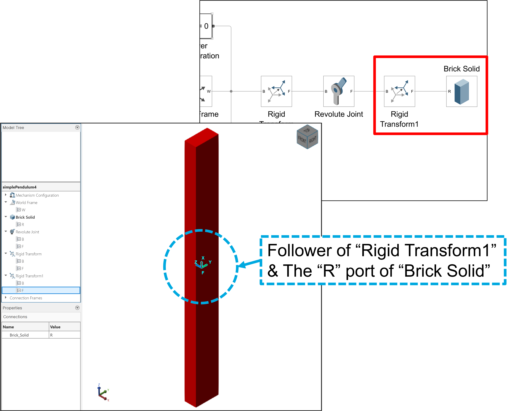

## 8. Joint에서 물리량을 꺼내 확인한다

움직임이 생겼다면, 반드시 수치로 확인해야 한다.

Revolute Joint의 Sensing 옵션을 사용하면, 각속도 같은 물리량을 직접 꺼낼 수 있다.

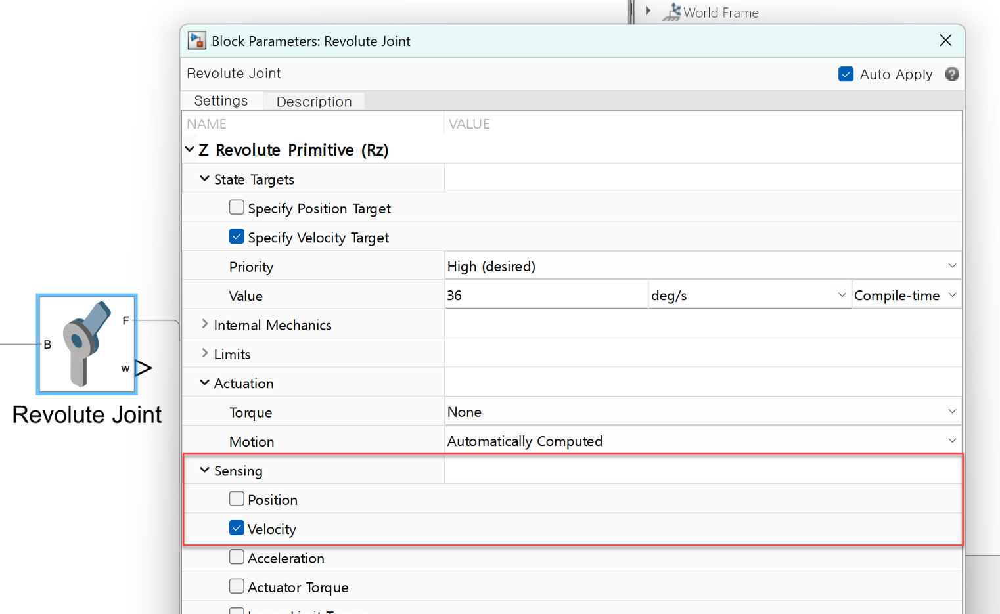

여기서 중요한 점은 신호의 성격이다.

Multibody에서 나오는 값은 물리 신호(Physical Signal)이다. 이를 일반적인 Simulink Scope에서 보기 위해서는 변환이 필요하다.

이 과정은 단순한 테크닉이 아니라, **물리 모델과 신호 모델의 경계**를 이해하게 해 준다.

또한 단위를 확인하는 순간, 모델은 시각적 애니메이션이 아니라 실제 물리 시스템으로 인식된다.

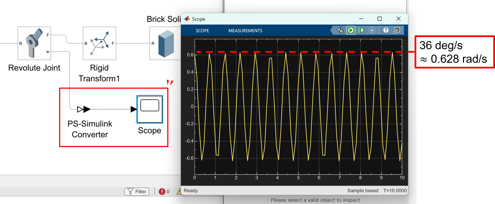

## 8. 단진자 실습의 핵심은 ‘정답’이 아니다

이 실습에서 중요한 것은
“단진자를 만들었다”는 사실이 아니다.

중요한 것은 다음과 같은 사고 흐름이다.

- 왜 안 움직이는가?
- 무엇이 아직 정의되지 않았는가?
- 프레임과 조인트 중 어디를 의심해야 하는가?

이 흐름을 한 번이라도 제대로 경험하면,
더 복잡한 Multibody 모델에서도 같은 방식으로 문제를 풀 수 있다.

## 9. 다음 단계: 더블 펜듈럼은 시험 문제이다

단진자를 이해했다면, 더블 펜듈럼은 자연스러운 다음 단계이다.

<video width = "50%" loop autoplay muted controls>
  <source src = "../../images/Multibody101/no02_Pendulum_Modeling/Media3.mp4">    
</video>

프레임을 스스로 잡아야 하고, 조인트의 위치와 방향을 직접 결정해야 한다.

이 모델이 잘 만들어진다면, Multibody의 핵심 개념은 이미 손에 들어와 있다. 이 부분은 스스로 수행해보도록 하자.

---

## 마무리

Simscape Multibody는 처음에는 낯설다. 하지만 프레임과 조인트를 기준으로 생각하기 시작하면, 모델은 점점 논리적으로 보이기 시작할 것이다.

이번 pendulum 예제가 그 사고 전환을 경험하기에 가장 좋은 예제가 되었길 바란다.