

### 워크샵 자료

워크샵의 실습 자료는 아래 링크에서 받을 수 있다.
👉[Simscape Multibody Workshop Material](https://tinyurl.com/MultibodyWorkshop)

워크샵의 발표 자료는 아래 링크에서 받을 수 있다.
👉[Simscape Multibody Workshop Presentation](https://tinyurl.com/multibody101slide)

# STEP 파일로 시작하는 Multibody 모델링 사고법

## 단순한 진자에서 ‘조립 가능한 시스템’으로 넘어가기

[단진자 예제](no02_Pendulum_Modeling.html)는 Multibody 사고의 출발점이었다.  
이번 포스팅에서는 한 단계 더 나아가, 실제 형상을 가진 부품들을 조립해 **의미 있는 기계 시스템**을 만든다.

이번 예제의 핵심은 “조인트를 추가하는 법”이 아니다.  
**CAD 기반 부품을 어떻게 Multibody 모델로 해석하고, 어디를 기준으로 연결할 것인가**에 대한 사고 전환이다.

<video width = "100%" loop autoplay muted controls>
  <source src = "../../images/Multibody101/no03_Manipulator_Modeling/Media1.mp4">    
</video>

## 1. 이번 예제의 목표는 단순히 ‘움직이는 로봇 팔’만이 아니다

이 예제의 결과물은 간단한 매니퓰레이터이다.  
하지만 진짜 목표는 다음 질문에 답할 수 있게 되는 것이다.

- CAD 형상은 Multibody 모델에서 어떤 의미를 갖는가?
- “부품을 연결한다”는 것과 frame을 생성하는 것은 어떤 관계가 있는가?
- 관절을 움직이기 위해서는 무엇이 필요하고, 제어기는 어떤 역할을 할까?

이 질문에 답하지 못한 상태에서 로봇 팔이 움직여도, 그 모델은 재사용할 수 없다.

## 2. STEP 파일을 불러온다는 것은 ‘형상’을 가져오는 일이다

모델링은 STEP 파일을 불러오는 것으로 시작한다.  
Base, Arm, Servo 같은 여러 부품이 각각 개별 Solid로 들어온다.

여기서 중요한 점은 하나다.

**STEP 파일에는 “형상”만 있다.**

- 질량은 자동으로 정해지지 않을 수 있다.
- 조인트 정보는 없다.
- 조립 관계도 없다.

즉, CAD 파일을 불러온 순간의 Multibody 모델은 "바닥에 흩어진 부품들"에 가깝다. STEP 파일들은 워크샵 실습 자료의 "03_simpleManipulator\step_files_ver2\" 폴더에 포함되어 있다. STEP 파일들은 다음과 같이 구성되어 있다.

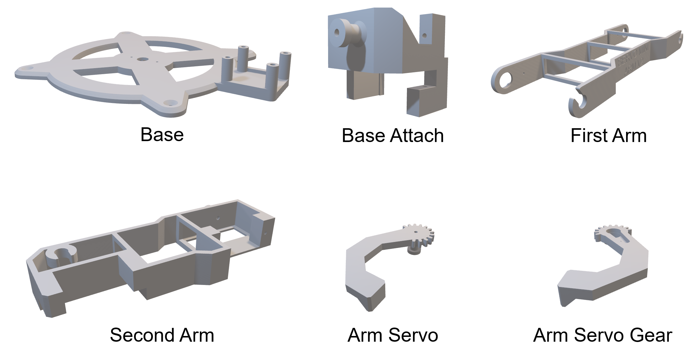

또한, 이 부품들 간의 조립 관계는 아래와 같다. 여기서 joint라고 표시되어 있는 것들은 모두 revolute joint가 된다.

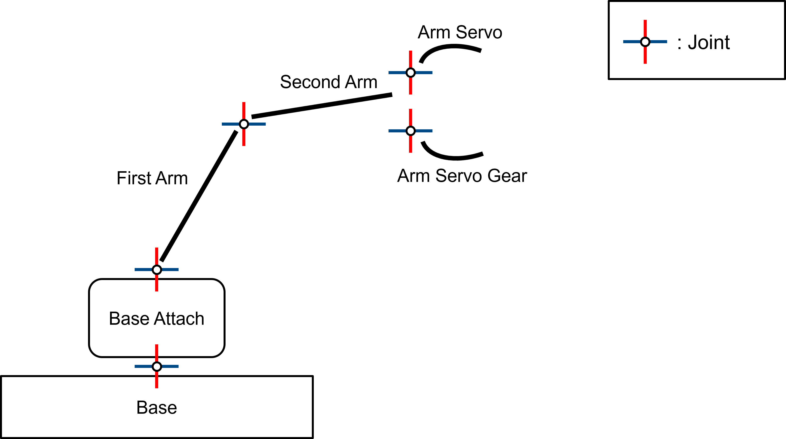

모든 부품이 모두 조립되면 아래와 같은 형태이다. 여러 각도에서 촬영했으니 조립 시 도움이 될 것으로 생각한다.

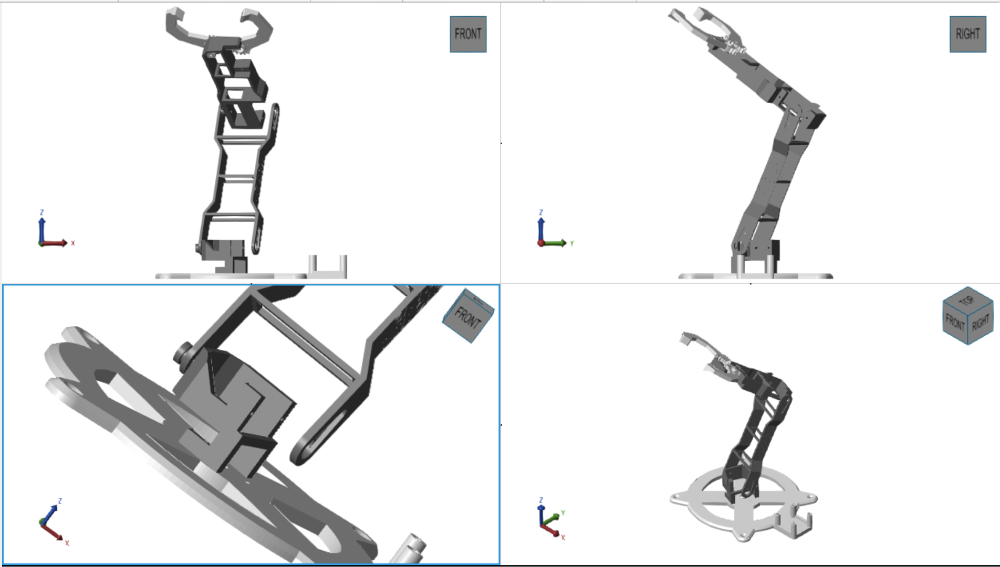

## 3. CAD 부품에도 프레임이 있다 — 하지만 대부분은 쓸 수 없다

CAD 파일을 읽어오기 위해선 Simscape Multibody의 "File Solid" 블록을 활용할 수 있다. 우리도 STEP 파일 중 base.step 파일을 불러와보자. 간단하게 밀도나 색깔 등의 정보를 입력할 수 있다.

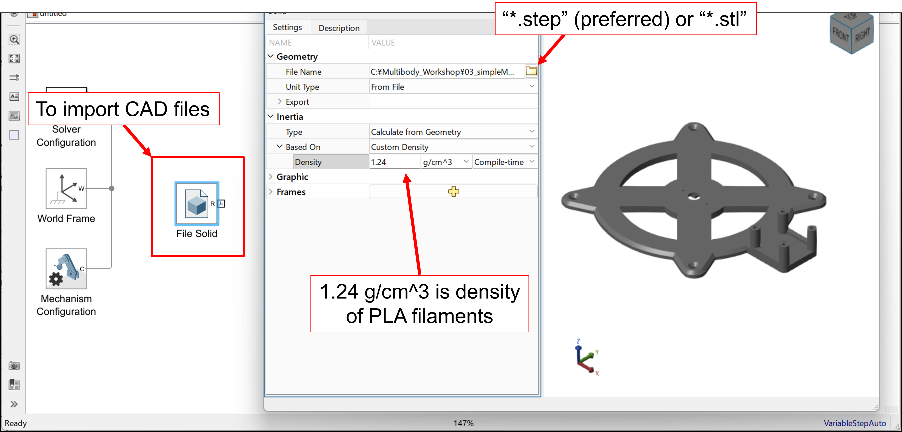

CAD 파일을 불러오면 각 부품에는 기본 프레임(R 포트)이 하나씩 있다.  
문제는 이 프레임이 **우리가 원하는 위치에 있지 않은 경우가 대부분**이라는 점이다.

예를 들어,
- 회전해야 할 축의 중심이 아니니거나,
- 형상의 무게중심이나 임의 위치에 프레임이 잡혀 있는 경우가 많다

이 상태에서 조인트를 바로 연결하면, 모델은 연결은 되었지만 의미 없는 위치에 놓여질 수 있다.

여기서 중요한 사고 전환이 필요하다.

> CAD 형상은 그대로 쓰되,  
> **프레임은 모델러가 다시 정의해야 한다.**

## 4. 프레임을 정의하는 순간, ‘조립’이 시작된다

Multibody Explorer를 열고, CAD 부품의 특정 면이나 모서리에 새로운 프레임을 추가한다. 이 프레임은 단순한 표시가 아니라, **조립의 기준점**이다.

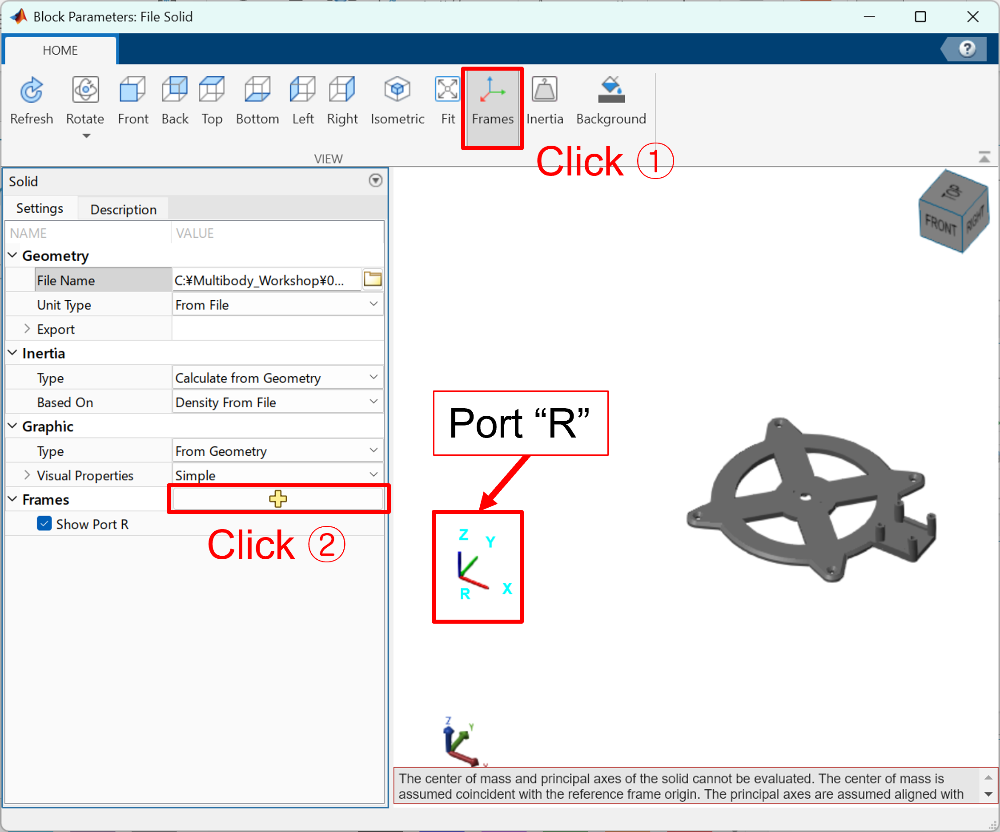

위 그림에서 처럼 "Frames" 아이콘을 누르면 현재 R 포트의 프레임이 어디에 놓여있는지 알 수 있다. 다른 물체에 연결시키기에 좋지 않은 곳에 있으므로 ②를 눌러 프레임을 추가하자.

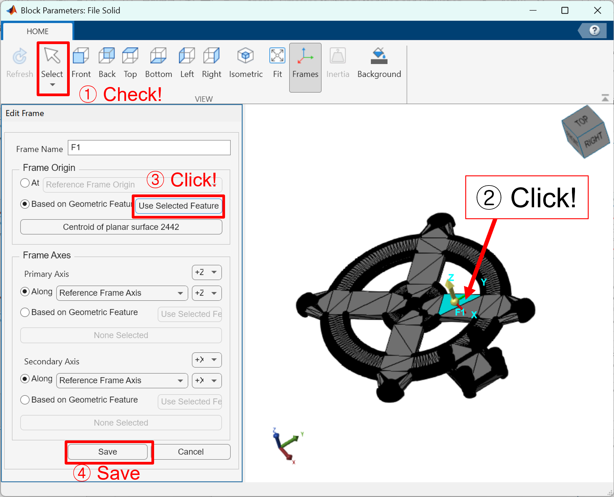

프레임 추가 버튼을 눌렀다면 ① "Select" 모드로 되어 있는지 확인한 뒤, ② 바디의 원하는 면을 클릭하자. 그런 다음 ③ 선택한 feature를 사용하기 버튼을 누르면 된다.

이때 생각해야 할 질문은 항상 같다.

- 이 부품은 어디에서 회전해야 하는가?
- 다른 부품과 맞닿는 기준은 어디인가?

다시 말해, 프레임은 다른 부품과 연결시키거나, 해당 부품에 모션이나 외력을 가하고 싶은 위치에 놓는 것이 좋다. 참고로 STEP 파일이 아닌 STL 파일들은 표면이 삼각화되어 있지 않아 이와 같이 feature 선택하여 frame을 넣기가 어려울 수 있다.

Frame이 추가되었다면 아래 그램과 같이 새로운 프레임의 위치를 확인할 수 있을 뿐만 아니라 "F1" 이라는 포트가 새로 생긴 것도 볼 수 있다.

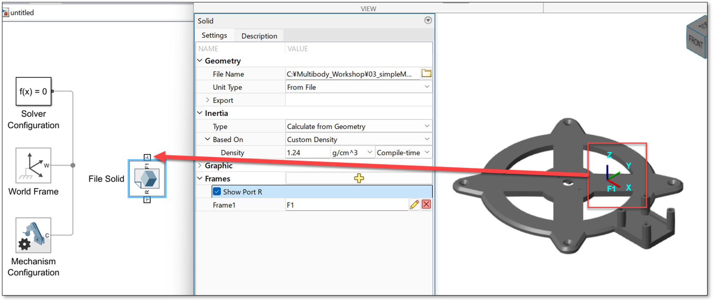

## 5. Rigid Transform은 ‘프레임을 미세 조정하는 도구’이다

프레임을 추가했는데도, 원하는 위치에 정확히 놓기 경우가 많다. 이럴 때 Rigid Transform을 사용할 수 있다. 우리는 Rigid Transform 을 이용해서 아래 그림의 빨간 화살표가 표시하는 곳에 프레임을 위치시킬 수 있다.

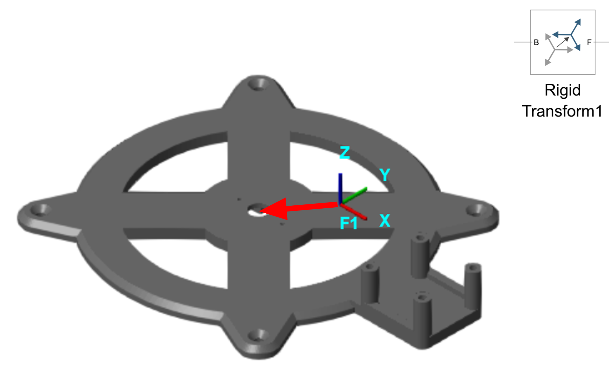

아래 그림에서는 약 [-16, -21, 0] mm 이동시켜 새로운 프레임을 잡았다. Base 바디의 어떤 부분을 새로운 프레임 F1으로 잡았는가에 따라 이 이동량은 달라질 수 있기 때문에 각자 상황에 맞게 이 값은 조정하도록 하자.

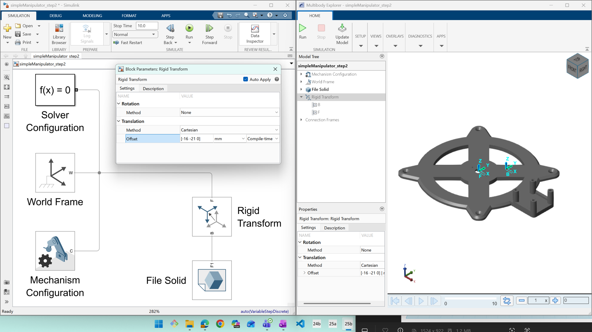

참고로 워크샵 실습 파일의 "03_simpleManipulator\img" 폴더에 들어가면 "dimensions"로 시작하는 그림들이 각 부품들의 수치를 표현하고 있으니 참고하는 것도 좋을 것이다.

Base를 놓을 때와 마찬가지 과정으로 Base Attach를 붙여보자. 결과적으로 아래와 같이 나오면 된다.

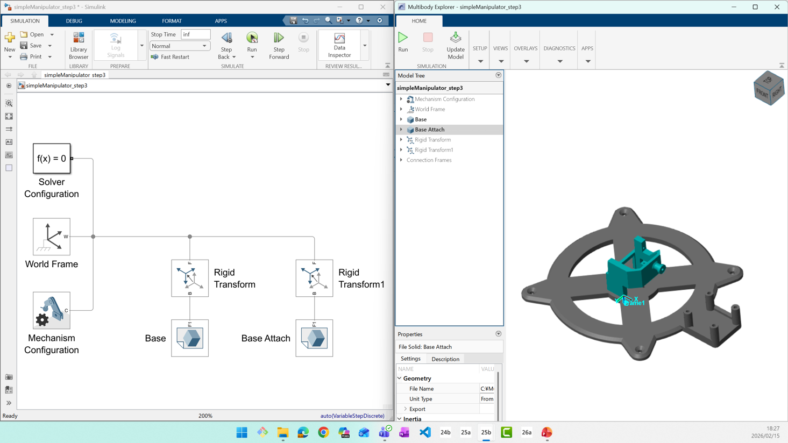

## 6. 조인트는 ‘부품 사이’가 아니라 ‘프레임 사이’에 붙는다

이제 Revolute Joint를 추가한다.  중요한 점은, 조인트는 **부품에 붙는 것이 아니라 프레임에 붙는다**는 사실이다.

즉, 조인트의 의미는 다음과 같다.

- 이 프레임과 저 프레임 사이에는
- 특정 축을 기준으로 회전 자유도가 있다

그래서 조인트를 추가하기 전에 항상 확인해야 한다.

- 회전축이 내가 의도한 방향인가? (revolute joint는 z 축 기준으로만 회전함)
- 이 조인트가 연결하는 두 프레임은 정말 맞는 쌍인가?

Revolute Joint는 가령 아래와 같이 연결시킬 수 있으며, Position Target을 주면 그 각도만큼 움직이게 된다. 참고로 revolute joint는 z축을 중심으로 움직이며, x 축이 0도가 되며 y축 방향으로 회전하는 것이 양의 회전으로 정의되어 있다. 더 자세한 내용은 [MathWorks 문서](https://kr.mathworks.com/help/sm/ref/revolutejoint.html)에서 확인할 수 있다.

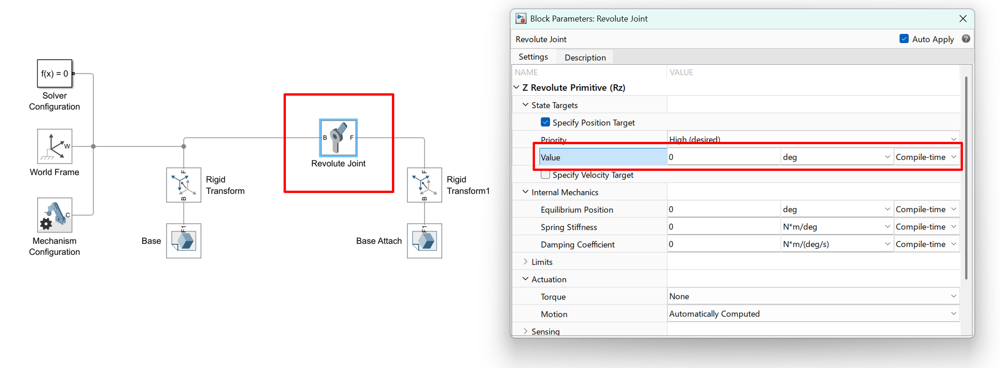

## 잠깐 Tip!

기구들을 조립하기 위한 모델링을 할 때 중요하게 파악해야하는 부분은 각 부품별로 프레임의 위치를 확인하는 것이다. 가령, 아래 그림과 같이 First Arm을 놓고 본다면, 이 First Arm이 다른 부품들과 연결될 프레임들의 위치를 First Arm을 중심으로 생각해야만 나중에 헷갈릴 일이 줄어든다.

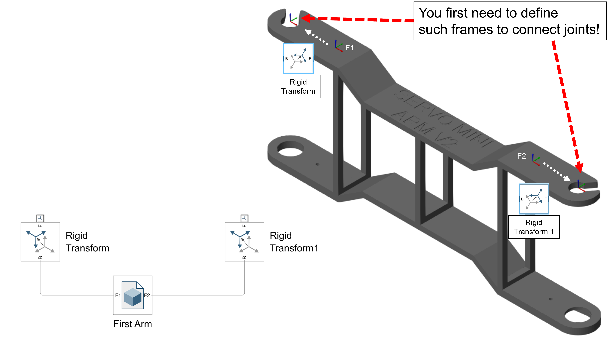

또 다른 팁은 모델을 Compile (단축키: Ctrl + D)하면 볼 수 있는 Multibody Explorer의 "Show Only This" 기능과 "Show Everything" 기능을 십분 활용하라는 것이다. 부품들이 많아지면 이 부품에 연결되는 프레임들이 어디 붙어있는지 헷갈리게 되어 있다. 이 "Show Only This"와 "Show Everything"을 번갈아가면서 활용하여 각 기구들의 frame이 원하는 위치와 방향으로 잘 놓여있는지 확인하는 것이 매우 중요하다.

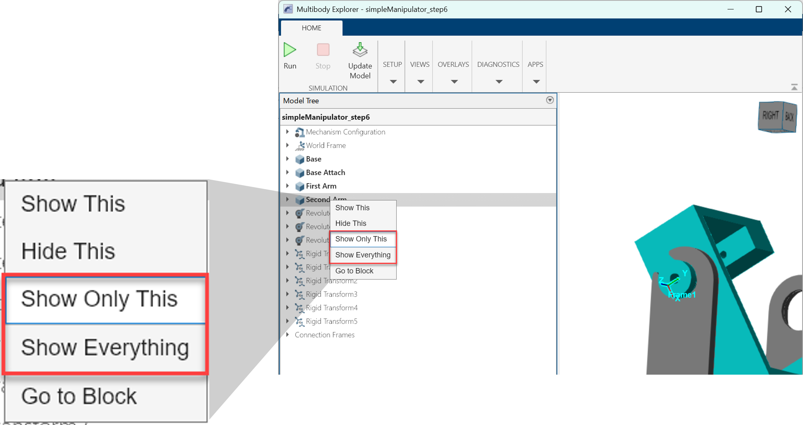

## 7. 여러 부품을 연결하면 ‘구조’가 보이기 시작한다

이제 Base와 Base Attach에 이어 First Arm, Second Arm, Servo 등을 차례 차례 연결하자.

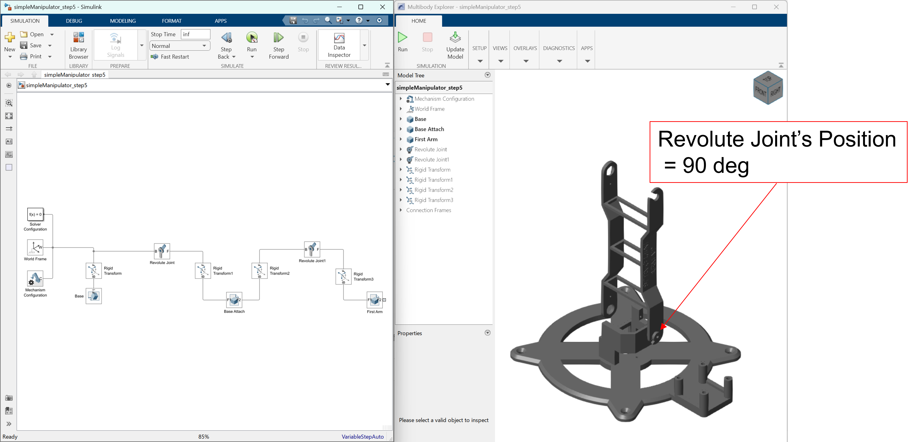

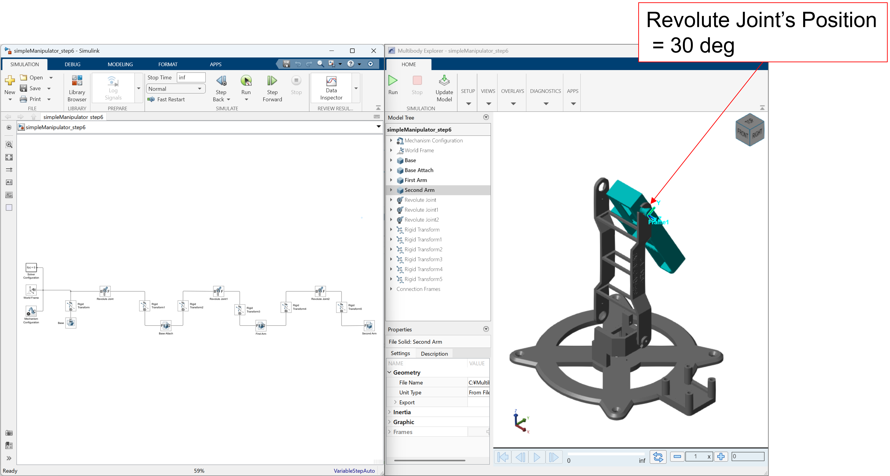

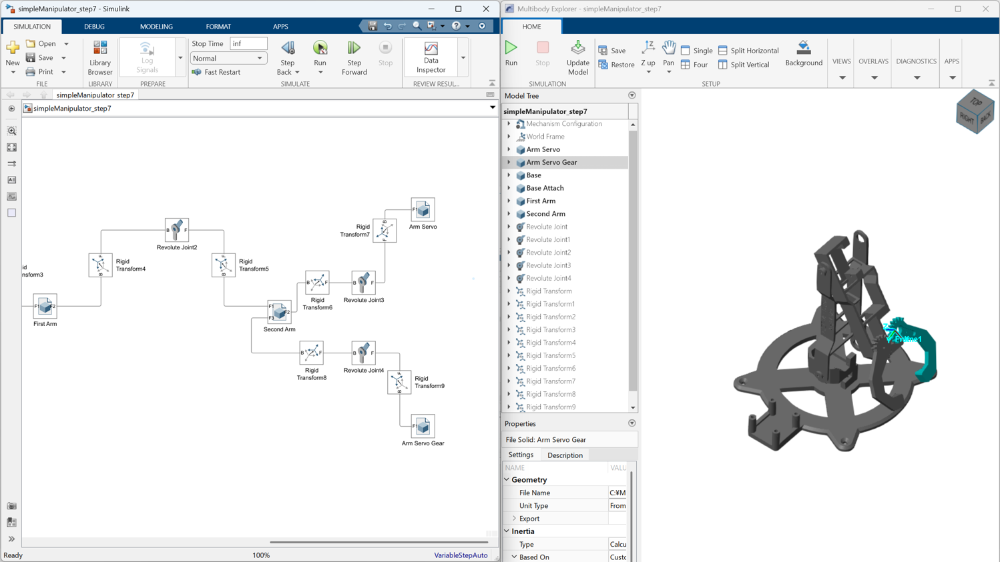

부품을 하나씩 연결하다 보면, 전체 구조가 드러난다.

이 시점에서 Multibody Explorer를 자주 확인하는 것이 중요하다.

- 어떤 부품이 기준이고
- 어떤 부품이 그 기준을 따라 움직이는지

구조를 눈으로 확인하지 않으면,  
조인트의 자유도 설정이나 방향 오류를 나중에 찾기 어렵다.

---

## 8. 이제 ‘움직임’을 제어할 차례이다

조인트가 제대로 연결되었다면, 토크 입력이나 위치 목표를 줄 수 있다. 이때 처음으로 제어 개념이 들어온다.

우선, 실제로는 매니퓰레이터에 모터가 들어가 토크 입력을 줄 때에는 어느정도 마찰이 존재하기 때문에 이 예제에서도  간단한 댐핑을 먼저 주고, 천천히 움직임을 확인한다.

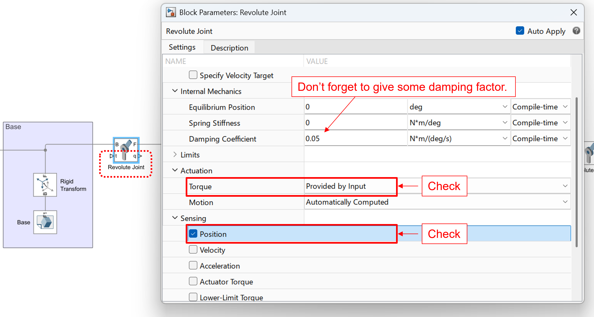

위 그림처럼 각 관절에 damping coefficient는 0.05 N*m/(deg/s)로 주고, Acuation의 Torque는 "Provided by Input"으로, Sensing의 Position을 체크하여 현재 위치 값을 받아준다.

이제 원하는 각도를 Constant 블록으로 주고, PID 제어기를 붙여서 torque 입력을 넣어주자. 혹시 PID 제어기에 대해 잘 모른다면 [이 링크](no01_WhatIsPIDControl.html)를 통해 확인해보자. Base와 Base Attach 사이의 관절만 토크 입력을 주고 나머지는 제어하지 않는 경우 아래와 같이 제어되는 것을 알 수 있다.

<video width = "100%" loop autoplay muted controls>
  <source src = "../../images/Multibody101/no03_Manipulator_Modeling/Media2.mp4">    
</video>

나머지 관절에도 PID 제어기를 아래와 같이 붙일 수 있다.

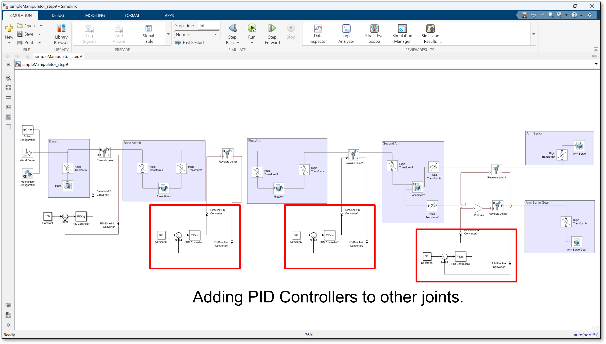

그럼 최종적으로 아래와 같이 각 관절을 제어할 수 있게 된다.

<video width = "100%" loop autoplay muted controls>
  <source src = "../../images/Multibody101/no03_Manipulator_Modeling/Media3.mp4">
</video>

---

## 9. 이 예제가 진짜로 가르치는 것

이번 핸즈온 예제의 핵심은 로봇 팔만은 아니며 다음 세 가지라고 볼 수 있다.

1. CAD 형상은 시작점일 뿐이다  
2. 프레임을 정의하지 않으면 조립은 없다  
3. 조인트는 프레임 관계를 표현하는 언어이다  

이 세 가지를 이해하면,  
매니퓰레이터가 아니라 차량 서스펜션이든, UAV 구조물이든 같은 방식으로 접근할 수 있다.

---

## 마무리

Multibody 모델링은 처음에는 벽이 높아 보이지만, 프레임과 조인트를 기준으로 사고하면 모델은 점점 논리적으로 설명 가능해진다. 

MathWorks에서는 다양한 Simscape Multibody를 이용한 예제들이 있으므로 꼭 참고해보길 바란다. [(링크)](https://www.mathworks.com/help/sm/examples.html?s_tid=CRUX_topnav&category=applications)

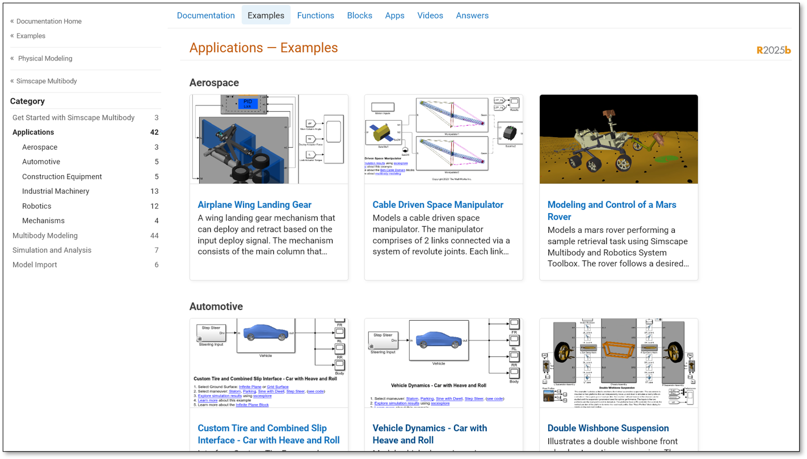