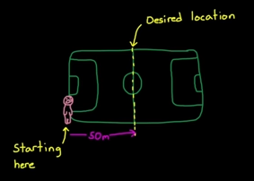
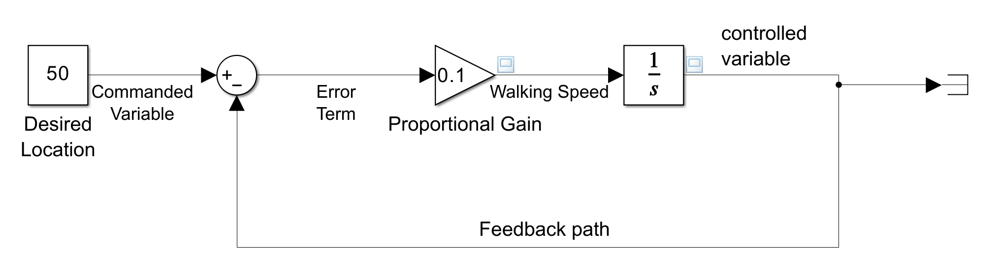
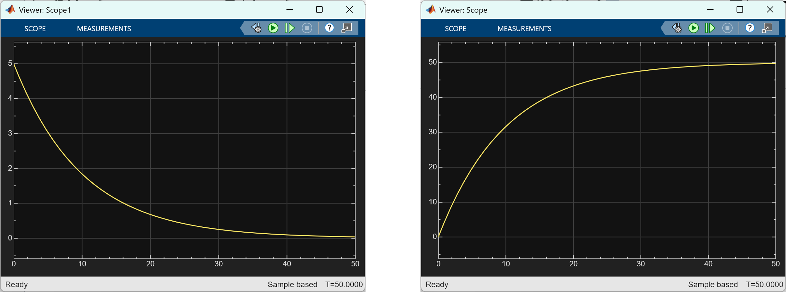
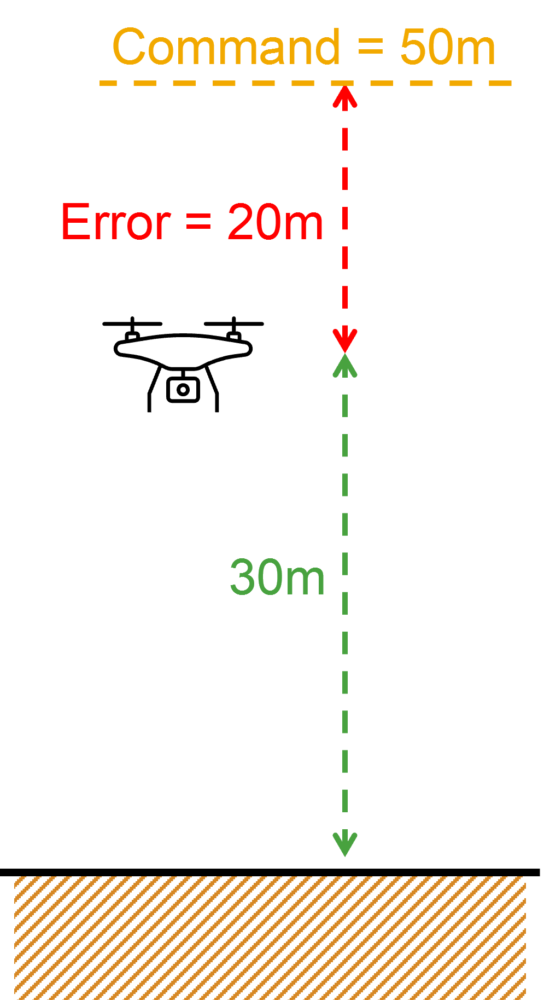
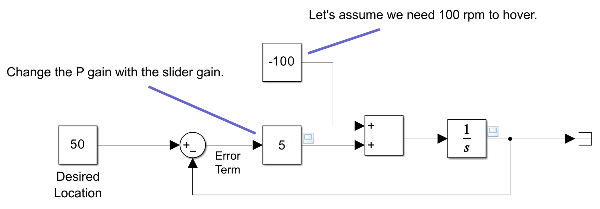
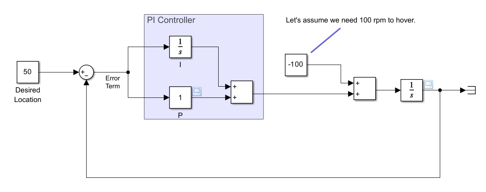
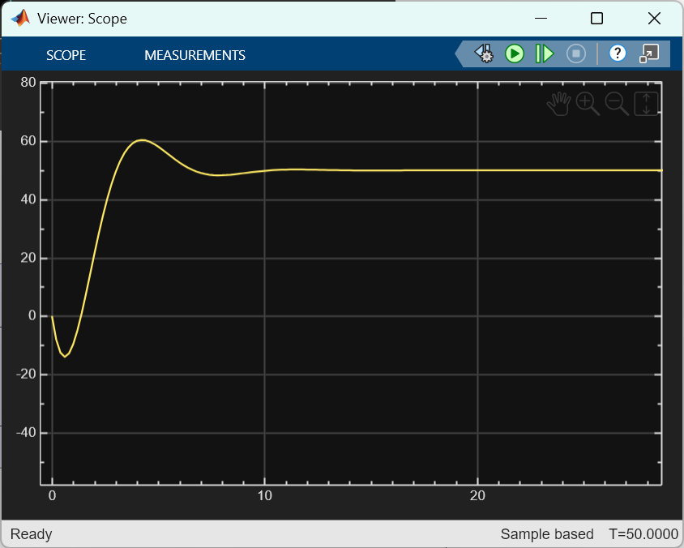
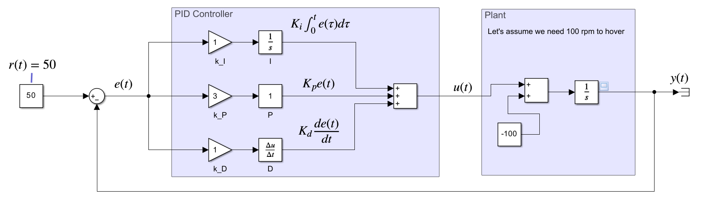
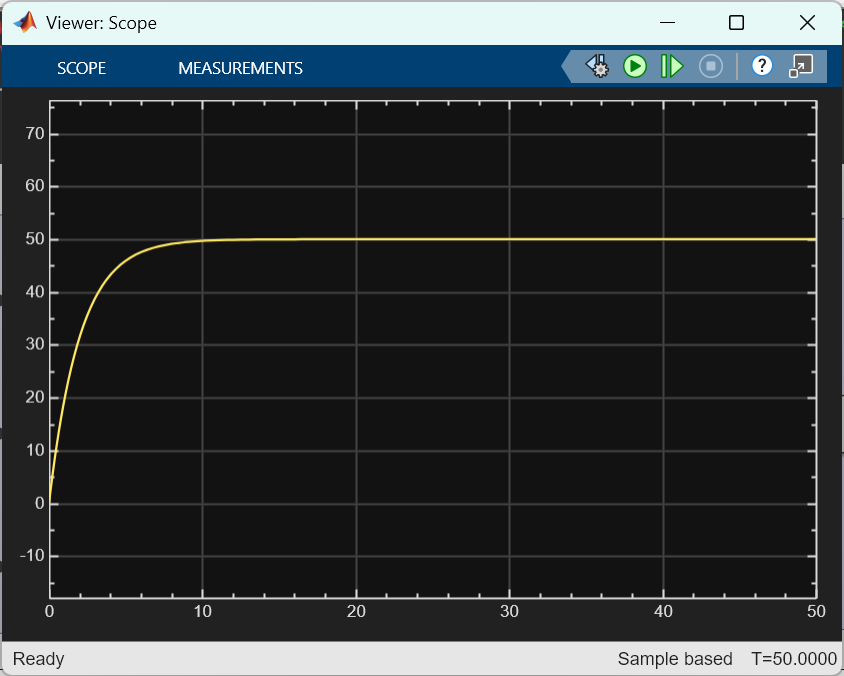

# PID 제어란 무엇인가? 공학 초심자를 위한 직관적 이해 (Part 1)

해당 포스팅은 아래 영상의 설명을 기반으로 하였으며, Google Gemini의 도움을 받아 작성되었습니다.

<iframe width="560" height="315" src="https://www.youtube.com/embed/wkfEZmsQqiA?si=F61Z5KxZbxGeGdvq" title="YouTube video player" frameborder="0" allow="accelerometer; autoplay; clipboard-write; encrypted-media; gyroscope; picture-in-picture; web-share" referrerpolicy="strict-origin-when-cross-origin" allowfullscreen></iframe>

이 포스팅에서 사용된 시뮬링크 모델들은 아래 링크에서 받으실 수 있습니다.

👉[**PID 101 Simulink Implementation**](https://github.com/angeloyeo/Quadcopter_Lessons/tree/main/UAV_Quadcopter_Lessons/UAV_03_QuadcopterControl/SimulinkModels/PID_Practice)

---

## 🚀 서론

공학 분야에서 **PID 제어(Proportional-Integral-Derivative Control)**는 가장 널리 사용되고 강력한 피드백 제어 기법 중 하나이다. 우리는 일상생활 속 수많은 시스템, 예를 들어 자동차의 크루즈 컨트롤, 보일러의 온도 유지, 드론의 자세 제어 등 다양한 분야에서 PID 제어의 원리가 활용된 경우가 많다.

이 글은 공학수학을 배우기 시작한 대학교 1학년 학생과 같이 제어 이론을 처음 접하는 독자를 위해, 복잡한 수학적 공식보다는 **직관적인 이해**에 초점을 맞추어 PID 제어의 기본 개념을 설명하는 데 목적이 있다. PID 제어의 세 가지 요소(비례, 적분, 미분)가 각각 어떤 역할을 하며, 왜 모두 필요한지에 대해 단계적으로 알아볼 것이다.

---

## 1. 제어 시스템의 기본 구조 및 오차 (Error)의 정의

모든 제어 시스템은 우리가 원하는 목표를 달성하기 위해 존재한다. 이를 이해하기 위해 몇 가지 용어를 정의한다.

1.  **플랜트 (Plant) 또는 시스템:** 우리가 제어하고자 하는 대상이다. (예: 드론, 모터, 온도 조절기)
2.  **명령 (Command) 또는 목표값 (Set-point):** 시스템이 도달해야 하는 원하는 값이다. (예: 고도 50m, 온도 25°C)
3.  **제어 변수(Controlled Variable) 혹은 출력 (Output):** 플랜트의 현재 상태를 나타내는 측정값이다.
4.  **조작량 (Actuating Signal)** 플랜트를 제어하기 위해 시스템에 가하는 신호이다. (예: 모터 회전 속도)

**피드백 제어 (Feedback Control)**의 핵심은 시스템의 **출력**을 다시 **명령**과 비교하여 그 차이를 계산하는 것이다. 이 차이를 **오차(Error)**라고 부른다.

$$\text{오차} = \text{명령} - \text{출력}$$

제어기의 목표는 이 오차를 0으로 수렴하게 만드는 조작량(입력)을 생성하는 것이다. [그림 1]은 이러한 피드백 제어 시스템의 기본적인 구조를 나타내는 블록 다이어그램이다.

 

> **[그림 1]** 피드백 제어 시스템의 기본 블록 다이어그램

---

## 2. 비례 제어 (Proportional Control, P 제어)의 원리

가장 단순한 형태의 제어는 **비례 제어(P 제어)**이다. P 제어는 **현재의 오차 크기에 비례**하는 조작량을 생성한다.

$$\text{조작량} = K_p \times \text{현재 오차}$$

여기서 $K_p$는 **비례 이득(Proportional Gain)**이며, 오차가 클수록 더 큰 힘을 가해 시스템을 빠르게 목표로 이동시키고, 오차가 작아질수록 힘을 줄여 부드럽게 멈추게 하는 역할을 한다. 마치 축구장 하프라인으로 걸어갈 때, 목표에서 멀수록 빠르게 걷고 가까워질수록 느리게 걷는 것과 유사하다.

 

> **[그림 2]** 비례 제어기(P Controller)의 비유: 축구장 왼쪽 끝에서 하프라인까지 걸어가게 만들기

맨 첫 번째 스텝에서는 희망 위치는 50 이지만 현재 위치는 0 이므로, 에러가 50에 이른다. 우리가 집중하고 있는 비례 제어 (Proportional Control)을 이용한다는 것은 그림 1의 Controller에 Gain 블록을 쓰는 것과 같다. 만약, Gain 블록의 값을 0.1이라고 한다면, $Error \times 0.1 = 50 \times 0.1 = 5$ 만큼 actuating signal로 입력을 줄 수 있게 된다. 이를 통해, 그림 2의 사람으로 표시된 "plant"는 5라는 입력만큼 걸어간다. 

이제는 희망 위치가 50이고, 현재 위치는 5가 되므로, 에러가 45가 된다. Gain 값이 0.1이라면 actuating input은 4.5가 될 것이고, 사람(Plant)은 총 9.5만큼 걸어갔을 것이다. 이와 같이 Proportional Controller는 에러의 크기에 비례해 actuating signal 값을 주면서 plant의 출력값에 의해 발생하는 error가 0이 되도록 한다.

이를 시뮬링크에서 모델로 만들면 아래와 같다. 모델은 [여기](https://github.com/angeloyeo/Quadcopter_Lessons/tree/main/UAV_Quadcopter_Lessons/UAV_03_QuadcopterControl/SimulinkModels/PID_Practice)에서 받을 수 있는 "no1_proportional_controller.slx"라는 모델이다. 이 모델에서 Plant는 actuating input을 계속 누적해서 받으므로 [integrator 블록](https://www.mathworks.com/help/simulink/slref/integrator.html)을 이용했다. 

 

> **[그림 3]** 비례 제어기(P Controller)를 포함한 제어 시스템의 블록 다이어그램과 P 제어만으로 구현된 Simulink 모델 

시뮬레이션을 50초간 돌려보면 Walking Speed는 에러가 줄어듦에 따라 함께 줄어들고, Controlled Variable인 이동거리가 50에 점점 수렴하는 것을 알 수 있다.

 

> **[그림 4]** (왼쪽) 비례 제어기(P Controller)를 포함한 제어 시스템에서 Actuating Signal (Walking Speed)가 갈수록 줄어들고 있다. (오른쪽) Controlled Variable인 이동거리가 명령 변수 50에 가까워지는 것을 알 수 있다.

---

## 3. P 제어의 한계와 적분 제어 (Integral Control, I 제어)의 도입 (PI 제어)

P 제어는 간단하고 빠르게 반응하지만, 모든 상황에서 완벽하지는 않다. 특히, **중력**과 같은 지속적인 외란이 존재하는 시스템(예: 드론의 고도 제어)에서는 **정상 상태 오차(Steady-State Error)**라는 문제가 발생한다.

드론을 50m 고도에 띄우려 할 때, P 제어는 오차가 0이 되는 순간 모터 출력을 멈춘다. 하지만 중력을 이기고 50m 고도를 유지하려면 모터가 계속 돌면서 특정 힘(예: 100RPM)을 내야 한다. P 제어는 오차가 0이 되면 출력을 0으로 만들기 때문에, 드론은 목표보다 낮은 고도(예: 30m)에서 모터 출력이 100RPM이 되어 중력과 균형을 이루고 멈추는 오차가 발생한다. 이것이 정상 상태 오차이다.

 

> **[그림 5]** 드론이 계속 떠있기 위해서 어느정도의 추력(여기서는 100)이 필요하게 되며, 이에 의해 지속적으로 오차가 발생한다. 이 그림에서와 같이 P gain의 값이 5라면, 20 의 에러가 발생했을 때 지속적인 오차 (100)를 겨우 상쇄하면서 떠있을 수 있게 된다.

이 현상을 더 잘 이해하기 위해서 steady-state error가 도입되는 현상을 시뮬링크 모델에서 구현하자면 아래와 같다. 모델은 [여기](https://github.com/angeloyeo/Quadcopter_Lessons/tree/main/UAV_Quadcopter_Lessons/UAV_03_QuadcopterControl/SimulinkModels/PID_Practice)에서 받을 수 있는 "no2_proportional_controller_steady_state_error.slx"라는 모델이다.

 

> **[그림 6]** "-100"이라고 적힌 constant block이 steady-state error를 표현하고 있다. Error Term 및 P gain을 거쳐 나오는 actuating signal에 -100이라는 steady-state error 값이 지속적으로 추가되고 있다. 

이 때, Scope 값을 찍어보면 고도는 30으로 계속 유지되는 것을 알 수 있다.

 

> **[그림 7]** 그림 6의 steady-state error가 존재하는 상황에서의 고도 변화 시뮬레이션 결과

이 오차를 해결하기 위해 **적분 제어(I 제어)**가 도입된다. I 제어는 **과거 오차를 모두 누적(적분)**하여 조작량을 생성한다.

$$\text{조작량}_\text{I} = K_i \times \int (\text{과거 오차}) \, dt$$

시스템에 오차가 남아있는 한, 이 오차는 계속해서 누적되어 적분값이 증가한다. 이 누적된 값은 플랜트의 조작량을 점점 증가시켜, 결국 오차를 0으로 만들고 목표 지점에 도달하게 할 만큼 충분한 힘을 보상한다. 오차가 0이 된 후에도, 과거의 누적값은 그대로 유지되어 드론이 50m에서 중력을 이기고 호버링할 수 있도록 100RPM의 출력을 유지하게 하는 것이다.

P 제어와 I 제어를 합친 것을 **PI 제어**라고 한다. PI 제어는 정상 상태 오차를 제거하는 데 매우 효과적이다.

이 현상을 시뮬링크 모델에서 구현하자면 아래와 같다. 모델은 [여기](https://github.com/angeloyeo/Quadcopter_Lessons/tree/main/UAV_Quadcopter_Lessons/UAV_03_QuadcopterControl/SimulinkModels/PID_Practice)에서 받을 수 있는 "no3_PI_Controller.slx"라는 모델이다.

 

> **[그림 8]** PI 제어기(PI Controller)를 포함한 제어 시스템의 블록 다이어그램과 PI 제어만으로 구현된 Simulink 모델

시뮬레이션 결과를 보면 PI 제어기를 이용하면 steady-state error를 효과적으로 상쇄할 수 있으며, 최종적으로 원하는 50m에 도달하게 되는 것을 알 수 있다.

 

> **[그림 9]** PI 제어기(PI Controller)를 포함한 제어 시스템의 시뮬레이션 결과

---

## 4. PI 제어의 한계와 미분 제어 (Derivative Control, D 제어)의 도입 (PID 제어 완성)

PI 제어는 정상 상태 오차를 제거하지만, 시스템의 응답 속도를 빠르게 하려다 보면 목표 지점을 지나쳤다가 다시 돌아오는 **오버슈팅(Overshooting)**과 진동 문제가 쉽게 발생한다. (이 현상을 그림 9에서 확인할 수 있다. 신호가 60까지 올라갔다가 다시 50으로 내려온다.) 이는 I 제어가 과거의 오차만을 보기 때문에 **미래를 예측하지 못하기** 때문이다.

오버슈팅을 방지하고 시스템의 안정성을 높이기 위해 **미분 제어(D 제어)**가 도입된다. D 제어는 **오차의 변화율(Rate of Change)**, 즉 오차가 얼마나 빠르게 줄어들고 있는지를 보고 조작량을 생성한다.

$$\text{조작량}_\text{D} = K_d \times \frac{d}{dt} (\text{오차})$$

드론이 목표 고도에 빠르게 접근할 때(오차가 급격히 감소할 때), 오차의 변화율은 큰 음수 값을 가진다. D 제어는 이 음수 값에 비례하는 제어 신호를 발생시켜, 목표에 도달하기 직전에 **미리 속도를 줄이는 역할**을 한다. 이는 마치 자동차로 목적지에 접근할 때, 브레이크를 밟아 속도를 미리 감속하여 목표 지점을 정확하게 통과하는 것과 같다.

이로써 **PID 제어(Proportional-Integral-Derivative Control)**가 완성된다. PID 제어는 현재(P), 과거(I), 미래(D)의 오차 정보를 모두 사용하여 시스템을 가장 빠르고 안정적이며 정확하게 제어할 수 있는 보편적인 제어 방식이 되는 것이다. 모델은 [여기](https://github.com/angeloyeo/Quadcopter_Lessons/tree/main/UAV_Quadcopter_Lessons/UAV_03_QuadcopterControl/SimulinkModels/PID_Practice)에서 받을 수 있는 "no4_PID_Controller.slx"라는 모델이다.

 

> **[그림 10]** 최종적인 PID 제어기(PID Controller)를 포함한 제어 시스템의 블록 다이어그램과 PID 제어로 완성된 Simulink 모델 

시뮬레이션 결과에서도 오버슈팅이 사라지고, 부드럽게 신호가 원하는 고도인 50 으로 값이 바뀌는 것을 알 수 있다.

 

> **[그림 11]** 최종적인 PID 제어기(PID Controller)를 포함한 모델의 시뮬레이션 결과. PI 제어기에서 발생한 오버슈팅이 사라지는 것을 볼 수 있다.

---

## 5. 결론 및 다음 단계

PID 제어는 세 가지 요소, 즉 **비례(P)**는 현재 오차에 반응하여 응답 속도를 결정하고, **적분(I)**은 과거 오차를 누적하여 정상 상태 오차를 제거하며, **미분(D)**은 오차의 변화율을 감지하여 오버슈팅을 방지하고 안정성을 확보한다. 이 세 가지 요소의 **게인값 ($K_p, K_i, K_d$)을 조정(튜닝)**하는 과정을 통해 원하는 성능을 얻을 수 있다.

PID 제어는 공학에서 가장 기본적인 제어기로서, 그 원리를 직관적으로 이해하는 것은 모든 제어 이론 학습의 출발점이다. 다음 글에서는 PID 제어기를 실제로 Simulink로 구현해보고, 각 게인값 변화에 따른 시스템의 응답을 관찰하는 **튜닝(Tuning)** 과정에 대해 심층적으로 다루어 볼 것이다.