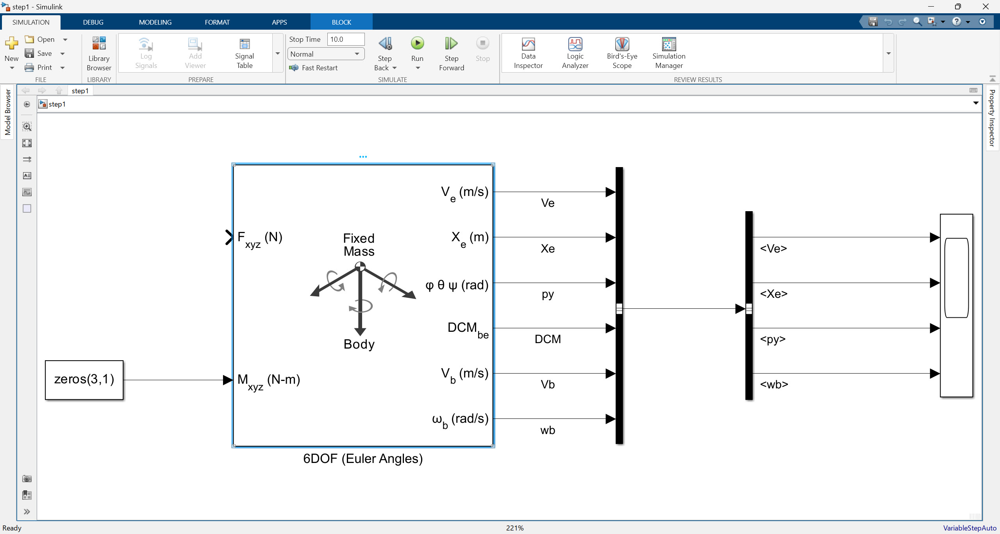
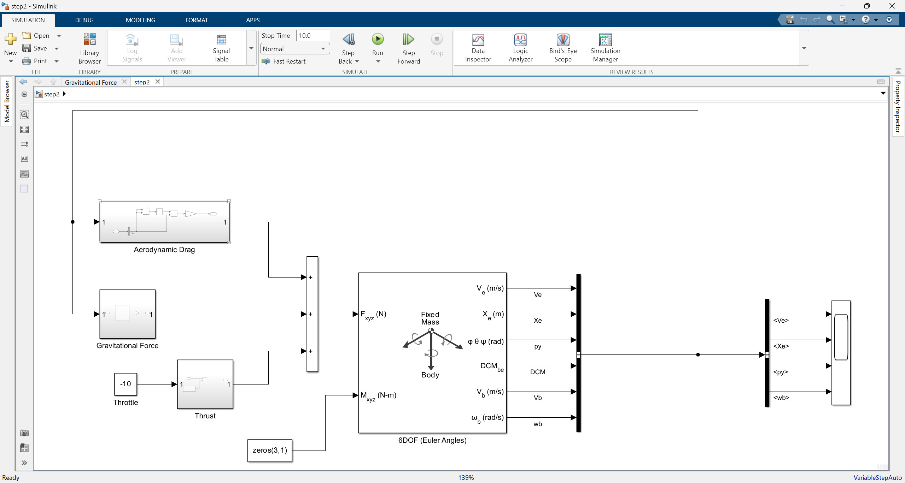
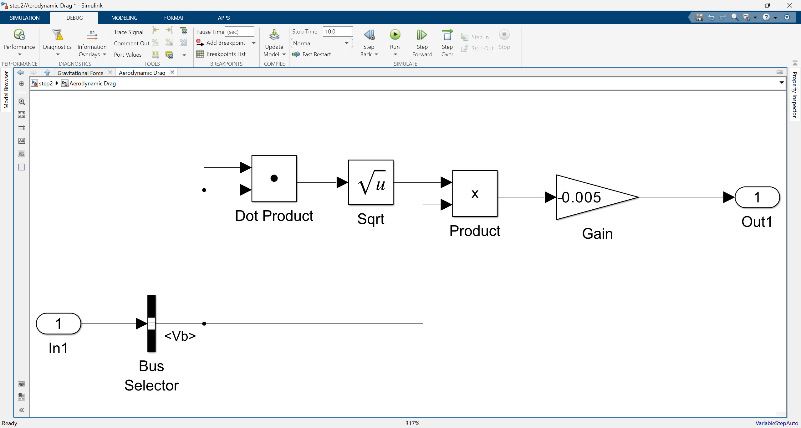
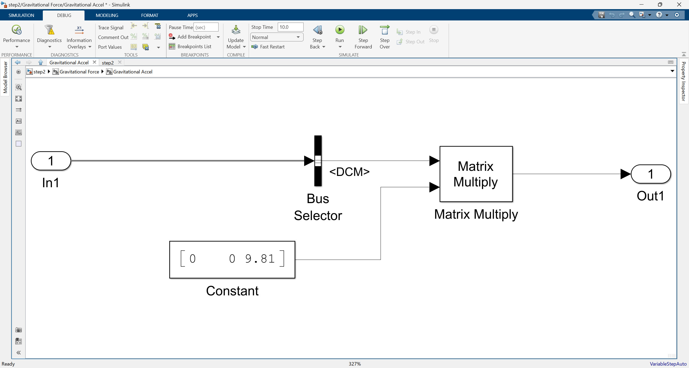
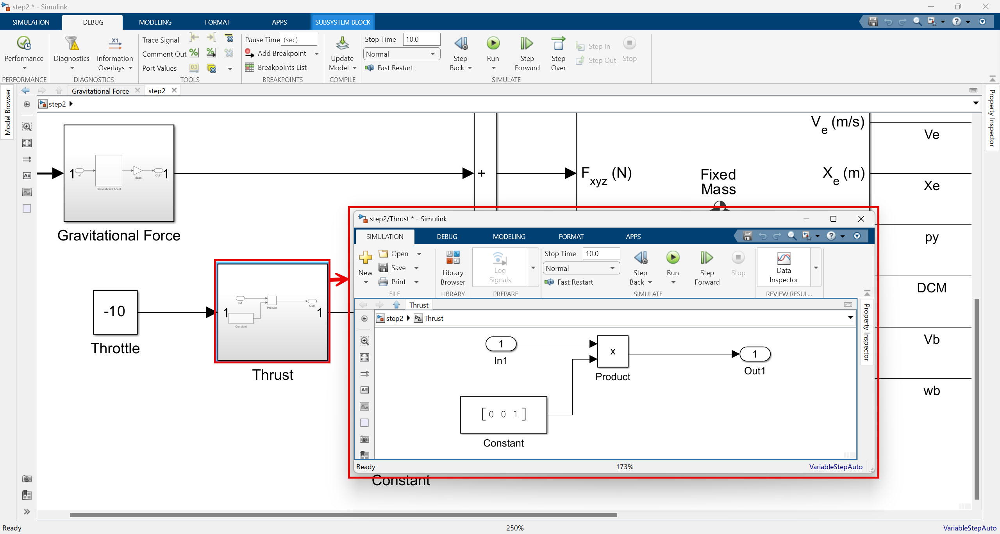
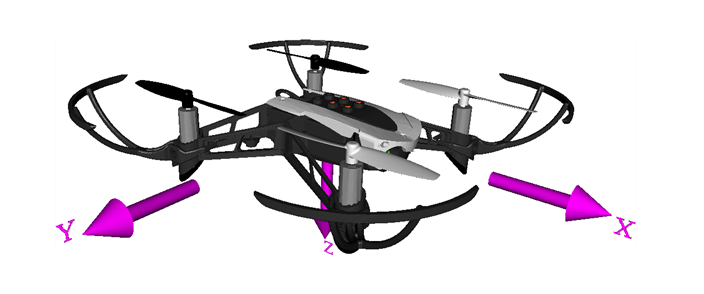
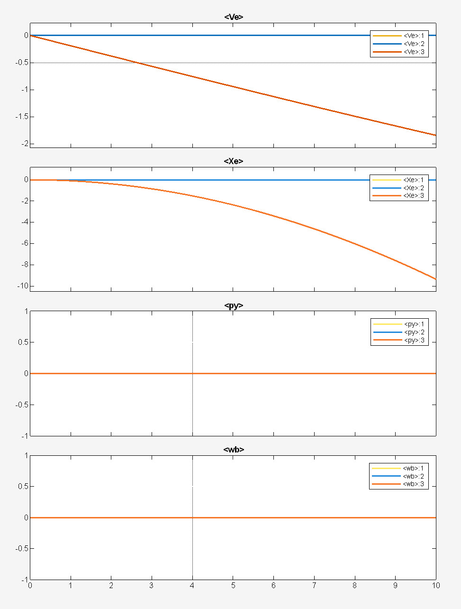
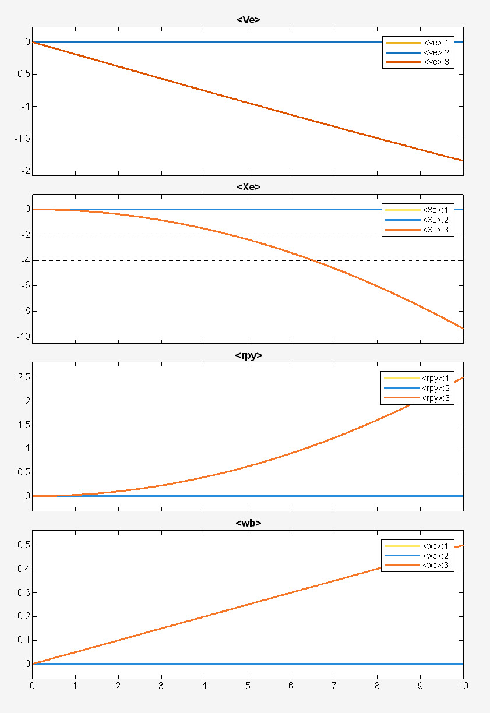

# Simulink로 에어프레임 모델 구축하기 (쿼드콥터 UAV를 위한 동역학 모델링)

안녕하세요! 이번 포스팅에서는 Simulink를 활용하여 비행체의 핵심이라고 할 수 있는 **에어프레임 모델**을 구축하는 방법에 대해 자세히 알아보겠습니다. 특히, 쿼드콥터 무인 항공기(UAV)를 위한 모델링에 초점을 맞추며, 에어프레임의 움직임을 지배하는 물리 원리들을 쉽게 살펴보겠습니다.

해당 포스팅은 아래 영상의 설명을 기반으로 하였으며, Google Gemini의 도움을 받아 작성되었습니다.

<iframe width="560" height="315" src="https://www.youtube.com/embed/uQXS3aeMUhY?si=vFu2nWpl3tRePQdE" title="YouTube video player" frameborder="0" allow="accelerometer; autoplay; clipboard-write; encrypted-media; gyroscope; picture-in-picture; web-share" referrerpolicy="strict-origin-when-cross-origin" allowfullscreen></iframe>

이 포스팅에서 사용된 시뮬링크 모델들은 아래 링크에서 받으실 수 있습니다.

👉[**Quadcopter\_Lessons**](https://kr.mathworks.com/matlabcentral/fileexchange/115770-quadcopter_lessons?s_tid=prof_contriblnk)

---

## 1. 학습 목표 (Learning Goals)

이 모듈을 완료하면 다음과 같은 내용을 이해할 수 있습니다:

* 쿼드콥터의 움직임 유형을 설명할 수 있습니다.
* 에어프레임에 사용되는 물리적 운동 방정식을 설명할 수 있습니다.
* 간단한 질량 블록이 방정식을 어떻게 구현하는지 설명할 수 있습니다.
* Simulink에서 에어프레임 모델을 구현할 수 있습니다.
* Simulink를 사용하여 모델 시스템의 해를 구할 수 있습니다.
* 다양한 강제력(forcings) 하에서 에어프레임 모델의 동작을 설명할 수 있습니다.
* 원하는 동작을 생성하는 강제 함수를 설계할 수 있습니다.

---

## 2. 에어프레임 모델이란?

에어프레임 모델은 비행체의 **시스템 모델**을 구성하는 핵심 요소입니다. 쿼드콥터 UAV를 예로 들면, 이 모델은 외부 **환경 요인**과 UAV의 **물리적 매개변수**를 입력으로 받아, 비행체의 **상태 방정식**을 계산하고 실제와 같은 움직임을 시뮬레이션합니다.

간단히 말해, 에어프레임 모델은 비행체에 어떤 힘과 토크가 가해졌을 때, 비행체가 어떻게 움직이고 자세를 바꿀지를 예측하는 역할을 합니다. 에어프레임은 또한 관성 기준 프레임과 바디 기준 프레임 간의 변환을 계산합니다. 앞으로 프로펠러 및 모터 기능, UAV 매개변수, 명령 및 제어 알고리즘, 센서 피드백 등에 대해서도 다룰 예정입니다.

---

## 3. 에어프레임 모델 구축 시작하기: 6자유도 (Euler Angles) 블록의 활용

Simulink에서 에어프레임 모델을 구축하려면 먼저 Simulink 창을 열고 라이브러리 브라우저에서 필요한 블록을 가져와야 합니다. 이 비디오에서는 특히 [**6자유도 (Euler Angles) 블록**](https://kr.mathworks.com/help/aeroblks/6dofeulerangles.html){:target="_blank"}을 활용하여 모델을 구축합니다.

     

### 6자유도 (Euler Angles) 블록과 에어프레임 모델의 연관성

**6자유도 (6 Degrees of Freedom) 블록**은 비행 물체의 움직임을 시뮬레이션하는 데 있어 핵심적인 '물리 엔진' 역할을 합니다. 6자유도는 3개의 선형 이동(앞뒤, 좌우, 상하)과 3개의 회전 이동(롤, 피치, 요)을 포함하여 물체가 공간에서 가질 수 있는 모든 움직임을 의미합니다. 여기서 (Euler Angles)는 이러한 회전 움직임을 '오일러 각'이라는 방식으로 표현한다는 뜻입니다.

이 블록은 에어프레임에 **가해지는 힘(Forces)과 토크(Torques)를 입력**으로 받습니다. 그리고 이 입력값을 기반으로 비행체의 **속도, 위치, 오일러 각(자세), 그리고 가속도**와 같은 다양한 출력값을 계산하여 제공합니다.

### 에어프레임 운동 원리 살펴보기

에어프레임의 움직임을 지배하는 물리 원리는 크게 두 가지로 나눌 수 있어요.

1.  **병진 운동 (Translational Motion): 물체의 위치와 속도 변화**

    * **이야기:** 병진 운동은 비행기가 마치 미끄러지듯이 **직선으로 움직이거나 속도를 바꾸는 것**을 말해요. 여러분이 자동차를 운전할 때 가속 페달을 밟으면 차가 앞으로 빠르게 나아가고, 브레이크를 밟으면 멈추는 것과 같아요. 비행기도 프로펠러가 미는 힘, 날개가 위로 뜨는 힘, 공기 저항, 그리고 중력 같은 '힘'을 받으면 속도가 변하고 위치가 이동해요.
    * **Simulink 6DOF 블록과의 연결:** 6자유도 블록은 비행기에 어떤 '힘'이 가해지는지 알면, 그 힘이 비행기의 '질량'과 '현재 움직임 상태'에 따라 얼마나 빠르게 가속하거나 감속해서 어디로 이동할지 계산해 줍니다. 마치 복잡한 계산기가 이 모든 것을 알아서 처리해 주는 거죠.

2.  **회전 역학 (Rotational Dynamics): 물체의 회전 자세 변화**

    * **이야기:** 회전 역학은 비행기가 제자리에서 **기울거나, 코를 들거나 내리거나, 좌우로 방향을 트는 것**처럼 '회전'하는 움직임을 말해요. 여러분이 자전거를 탈 때 핸들을 돌려 방향을 바꾸거나, 병뚜껑을 돌려 열 때처럼 물체를 '회전시키는 힘'이 필요하죠. 비행기에서는 이런 회전시키는 힘을 '토크'라고 불러요. 쿼드콥터의 경우, 각각의 프로펠러가 내는 힘을 조절하여 이런 토크를 만들어요.
    * **Simulink 6DOF 블록과의 연결:** 6자유도 블록은 비행기에 어떤 '토크'가 가해지는지 알면, 비행기의 '모양'과 '질량 분포(관성 모멘트)'에 따라 얼마나 빠르게 회전 가속할지 계산해서 비행기의 '자세'가 어떻게 변할지 알려줍니다.

3.  **오일러 각 변화율 (Rate of Change of Euler Angles): 비행기의 자세 표현**

    비행기의 자세는 '오일러 각'이라는 세 가지 각도($\phi, \theta, \psi$)로 표현해요.
    * $\phi$: **롤(Roll) 각** - 비행기가 좌우로 기우는 정도 (날개가 뱅글뱅글 도는 것처럼)
    * $\theta$: **피치(Pitch) 각** - 비행기가 코를 들거나 내리는 정도 (고개를 끄덕이는 것처럼)
    * $\psi$: **요(Yaw) 각** - 비행기가 좌우로 방향을 트는 정도 (머리를 좌우로 돌리는 것처럼)

    Simulink 6자유도 블록은 비행기가 어떤 속도로 회전하고 있는지(각속도 $p, q, r$)를 알면, 이 세 가지 오일러 각이 얼마나 빠르게 변하는지를 계산해서 비행기의 실시간 자세를 추적합니다.

### 모델링 가정 (Modeling Assumptions)

이 에어프레임 모델에는 몇 가지 중요한 가정이 있습니다.

1.  **질량은 일정합니다.** 이는 전기 쿼드콥터에는 합리적이지만, 연료를 소비하는 내연기관 쿼드콥터에는 적합하지 않을 수 있습니다.
2.  **오일러 각은 피치 각($\theta$)이 $\pm 90^{\circ}$ (코가 완전히 위나 아래를 향할 때)일 때는 수학적으로 정의되지 않는 '특이점'을 가집니다.** 이 모델에서는 일반적으로 작은 피치 각만 다루므로 문제가 되지 않습니다.

### Simulink 6자유도 블록의 내부 동작 (상태 방정식 구현)

위에서 설명한 병진 운동, 회전 역학, 그리고 자세 변화의 물리 원리들은 실제로는 복잡한 수학 방정식으로 이루어져 있어요. 하지만 여러분은 이 방정식을 직접 풀 필요가 없습니다! Simulink의 6자유도 블록이 바로 이 모든 **복잡한 계산을 내부적으로 처리**해 줍니다.

우리가 할 일은:
* 비행기의 **물리적 특성(질량, 관성 모멘트 등)**을 블록에 설정해 줍니다.
* 비행기에 가해지는 **힘(추력, 중력, 항력 등)과 토크(회전시키는 힘)**를 블록의 입력으로 넣어줍니다.

그러면 6자유도 블록은 현재 비행기의 **위치, 속도, 자세(오일러 각), 그리고 가속도**와 같은 모든 정보를 계산해서 출력으로 보여주는 거예요. 마치 비행기의 '두뇌' 역할을 하는 셈이죠.

---

## 4. Simulink 모델 설명

Simulink 모델을 구축하는 데 필요한 몇 가지 핵심 블록들이 있습니다.

* **Fixed Mass Body Euler Angles Equations of Motion Block:** [**6자유도 (Euler Angles) 블록**](https://kr.mathworks.com/help/aeroblks/6dofeulerangles.html){:target="_blank"}의 정식 명칭이며, 질량이 고정된 물체의 오일러 각 기반 운동 방정식을 구현합니다.
* **Bus Creator / Bus Selector:** 여러 신호들을 하나의 '버스'로 묶거나, 묶인 버스에서 필요한 신호를 선택할 때 사용합니다. 모델의 가독성을 높여줍니다.
* **Scope:** 시뮬레이션 결과를 그래프로 시각화하여 보여주는 블록입니다.
* 그 외 기본적인 연산 블록들 (덧셈, 곱셈, 상수 등)이 사용됩니다.

영상에 나오는 순서대로 모델을 그려나가보자면 아래와 같습니다. 세 단계의 모델로 구성되어 있으며 모델들은 아래 링크에서 받을 수 있습니다.

👉[**Simulink Model 받으러 가기**](https://github.com/angeloyeo/Quadcopter_Lessons/tree/main/UAV_Quadcopter_Lessons/UAV_01_AirFrame/SimulinkModels/ModelsInVideo){:target="_blank"}

 

위 그림에서 제일 중심적인 역할을 하는 것은 아무래도 6DOF 블록입니다. 6DOF 블록은 앞서 설명한 것과 같이 물리엔진의 역할을 해주는 녀석이며, 원하는 병진운동 힘과 회전 운동 토크를 입력하면 기체 고정 좌표계(body-fixed coordinate frame)와 지면 기준 좌표계(flat Earth reference frame)을 고려한 속도, 위치, 오일러 각을 제공해줍니다. 6DOF 블록 뒤에 있는 Bus creator, Bus selector를 이용해서 원하는 신호를 가져오는 것이 포인트라고 할 수 있겠습니다. 여기서는 아무런 힘도 주어지지 않은 상태이고, 토크 값은 모두 0이므로 회전 운동은 하지 않도록 설계되어 있습다.

 

이제 step2 모델에서는 외력에 해당하는 값들을 왼쪽 위에 보이는 subsystem의 형태로 넣어줍니다. 힘의 종류는 크게 세 가지로 상정되어 있는데 (1) Aerodynamic Drag, (2) Gravitational Force, (3) Thrust 입니다. 

 

우선 Aerodynamic Drag 부터 보면, Vb (Velocity in the body-fixed frame) 속도 벡터값을 가져오고 아래 수식과 같은 계산 과정을 거치게 됩니다.

$$\vec{F}_{drag} = -0.005 \times ||V_b|| \times V_b$$

여기서 $V_b$는 Veolcity in the body-fixed frame에 해당하는 3차원 벡터를 의미한 것입니다.

**공기역학적 항력(Aerodynamic Drag)**은 쿼드콥터와 같이 공기 중에서 움직이는 물체에 작용하는, **운동 방향에 반대되는 저항력**을 의미합니다. 이 힘은 쿼드콥터의 속도가 빨라질수록 증가하여 비행체의 속도를 늦추려는 경향이 있습니다. 0.005라는 값은 비행체의 형태, 표면의 거칠기, 공기의 밀도, 그리고 속도에 의해 결정되는 항력 파라미터인데 여기서는 임의로 결정된 것이라고 봐도 좋을 것 같습니다. 

 

또, Gravitational Force 부분을 보면, [0, 0, 9.81]이라는 중력가속도 벡터에 DCM 행렬을 곱해준 것이 전부입니다. DCM 행렬은 지면 기준 좌표계와 기체 고정 좌표계 간의 변환 관계를 설명하고 있으므로 결국 여기서 수행하는 것은 지구 중력이 기체에 미치는 가속도를 환산하여 적용하는 것임을 알 수 있습니다. 다운 받은 모델을 열어보면 바로 위 subsystem 한 단계 위 subsystme에서는 Mass와 곱해지는 것을 쉽게 확인할 수 있을 것입니다. 

 

마지막으로 Thrust 부분은 "추진력"을 의미하는데 -10이 subsystem의 입력으로 들어가고 [0, 0, 1] 벡터와 곱해진 것을 알 수 있습니다. 즉, 여기서는 지표좌표계를 기준으로 10N의 힘으로 윗 방향으로 추진력을 주겠다는 의미입니다. -10의 음수값이 들어가는 것은 드론의 앞으로 이동 방향을 x, 우측으로 이동 방향을 y, 지면으로의 방향을 z 로 설정하기 때문입니다.

 

---

## 5. 입력 힘(Forces) 설정

비행기에 가해지는 힘은 반드시 비행기 **자신(바디 프레임)을 기준**으로 입력해야 해요.

* **추력 (Thrust):** 프로펠러가 비행기를 위로 또는 앞으로 밀어내는 힘이에요.
* **중력 (Gravitational Force):** 지구 관성 프레임(지구 기준)에서 바디 프레임(비행기 기준)으로 변환되어 비행기에 적용됩니다.
* **토크 (Torques):** 비행기를 회전시키는 힘이에요. 이 초기 모델에서는 토크 입력은 모두 0으로 설정되어 있습니다.

### `Thrust = [0, 0, -10]` 의 의미

영상에서 스로틀 입력을 `-10`으로 설정하는 예시가 나옵니다. 여기서 `Thrust = [0, 0, -10]` 이라는 힘 벡터는 다음과 같이 해석됩니다:

* **X축 방향의 힘: 0** (앞뒤 움직임 없음)
* **Y축 방향의 힘: 0** (좌우 움직임 없음)
* **Z축 방향의 힘: -10** (Simulink에서 Z축이 '아래쪽'을 향한다고 가정할 때, `-10`이라는 음수 값은 Z축의 양의 방향(아래)과는 반대되는, 즉 **위쪽으로 10단위의 힘**이 가해지는 것을 의미합니다. 이는 쿼드콥터가 이륙하거나 상승할 때 필요한 **상향 추력**을 나타내는 것입니다.)

---

## 6. 시뮬레이션 결과 및 분석

첫 번째 시뮬레이션 결과는 매우 예측 가능합니다. 이 시뮬레이션에서는 토크 입력 없이 추력만 가해서 비행기를 띄워봅니다.

* **이륙 및 가속:** 이 경우, 추력이 중력보다 약간 더 커서 쿼드콥터는 **일정한 가속도**로 이륙합니다.
* **속도와 위치:** 속도 크기는 선형적으로 증가하며, 속도와 위치 값이 음수로 나타나는 것은 **Z축이 지면을 향하고 있기 때문**입니다. 즉, Z축이 아래를 향하는데 비행기가 위로 올라가므로 Z 위치는 점점 0에서 음수 방향으로 멀어지는 것을 의미합니다.

 

여기서 $Ve$와 $Xe$는 각각 지구 관성 기준 프레임의 속도와 위치를 나타냅니다. Ve는 일정한 음의 기울기를 가지는 변화를 보인다는 것을 알 수 있고, Xe는 그에 맞춰 2차 함수 곡선 형태로 변화하고 있는 것을 알 수 있습니다.

<video width = "100%" loop autoplay muted controls>
  <source src = "../../images/uav101/no01_Airframe/noTorque.mp4">    
</video> 아무런 토크 입력 없이 추력 10단위의 힘만 가해서 비행 시뮬레이션 하는 경우

이번에는 토크 값을 약간 조정해보겠습니다. Yaw 값을 아주 작게 줘볼게요 (0.005). 비행체가 빙글빙글 돌면서 올라가는 모습을 상상해보면 되겠습니다.

 

위 그림에서 볼 수 있듯이 $\omega_b$ 값이 선형적으로 변하는 것을 볼 수 있고 이에 따라 `rpy`의 세 번째 차원 값인 $\psi$(yaw)가 2차 함수의 형태로 변해가는 것을 볼 수 있습니다.

<video width = "100%" loop autoplay muted controls>
  <source src = "../../images/uav101/no01_Airframe/torqueYaw05.mp4">    
</video> Yaw에 대응하는 토크 값을 0.05만큼 입력하면서 추력 10단위의 힘을 가해 비행 시뮬레이션 하는 경우

### 초기 조건 조정

추력 값을 조절하여 쿼드콥터가 제자리에서 **호버링(Hovering)**할 수 있도록 힘을 결정하는 연습도 해볼 수 있습니다. 호버링은 추력과 중력이 정확히 균형을 이루어 공중에 정지해 있는 상태를 말합니다. 이 때는 Thrust 값을 [0, 0, 9.81] 처럼만 설정하면 되겠습니다.

---

## 결론

이 포스팅에서는 Simulink를 활용한 에어프레임 모델 구축의 핵심 원리들을 이야기 위주로 살펴보았습니다. 복잡한 수학 방정식 대신, 일상적인 비유를 통해 비행기의 움직임을 지배하는 물리 법칙들(병진 운동, 회전 역학), 그리고 비행 시뮬레이션에 필수적인 좌표계 개념을 이해하는 데 초점을 맞추었습니다.

Simulink의 6자유도 블록이 어떻게 이러한 물리적 계산을 대신해주는지 알게 되셨기를 바랍니다. 이러한 기본 지식은 앞으로 더 복잡한 비행체 제어 시스템을 만들고 이해하는 데 훌륭한 출발점이 될 것입니다.

이 포스팅이 Simulink를 이용한 에어프레임 모델링 이해에 도움이 되었기를 바랍니다! 궁금한 점이 있다면 언제든지 댓글로 질문해주세요.