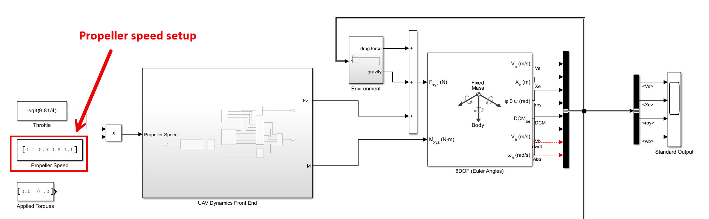
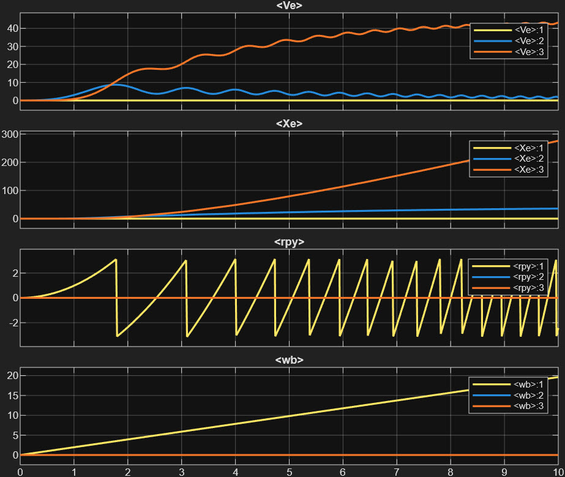
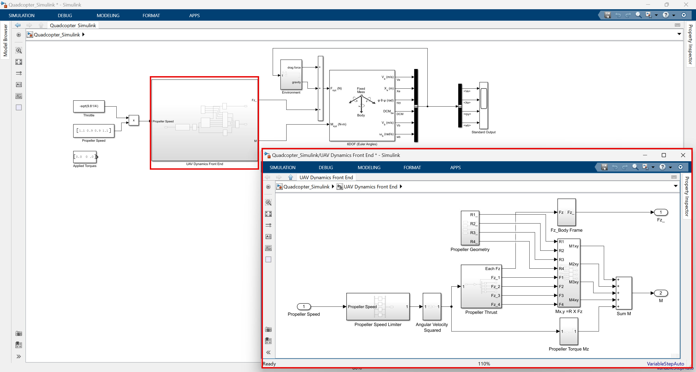
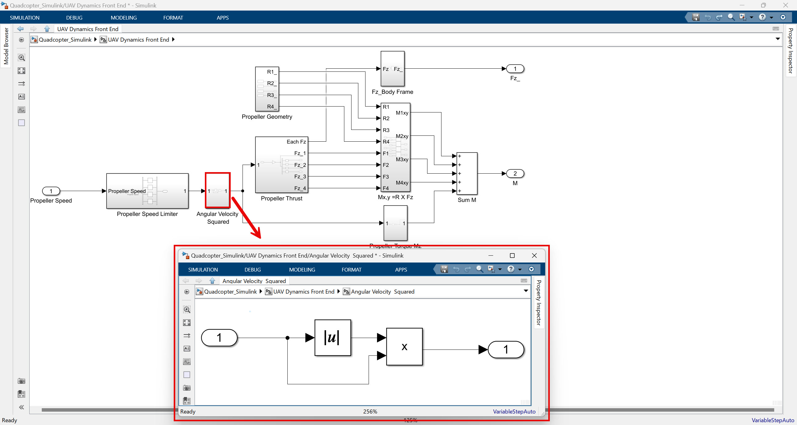
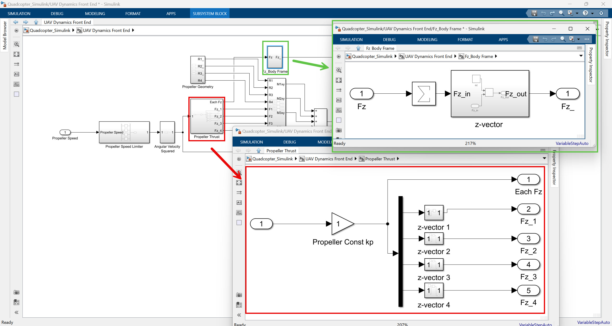
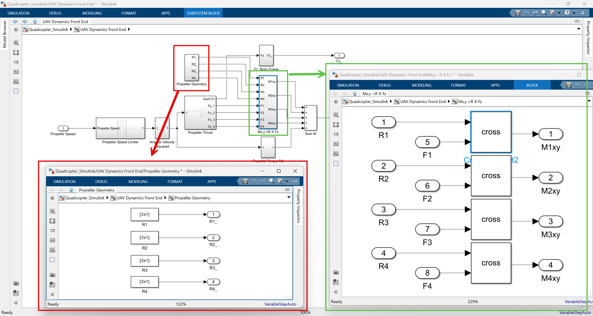
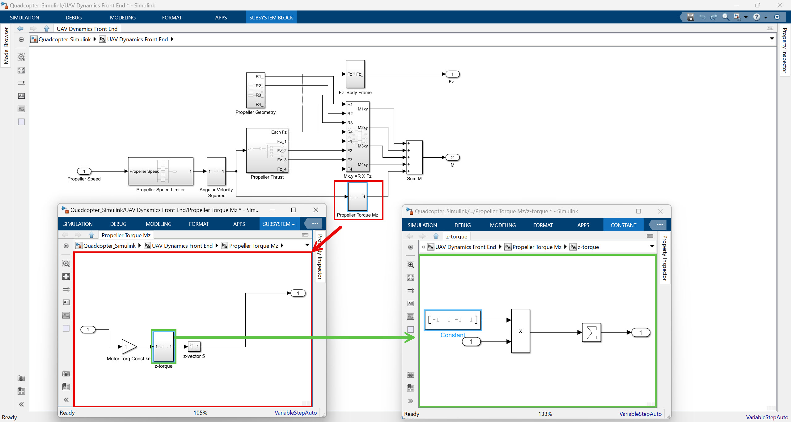

# Quadcopter의 비밀: 추력, 무게, 그리고 움직임의 조화 (UAV 시뮬레이션 #2)

안녕하세요! 지난 시간에는 Simulink를 이용하여 비행체의 움직임을 모델링하는 첫걸음, 에어프레임 모델에 대해 알아보았습니다. 이번 시간에는 조금 더 나아가 **쿼드콥터(Quadcopter)**라는 특정 형태의 UAV에 집중하여 그 독특한 특성과 움직임의 원리를 파헤쳐 보겠습니다. 특히, 프로펠러의 회전 속도가 어떻게 쿼드콥터의 움직임을 만들어내는지 Simulink 모델과 함께 자세히 살펴보겠습니다.

해당 포스팅은 아래 영상의 설명을 기반으로 하였으며, Google Gemini의 도움을 받아 작성되었습니다.

<iframe width="560" height="315" src="https://www.youtube.com/embed/cViiIFEXujc?si=qRgitYLhBaK7HG-4" title="YouTube video player" frameborder="0" allow="accelerometer; autoplay; clipboard-write; encrypted-media; gyroscope; picture-in-picture; web-share" referrerpolicy="strict-origin-when-cross-origin" allowfullscreen></iframe>

이 포스팅에서 사용된 시뮬링크 모델들은 이전과 동일하게 아래 링크에서 받으실 수 있습니다.

[**Quadcopter\_Lessons**](https://kr.mathworks.com/matlabcentral/fileexchange/115770-quadcopter_lessons?s_tid=prof_contriblnk)

---

## 1. 학습 목표 (Learning Goals)

이 모듈을 완료하면 다음과 같은 내용을 이해할 수 있습니다:

* 쿼드콥터의 주요 구성 요소를 식별할 수 있습니다.
* 쿼드콥터의 추력이 어떻게 생성되는지 설명할 수 있습니다.
* 쿼드콥터의 총 추력을 계산할 수 있습니다.
* 쿼드콥터의 무게 중심(Center of Gravity, CG)과 추력 중심(Center of Thrust, CT)을 이해하고 그 중요성을 설명할 수 있습니다.
* 쿼드콥터의 회전 운동(롤, 피치, 요)이 어떻게 발생하는지 설명할 수 있습니다.
* **프로펠러 속도 변화가 쿼드콥터에 가해지는 외력(Forces)과 토크(Torques)로 어떻게 변환되어 에어프레임 모델을 업데이트하는지 설명할 수 있습니다**.
* **쿼드콥터 제어 시스템의 기본 구성 요소(센서 및 액추에이터)와 제어 문제를 이해할 수 있습니다**.
* 쿼드콥터의 움직임을 제어하기 위한 기본적인 개념을 이해할 수 있습니다.

---

## 2. 쿼드콥터의 기본 구조와 추력의 발생

쿼드콥터는 이름 그대로 네 개의 회전 날개(로터, Rotor)를 가지고 하늘을 나는 드론입니다. 각 로터는 모터에 연결되어 시계 방향(Clockwise, CW) 또는 반시계 방향(Counter-Clockwise, CCW)으로 회전하며 **추력(Thrust)**이라는 위로 솟아오르는 힘을 만들어냅니다.

### 추력(Thrust)이란 무엇일까요?

추력은 프로펠러가 공기를 아래로 밀어내는 힘의 반작용으로, 쿼드콥터를 위로 밀어 올리는 힘입니다. 마치 선풍기가 바람을 아래로 보내면서 선풍기 자체가 약간 위로 들리는 것과 같은 원리죠. 각 모터의 **회전 속도($\omega$)**를 조절하면 각 로터가 생성하는 추력의 크기를 변화시킬 수 있습니다.

### 프로펠러 속도와 추력의 관계

각 프로펠러가 만들어내는 추력은 해당 프로펠러의 회전 속도에 따라 달라집니다. 일반적으로 추력은 회전 속도의 제곱에 비례한다고 가정합니다. 즉, 프로펠러가 두 배 빠르게 돌면 추력은 네 배로 증가하는 식입니다.

$$
T_i = k_T \omega_i^2
$$

여기서 $T_i$는 $i$번째 로터의 추력, $\omega_i$는 $i$번째 로터의 회전 속도, $k_T$는 프로펠러의 특성과 공기 밀도 등에 따라 결정되는 비례 상수입니다. 이 비례 상수는 쿼드콥터의 비행 특성을 결정하는 중요한 매개변수 중 하나입니다.

### 쿼드콥터의 총 추력 계산하기

쿼드콥터가 하늘로 날아오르려면 총 추력이 자신의 무게보다 커야 합니다. 각 로터가 생성하는 추력을 $T_1, T_2, T_3, T_4$라고 하면, 쿼드콥터의 **총 추력($F_{total}$)**은 단순히 이 네 개의 추력을 모두 더한 값이 됩니다.

$$
F_{total} = T_1 + T_2 + T_3 + T_4
$$

이 총 추력은 쿼드콥터에 작용하는 **수직 방향의 외력**이 됩니다. Simulink 모델에서는 이 총 추력 값을 계산하여 지난 시간에 다룬 에어프레임 모델의 6자유도 블록에 **Z축 방향의 힘($F_z$)**으로 입력하게 됩니다.

---

## 3. 무게 중심 (CG) 과 추력 중심 (CT) 의 중요성

쿼드콥터의 안정적인 비행을 위해서는 **무게 중심(Center of Gravity, CG)**과 **추력 중심(Center of Thrust, CT)**이라는 두 가지 중요한 개념을 이해해야 합니다.

### 무게 중심 (CG) 이란?

무게 중심은 쿼드콥터 전체 무게가 마치 하나의 점에 집중되어 있는 것처럼 작용하는 가상의 지점입니다. 쿼드콥터의 프레임, 배터리, 모터, 전자 장비 등 모든 부품의 무게 분포에 따라 무게 중심의 위치가 결정됩니다. 마치 긴 막대기의 균형을 잡을 때, 특정 지점을 잡아야만 기울어지지 않고 평형을 유지할 수 있는 것과 같습니다.

### 추력 중심 (CT) 이란?

추력 중심은 네 개의 로터가 만들어내는 총 추력이 마치 하나의 점에 집중되어 작용하는 가상의 지점입니다. 이상적인 경우에는 각 로터의 위치와 발생하는 추력이 균등하게 분포되어 추력 중심이 무게 중심과 정확히 일치하는 것이 쿼드콥터의 안정적인 수직 비행에 유리합니다.

### CG와 CT가 어긋난다면?

만약 무게 중심과 추력 중심이 서로 다른 위치에 있다면, 쿼드콥터에 원치 않는 **회전 모멘트(Moment)**, 즉 회전시키려는 힘이 발생하여 불안정한 비행을 초래할 수 있습니다. 예를 들어, 무게 중심이 추력 중심보다 약간 앞에 있다면, 쿼드콥터는 앞쪽으로 기울어지려는 경향을 보일 것입니다. 따라서 쿼드콥터 설계 시에는 무게 중심과 추력 중심을 최대한 가깝게 유지하는 것이 중요합니다.

---

## 4. 쿼드콥터의 회전 운동: 네 개의 로터가 만드는 마법

쿼드콥터는 네 개의 로터의 회전 속도를 각각 독립적으로 조절하여 3차원 공간에서 원하는 방향으로 움직이고 자세를 제어할 수 있습니다. 특히, 롤(Roll), 피치(Pitch), 요(Yaw)와 같은 회전 운동은 네 개의 로터의 미묘한 속도 조절을 통해 이루어집니다. 이 과정에서 각 로터가 만들어내는 추력뿐만 아니라, 로터 회전에 의한 **항력(Drag)**과 **반작용 토크(Reaction Torque)**도 중요한 역할을 합니다.

쿼드콥터의 각 로터는 특정 위치에 고정되어 있으며, 각 로터가 만들어내는 추력의 크기와 방향에 따라 쿼드콥터 전체에 작용하는 회전 토크(롤, 피치, 요)가 결정됩니다.

**모터 번호 지정 및 회전 방향:**

* **모터 1:** 전방-왼쪽 (Top-Left), 시계 방향 (CW) 회전
* **모터 2:** 전방-오른쪽 (Top-Right), 반시계 방향 (CCW) 회전
* **모터 3:** 후방-오른쪽 (Bottom-Right), 시계 방향 (CW) 회전
* **모터 4:** 후방-왼쪽 (Bottom-Left), 반시계 방향 (CCW) 회전

### 롤 (Roll) 운동: 좌우로 기울이기

쿼드콥터를 좌우로 기울이는 롤(Roll) 운동은 **한쪽 측면 로터들의 추력을 증가시키고, 반대쪽 측면 로터들의 추력을 감소시키는 방식**으로 만들어집니다. 예를 들어, 쿼드콥터를 오른쪽으로 롤(오른쪽으로 기울이기) 시키려면, **왼쪽 로터들(모터 1, 모터 4)의 추력을 증가시키고, 오른쪽 로터들(모터 2, 모터 3)의 추력을 감소시킵니다.** 이러면 쿼드콥터의 왼쪽에 더 큰 힘이 작용하여 오른쪽으로 기울어지게 됩니다.

롤 토크($M_x$)는 다음과 같이 표현할 수 있습니다:

$$
M_x = L((T_1+T_4) - (T_2+T_3))
$$

여기서 $L$은 로터 중심에서 무게 중심까지의 거리(암 길이)를 나타냅니다. 즉, 좌우 로터의 추력 차이가 클수록 더 큰 롤 토크가 발생합니다.

### 피치 (Pitch) 운동: 앞뒤로 기울이기

쿼드콥터를 앞뒤로 기울이는 피치(Pitch) 운동은 **전방 또는 후방에 위치한 로터들의 추력을 다르게 조절**하여 만들어집니다. 예를 들어, 쿼드콥터를 앞으로 피치(앞으로 기울이기) 시키려면, **후방 로터들(모터 3, 모터 4)의 추력을 증가시키고, 전방 로터들(모터 1, 모터 2)의 추력을 감소시킵니다.** 이러면 쿼드콥터의 뒤쪽에 더 큰 힘이 작용하여 앞쪽으로 기울어지게 됩니다.

피치 토크($M_y$)는 다음과 같이 표현할 수 있습니다:

$$
M_y = L((T_3+T_4) - (T_1+T_2))
$$

마찬가지로, 앞뒤 로터의 추력 차이가 클수록 더 큰 피치 토크가 발생합니다.

### 요 (Yaw) 운동: 좌우로 회전하기

쿼드콥터가 수평을 유지하면서 좌우로 회전하는 요(Yaw) 운동은 쿼드콥터의 독특한 로터 회전 방향 덕분에 가능합니다. 일반적으로 쿼드콥터는 **시계 방향(CW)으로 회전하는 두 개의 로터와 반시계 방향(CCW)으로 회전하는 두 개의 로터**를 가지고 있습니다. 이는 각 로터의 회전에 의한 **반작용 토크(Reaction Torque)**를 상쇄시켜 쿼드콥터가 스스로 회전하는 것을 막기 위함입니다.

* **반작용 토크:** 프로펠러가 한 방향으로 회전하면, 그 반대 방향으로 쿼드콥터 본체를 회전시키려는 힘(토크)이 발생합니다. 마치 전동 드릴로 나사를 조일 때 드릴 본체가 반대 방향으로 살짝 돌아가려는 것과 같습니다.

요 운동을 위해서는 **같은 방향으로 회전하는 두 로터의 속도를 증가시키고, 반대 방향으로 회전하는 두 로터의 속도를 감소시키는 방식**을 사용합니다. 예를 들어, 시계 방향으로 요(시계 방향으로 회전) 시키려면, **시계 방향으로 회전하는 로터들(모터 1, 모터 3)의 속도를 증가시키고, 반시계 방향으로 회전하는 로터들(모터 2, 모터 4)의 속도를 감소시킵니다.** 이러면 시계 방향 로터들의 반작용 토크가 반시계 방향 로터들의 반작용 토크보다 커져 쿼드콥터 전체에 시계 방향의 순수한 토크가 발생하여 쿼드콥터가 시계 방향으로 회전하게 됩니다.

요 토크($M_z$)는 다음과 같이 표현할 수 있습니다:

$$
M_z = k_D ((\omega_1^2 + \omega_3^2) - (\omega_2^2 + \omega_4^2))
$$

여기서 $k_D$는 항력 계수와 관련된 상수입니다. 이 식은 시계 방향으로 회전하는 로터들의 속도 제곱 합에서 반시계 방향으로 회전하는 로터들의 속도 제곱 합을 뺀 값에 비례하여 요 토크가 발생함을 보여줍니다.

### Simulink 모델에서의 외력 및 토크 구성

Simulink 모델에서는 각 프로펠러의 회전 속도($\omega_i$)를 입력받아 쿼드콥터에 작용하는 **총 외력(Forces)**과 **총 토크(Torques)**를 구성하는 과정을 구현합니다. 이 과정은 **"Propeller / Motor Function"**이라는 서브시스템으로 모델링될 수 있습니다.

1.  **외력 (Forces):**
    * 주로 Z축 방향의 힘($F_z$)이 중요하며, 이는 앞서 설명한 **네 로터의 총 추력($F_{total} = T_1 + T_2 + T_3 + T_4$)**이 됩니다. Simulink 모델에서는 이 값을 계산하여 6자유도 블록의 Z축 힘 입력에 연결합니다.
    * X, Y축 방향의 힘은 일반적으로 0으로 가정하거나, 공기 저항과 같은 미미한 요소로 간주할 수 있습니다.

2.  **토크 (Torques):**
    * **롤 토크($M_x$):** 좌우 로터의 추력 차이에서 발생하는 회전력으로 계산됩니다.
    * **피치 토크($M_y$):** 앞뒤 로터의 추력 차이에서 발생하는 회전력으로 계산됩니다.
    * **요 토크($M_z$):** 로터 회전 방향에 따른 반작용 토크의 차이로 계산됩니다.

이렇게 계산된 외력 벡터($[F_x, F_y, F_z]$)와 토크 벡터($[M_x, M_y, M_z]$)는 Simulink 모델에서 지난 시간에 구축한 **6자유도 (Euler Angles) 블록의 입력**으로 전달됩니다. 6자유도 블록은 이 힘과 토크를 바탕으로 쿼드콥터의 실제 움직임(위치, 속도, 자세)을 시뮬레이션하게 됩니다. 즉, 프로펠러 속도라는 가장 기본적인 입력이 쿼드콥터의 복잡한 3차원 움직임으로 변환되는 과정이 Simulink 모델 내에서 구현되는 것입니다.

 

좌측에 위치한 프로펠러 1, 4번의 속도는 1.1로 설정하고, 우측에 위치한 프로펠러 2, 3번의 속도는 0.9로 설정하면 오른쪽으로 롤링하는 모션을 보이게 된다.

 

위 그림의 마지막 subplot에서 볼 수 있는 것 처럼 양의 방향 롤 토크가 발생하여 우측으로 계속 회전하게 되는 것을 알 수 있다. 회전 속도가 계속해서 빨라지는 것도 볼 수 있다.

<video width = "100%" loop autoplay muted controls>
  <source src = "../../images/uav101/no02_quadcopters/propellerSpeed11090911.mp4">    
</video> 좌측에 위치한 프로펠러 1, 4번의 속도는 1.1로 설정하고, 우측에 위치한 프로펠러 2, 3번의 속도는 0.9로 설정하면 오른쪽으로 롤링하는 모션을 보이게 된다.

---

## 5. 시뮬링크 모델의 UAV Dynamics Front End 서브시스템 내용물 확인

이번 시뮬레이션에 활용되는 시뮬링크 모델을 보면 Propeller Speed를 가장 앞단 입력으로 보고 있다. Throttle 값을 추가로 곱해주긴 하지만, 핵심적인 것은 결국 우리가 제어하게 되는 것은 쿼드콥터의 프로펠러라는 것이다. 우리는 힘이나 토크 값을 바로 계산하기 보다는 결국 프로펠러를 제어해서 힘 혹은 토크 값을 얻어내게 되기 때문이다. 그렇다면, 이번 시뮬레이션에서 힘과 토크 값을 계산하는데 핵심이 되는 UAV Dynamics Front End 서브시스템 내용물을 확인해보자. 

 

일단 내부 구성을 순서대로 살펴보면 Propeller Speed Limiter에서 프로펠러 각속도에 대한 limit을 걸어주게 되고 그 다음 Angular Velocity Squared를 계산해주는 것을 알 수 있다.

### Angular Velocity Squared

 

여기서는 비행체의 추력(thrust)를 계산하는 과정을 포함하고 있다. 추력(Thrust)이라는 것은 물체를 앞으로 또는 위로 밀어내는 힘을 말한다. 보통 프로펠러의 추력은 프로펠러의 회전 속도(각속도)의 제곱에 비례한다고 알려져 있다. 수식으로 간단히 쓰면 다음과 같다:

$$T=k\omega^2$$

여기서 $T$가 추력, $k$는 추력계수라고 불리는 비례상수인데, 프로펠러의 모양, 크기, 공기 밀토 등에 따라 달라지는 값이다. $\omega$는 프로펠러의 각속도이다.

그런데, 시뮬링크 모델을 보면 각속도를 바로 제곱해주지 않고 벡터 원소들의 크기는 제곱하면서도 부호는 유지해주는 것을 알 수 있다. 다시 말해, 프로펠러 네 개의 스피드를 나타내는 4차원 벡터 v의 각 원소($\omega_i$)에 대해 abs($\omega_i$) * $\omega_i$를 계산하는 것은 각 프로펠러가 생성하는 힘(추력)과 특히 토크의 방향성까지 고려한 모델링을 위함이다.

먼저, 이 계산의 결과를 살펴보자:
* $\omega_i$가 양수($\omega_i > 0$)인 경우: abs($\omega_i$) * $\omega_i$ = $\omega_i \times \omega_i = \omega_i^2$ (양수)
* $\omega_i$가 음수($\omega_i < 0$)인 경우: abs($\omega_i$) * $\omega_i$ = $(-\omega_i) \times \omega_i = -\omega_i^2$ (음수)

즉, 이 연산은 크기는 각속도의 제곱에 비례하지만, 결과값의 부호(방향)는 원래 각속도($\omega_i$)의 부호를 그대로 따라가는 특성을 가진다.

**이 계산 방식을 사용하는 이유:**

1.  **추력(Thrust) 계산 (크기)**:
    일반적으로 프로펠러가 생성하는 추력의 크기($T_i$)는 각속도 크기의 제곱($|\omega_i|^2$)에 비례하며 항상 양수이다.

    $$T_i = k_T |\omega_i|^2$$

    만약 모델에서 $\omega_i$가 항상 양수만을 의미하거나, 음의 $\omega_i$에 대해서는 추력이 0으로 처리된다면, abs($\omega_i$) * $\omega_i$는 단순히 $\omega_i^2$와 동일한 양의 값을 제공할 것이다. 그러나 만약 모델이 역추력(음의 추력)을 표현하려는 의도라면, 이 계산 결과가 추력에 직접 사용될 수 있다.

2.  **토크(Torque)의 방향성 계산을 위해서 (핵심)**:
    이 abs($\omega_i$) * $\omega_i$ 형태는 **프로펠러가 기체에 가하는 반작용 토크(Reaction Torque)**를 모델링하는 데 가장 중요하고 흔히 사용된다.
    * 프로펠러가 시계 방향(CW)으로 회전하면 기체에는 반시계 방향(CCW)의 반작용 토크에 해당하는 추력을 가한다.
    * 프로펠러가 반시계 방향(CCW)으로 회전하면 기체에는 시계 방향(CW)의 반작용 토크에 해당하는 추력을 가한다.

    이때 반작용 토크의 **크기는 회전 속도($\|\omega_i\|^2$)에 비례**하지만, **토크의 방향은 회전 방향에 따라 바뀐다.** abs($\omega_i$) * $\omega_i$ (즉, $\omega_i \|\omega_i\|$) 연산은 바로 이 특성을 완벽하게 반영한다.

    $i$번째 프로펠러의 추력($T_i$)는 다음과 같이 모델링될 수 있다:

    $$T_i = k_T \times \omega_i \times |\omega_i|$$

    여기서 $k_T$는 프로펠러의 특성과 공기 밀도 등에 따라 결정되는 비례 상수이다. $\omega_i \times \|\omega_i\|$는 각속도의 부호가 토크의 방향을 결정하고, 각속도의 크기 제곱이 토크의 크기를 결정함을 나타낸다.

요약하자면, 시뮬링크 모델에서 abs(v) * v를 사용하는 것은 각 프로펠러의 회전 속도에 따른 힘(추력)과 토크의 방향성까지 고려하여 계산하려는 의도이며, 특히 요(Yaw) 제어에 필수적인 반작용 토크의 정확한 방향과 크기를 계산하는 데 매우 효과적인 방법이다. 이렇게 계산된 각 프로펠러의 추력과 토크는 이후 "모터 믹싱 행렬(Motor Mixing Matrix)" 등을 통해 전체 바디 프레임(Bodyframe)에 가해지는 순 힘과 토크로 합산된다.

### 추력 계산부

 

Propeller Thrust 서브시스템과 Fz_Body Frame 서브시스템은 힘을 계산해주는 부분인데, 사실 추력에서 얻은 4개의 값들을 각각 뽑아서 z 방향의 단위 벡터에 곱해주어 z 방향으로 힘을 표현해주는 역할이 전부라고 볼 수 있다. 여기서는 추력이 z 방향으로만 간다고 계산하고 있기 때문에 이런식으로 설계하고 있는 것으로 보인다. 

### 모먼트 토크 계산부

 

위에서 표시한 부분은 모먼트 토크를 계산하는 부분으로 각 프로펠러의 geometry를 묘사하는 벡터와 각 프로펠러의 추력 벡터 간의 외적으로 계산된다. 참고로 모먼트 토크는 피치와 롤 제어에 사용하는 토크이다. 

### 반작용 토크 계산부

 

위에서 표시한 부분은 반작용 토크를 계산하는 부분이다. **반작용 토크**는 프로펠러 자체의 회전으로 인해 기체에 발생하는 회전력이며, 주로 쿼드콥터의 **요(Yaw) 움직임**을 만들어낸다. 이 모델에서 이 반작용 토크, 특히 요 토크를 계산하는 방식은 다음과 같이 시뮬링크 블록들로 묘사될 수 있다:

1.  **추력 벡터 입력**: 각 프로펠러의 **추력 값(4차원 벡터)**이 입력으로 들어온다.
2.  **`Motor Torq Const km` (토크 계수) 곱셈**: 각 추력 값에 `Gain` 블록을 사용하여 `Motor Torq Const km` 상수를 곱해준다. 이는 각 프로펠러의 추력으로부터 반작용 토크의 크기를 얻는 과정이다.
3.  **`[-1, 1, -1, 1]` 원소별곱**:
    * `[-1, 1, -1, 1]` 값은 'Constant' 블록으로 표현될 수 있다.
    * 이 상수는 앞서 계산된 각 프로펠러의 토크 크기 값들과 `Product` 블록(원소별곱 모드)으로 곱해진다. 이 단계에서 각 프로펠러가 기체에 가하는 반작용 토크의 **방향성(부호)**이 부여된다. 예를 들어, 1번 프로펠러(CW)의 토크에는 `-1`이 곱해져 음의 요 토크 성분을, 2번 프로펠러(CCW)에는 `+1`이 곱해져 양의 요 토크 성분을 가지게 된다.
4.  **전체 원소 합산**: `Sum` 블록을 사용하여 앞서 계산된 4개의 반작용 토크 성분들을 모두 합친다. 이 합산 결과가 바로 기체에 작용하는 **순 요(Yaw) 토크의 스칼라 값**이다.
5.  **`[0, 0, 1]` 벡터로 변환**:
    * 'Constant' 블록으로 `[0, 0, 1]` 벡터를 표현한다.
    * 앞서 합산된 스칼라 요 토크 값과 이 `[0, 0, 1]` 벡터를 `Product` 블록(스칼라-벡터 곱셈 모드)으로 곱해준다.
    * **출력**: 최종적으로 `[0, 0, 순 요 토크의 합]` 형태의 3차원 **요 토크 벡터**가 생성된다. 이 벡터는 쿼드콥터의 Z축 주위 회전을 담당하는 토크를 나타낸다.

### 결론

쿼드콥터는 이처럼 **모먼트 토크**(피치/롤 제어)와 **반작용 토크**(요 제어)라는 두 가지 주요 토크 메커니즘을 복합적으로 활용하여 모든 방향으로의 정교한 움직임을 가능하게 한다. 시뮬링크 모델에서는 이러한 물리적 원리들이 각 기능에 맞는 블록들의 조합으로 명확하게 구현될 수 있다.

---

## 결론

이번 시간에는 쿼드콥터의 기본적인 구조, 추력 발생 원리, 무게 중심과 추력 중심의 중요성, 그리고 롤, 피치, 요 운동이 어떻게 만들어지는지에 대해 자세히 알아보았습니다. 특히, **프로펠러의 회전 속도라는 가장 기본적인 입력이 어떻게 쿼드콥터의 외력과 토크로 변환되어 Simulink의 6자유도 블록에 입력되는지**에 대한 이해를 다졌습니다. 

다음 시간에는 기본적인 제어 로직을 구현하여 쿼드콥터가 하늘을 나는 모습을 시뮬레이션해 보도록 하겠습니다. 궁금한 점이 있다면 언제든지 댓글로 질문해주세요!