

해당 포스팅은 아래 영상의 설명을 기반으로 하였으며, Google Gemini의 도움을 받아 작성되었습니다.

<iframe width="560" height="315" src="https://www.youtube.com/embed/wEY21nvUhHA?si=BjjGIIv7gP68inhb" title="YouTube video player" frameborder="0" allow="accelerometer; autoplay; clipboard-write; encrypted-media; gyroscope; picture-in-picture; web-share" referrerpolicy="strict-origin-when-cross-origin" allowfullscreen></iframe>

이 포스팅에서 사용된 시뮬링크 모델들은 이전과 동일하게 아래 링크에서 받으실 수 있습니다.

[**Quadcopter\_Lessons**](https://tinyurl.com/MATLABUAV)

추가로, 영상에서 나오는 모델들을 step by step으로 구성한 Simulink 모델들은 여기서 받을 수 있습니다. (step1~step3)

👉[**Simulink Model 받으러 가기**](https://github.com/angeloyeo/Quadcopter_Lessons/tree/main/UAV_Quadcopter_Lessons/UAV_03_QuadcopterControl/SimulinkModels){:target="_blank"}

# 쿼드콥터의 두뇌 만들기: 시뮬링크로 배우는 제어 시스템과 비행 원리

쿼드콥터는 단순히 프로펠러가 달린 비행체가 아니다. 복잡한 물리 법칙과 정교한 제어 알고리즘이 결합되어야 비로소 하늘을 자유롭게 날 수 있는 '드론'이 탄생한다. 이번 글에서는 쿼드콥터의 제어 시스템, 특히 시뮬링크(Simulink) 환경에서 이러한 제어 원리들이 어떻게 구현되는지 자세히 알아볼 것이다. 에어프레임의 물리 법칙과 프로펠러 모터의 기능을 이해했다면, 이제 이 모든 것을 하나로 묶어 비행을 가능하게 하는 '소프트웨어'인 제어 알고리즘을 개발할 차례다.

## 1. Motor Mixing Algorithm: 제어 명령을 프로펠러 속도로

step1 시뮬링크 모델은 아래와 같다. step1에서는 빨간색으로 표시한 "A new part" 부분에 초점을 맞춰서 이해하면 된다.

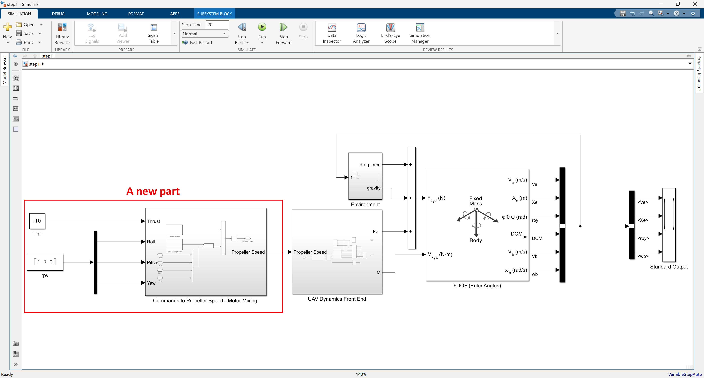 

여기서 "Commands to Propeller Speed - Motor Mixing" 서브시스템 안을 살펴보자.

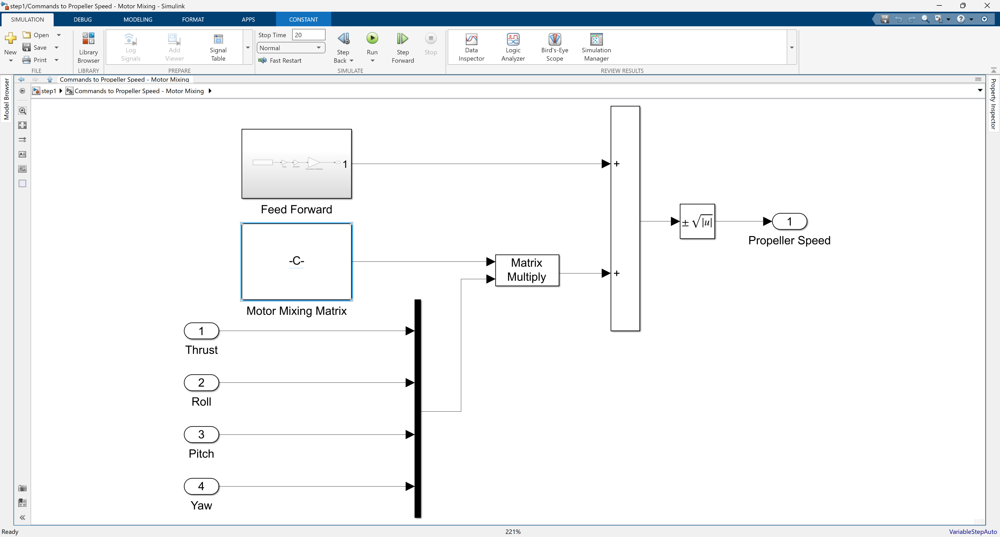 

위 시스템에서는 Feed Forward 텀과 Motor Mixing Matrix를 이용한 Thrust, Roll, Pitch, Yaw 값과의 곱이 마련되어 있다. 최종적으로는 4개의 모터의 회전 속도에 대응하는 4차원 벡터를 출력해주도록 출력이 나오게 되어 있다.

여기서 `Motor Mixing Matrix`는 다음과 같다:

$$0.5 \times \begin{pmatrix} 1 & -1 & -1 & -1 \\ 1 & 1 & -1 & 1 \\ 1 & 1 & 1 & -1 \\ 1 & -1 & 1 & 1 \end{pmatrix}$$

이 행렬은 비행 제어기에서 출력되는 상위 수준의 제어 명령(총 추력, 롤, 피치, 요)을 **각각의 4개 프로펠러가 내야 할 개별적인 속도 명령으로 변환**해주는 핵심적인 변환기이다.

행렬의 각 열은 제어 입력에 대응하고, 각 행은 4개의 프로펠러에 대응한다. 표준적인 쿼드콥터 (X-형태 배치)의 물리적 특성과 각 프로펠러의 회전 방향을 고려하여 설계된다.

* **첫 번째 열 (`[1, 1, 1, 1]`) (총 추력)**: 모든 프로펠러가 동일하게 총 추력 명령에 기여하여 고도를 제어한다.
* **두 번째 열 (`[-1, 1, 1, -1]`) (롤)**: 롤 명령이 들어오면, 좌우 프로펠러들의 추력을 차등 조절하여 기체를 좌우로 기울인다. (예: 오른쪽 롤을 위해 P2, P3 증가, P1, P4 감소)
* **세 번째 열 (`[-1, -1, 1, 1]`) (피치)**: 피치 명령이 들어오면, 앞뒤 프로펠러들의 추력을 차등 조절하여 기체를 앞뒤로 기울인다. (예: 전방 피치를 위해 P3, P4 증가, P1, P2 감소)
* **네 번째 열 (`[-1, 1, -1, 1]`) (요)**: 요 명령이 들어오면, 프로펠러들의 속도를 조절하여 반작용 토크의 균형을 깨뜨려 기체를 회전시킨다. (예: 시계 방향 요를 위해 P2, P4 증가, P1, P3 감소)

행렬 앞의 `0.5`와 같은 스케일링 계수는 전체적인 스케일링 계수이며, 입력 명령의 범위나 물리적 계수(프로펠러 효율, 모터 특성 등)에 맞춰 값을 조정하는 역할을 한다.

### 1.1. Feedforward 입력의 역할 (시뮬링크 모델에서)

step1 시뮬링크 모델에서 프로펠러 속도를 계산할 때 다음과 같은 `Feedforward_Input`을 사용한다:

`Feedforward_Input = [1, 1, 1, 1] * mass * direction * (9.81 / 4)`

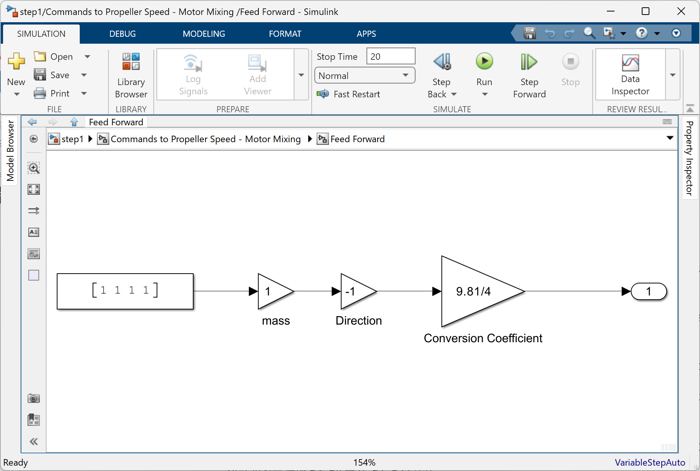 

이 피드포워드 입력은 **쿼드콥터가 제자리에서 안정적으로 떠오르는(호버링하는) 데 필요한 기본 추력 명령을 제공하는 역할**을 한다. `mass * 9.81`은 쿼드콥터의 총 중력(무게)을 나타내며, 이를 `4`(프로펠러 개수)로 나눈 값은 각 프로펠러가 중력을 상쇄하기 위해 발생시켜야 하는 기본 추력이다.

이처럼 피드포워드 항을 사용하면, 제어기가 중력 상쇄와 같은 '항상 필요한' 기본적인 작업을 계산하는 부담을 덜고, **오직 사용자의 조종 입력이나 외부 교란에 대응하는 추가적인 힘/토크**만을 계산하는 데 집중할 수 있게 된다. 이는 제어 시스템의 효율성과 안정성을 크게 높여주는 이점을 가진다.

이제 Thrust를 -10으로 넣어주고 roll 값에 1 단위를 넣어주었을 때 시뮬레이션 해보자.

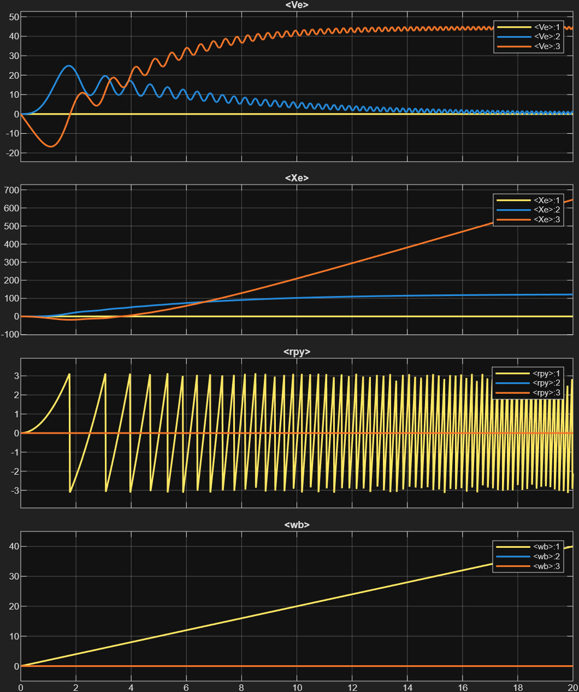 

Ve, Xe 값은 관성 기준 프레임에서 본 기체의 속도와 거리인데 z 방향으로 잠깐 떴다가 아래로 떨어지는 것을 확인할 수 있다. rpy 값에서는 roll 방향으로 기체가 계속해서 회전한다는 것을 알 수 있다. 3D Animation으로 보면 아래와 같다.

<video width = "100%" loop autoplay muted controls>
  <source src = "../../images/uav101/no03_PIDControl/step1Thrust-10Roll1.mp4">    
</video>

사실상 이 step1 시뮬링크 모델까지에서 제어라고 할만한 부분은 thrust에 대한 feed-forward 제어에 불과하다. feed-forward 텀이 있어서 드론이 계속해서 움직이긴 한다. 우선은, 드론이 지속적으로 움직이고 있긴 하니까 적절히 자세를 제어해서 드론을 좀 더 원하는 모습으로 움직여보도록 하자.

## 2. PID 제어: 제어 시스템의 핵심 동력

PID(Proportional, Integral, and Derivative) 제어기는 다양한 제어 문제에서 핵심적인 역할을 하는 '만능 일꾼'과도 같다. PID 제어는 원하는 상태와 현재 상태의 차이(오차)를 줄여 목표에 도달하도록 돕는 피드백 제어 방식이다.

PID 제어기는 세 가지 주요 요소로 구성된다:
* **비례(Proportional) 항**: 현재 오차에 비례하는 힘을 가해 목표값으로 빠르게 접근하도록 한다.
* **미분(Derivative) 항**: 오차의 변화율(속도)에 비례하는 힘을 가해 과도한 오버슈트(overshoot)를 방지하고 시스템을 안정화시킨다.
* **적분(Integral) 항**: 시간에 따른 오차의 누적을 보정하여 정상 상태(steady state)에서의 오차(bias)를 제거하고 목표값에 정확히 도달하도록 돕는다.

시뮬링크에서 제어 시스템은 '플랜트(Plant)'와 '컨트롤러(Controller)'로 구성된 블록 다이어그램으로 묘사될 수 있다. 여기서 '플랜트'는 쿼드콥터 본체(프로펠러/모터 기능, 에어프레임, 동역학 포함)와 같은 물리적인 시스템을 의미하며, '컨트롤러'는 플랜트의 움직임을 조절하는 제어 알고리즘이다.

## 3. 쿼드콥터 고도 제어: PD + Feedforward 방식

쿼드콥터의 수직 움직임, 즉 고도 제어는 안정적인 비행의 기본이다. 단순한 비례(P) 제어만으로는 목표 고도를 지나치게 가속하거나 정확히 도달하지 못하는 문제가 발생한다. 미분(D) 제어를 추가하면 오버슈트를 줄일 수 있지만, 중력과 같은 외란 때문에 정상 상태에서 목표 고도에 정확히 도달하지 못하는 '오프셋'이 발생할 수 있다.

이러한 정상 상태 오차를 해결하기 위해 흔히 적분(I) 제어를 사용하지만, 쿼드콥터의 고도 제어에서는 **피드포워드(Feedforward) 제어**로 적분 제어의 역할을 대체하는 경우가 많다.

## 4. 자세(Attitude) 제어: 롤, 피치, 요 컨트롤러

고도 제어와 유사하게, 쿼드콥터의 롤, 피치, 요 자세를 제어하기 위해서도 PD 제어기가 사용된다. 각 축(롤, 피치, 요)에 대해 별도의 PD 컨트롤러가 구성되어, 원하는 자세 값과 실제 자세 값의 오차를 줄이도록 명령을 생성한다.

* **롤 컨트롤러**: 원하는 롤 각도와 실제 롤 각도 사이의 오차를 기반으로 롤 토크 명령을 생성한다.
* **피치 컨트롤러**: 원하는 피치 각도와 실제 피치 각도 사이의 오차를 기반으로 피치 토크 명령을 생성한다.
* **요 컨트롤러**: 원하는 요 각도와 실제 요 각도 사이의 오차를 기반으로 요 토크 명령을 생성한다.

이러한 자세 컨트롤러들은 쿼드콥터가 안정적인 자세를 유지하고, 원하는 방향으로 기울어지도록 돕는다.

위 2-4의 내용을 적용한 모델이 step2 시뮬링크 모델이 된다.

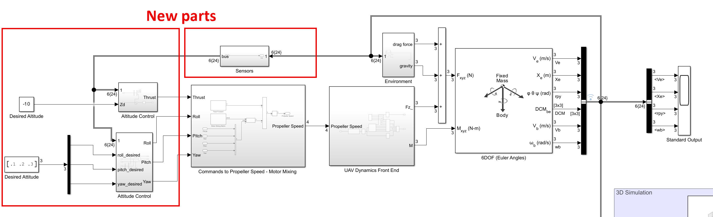 

이 모델은 표시된 것과 같이 센서로부터 획득한 플랜트(드론)의 상태(좌표, 방향)를 피드백 받고 제어하는 파트들이 추가 되어 있다. 여기서는 이상적인 센서를 가정하여 6DOF 블록에서 나오는 값들을 그대로 되먹임 받는 것으로 되어 있다.

Altitude Control 서브시스템은 간단하게 높이 센서값을 얻어와 PD 제어를 수행한다. 입력으로는 원하는 높이값을 입력 받고 PD 제어기를 통해 나오는 추력값을 출력하게 된다.

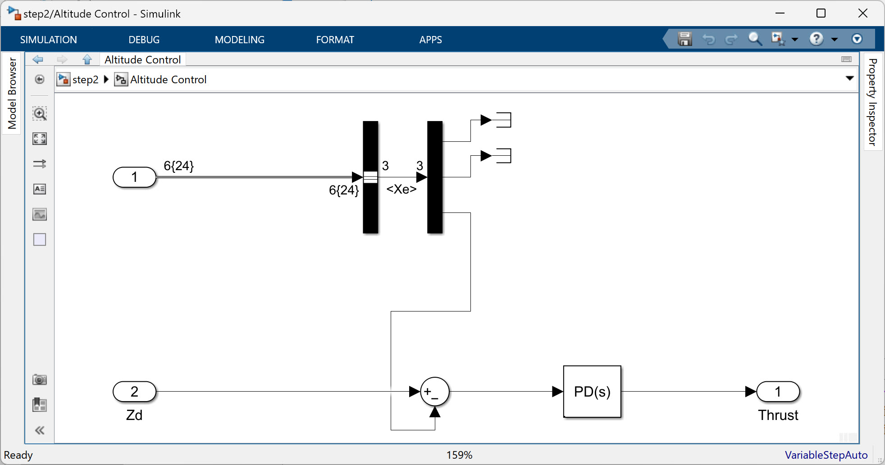 

Attitude Control 서브시스템도 크게 다르지 않게 구성되어 있다. 입력으로는 원하는 roll, pitch, yaw 각도값을 입력 받고 PD 제어기를 통해 나오는 부족분을 출력하게 된다.

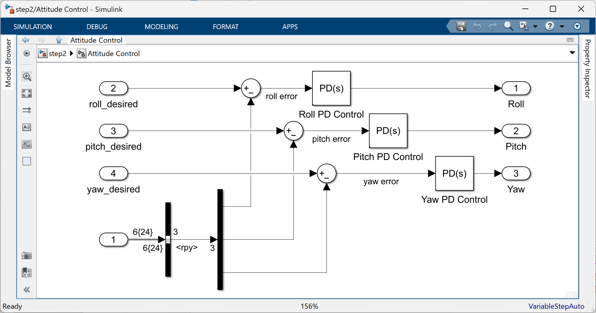 

여기까지 모아서 원하는 고도는 -10, 원하는 roll, pitch, yaw 값은 0.1, 0.2, 0.3으로 넣어주고 시뮬레이션을 해보면 아래와 같은 결과를 얻게 된다.

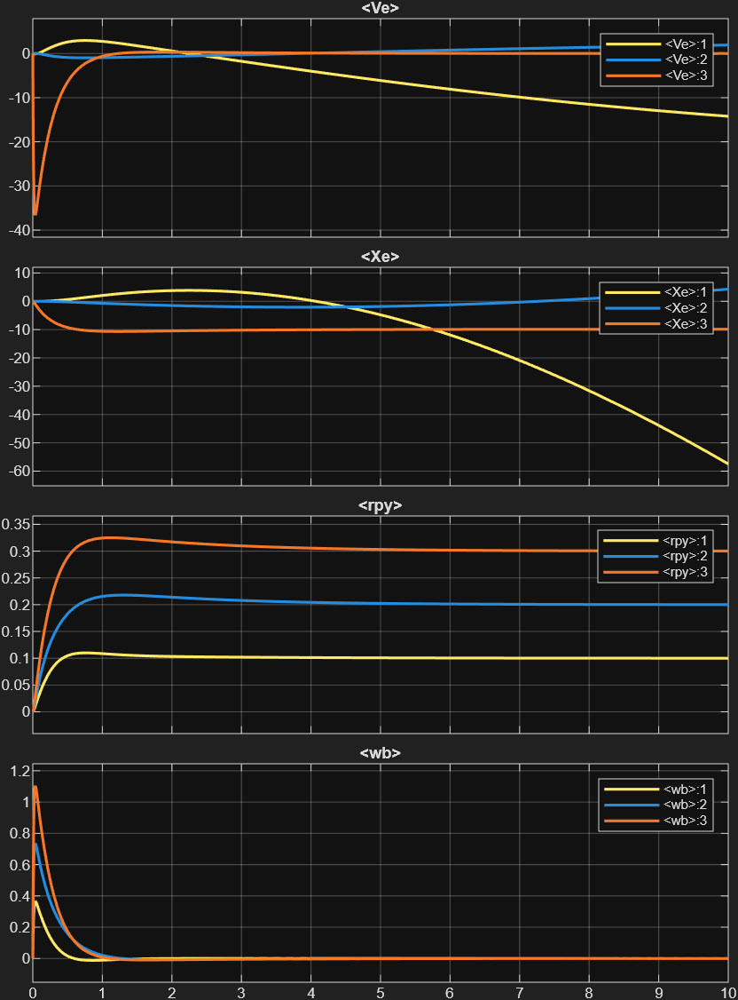 

위 그림에서 볼 수 있는 것은 우리가 원하는 고도와 roll, pitch, yaw 값에는 맞게 제어가 진행되고 있다는 점이다. Xe 값의 붉은 선이 고도 (-10)이며 rpy 값이 각각 0.1, 0.2, 0.3 값이 들어간 것을 알 수 있다. 3D Animation으로 보면 아래와 같다.

<video width = "100%" loop autoplay muted controls>
  <source src = "../../images/uav101/no03_PIDControl/step2Alt10Attpoint123.mp4">    
</video>

그런데, 이쯤되면 roll, pitch, yaw를 직접 제어하는 드론의 자세를 제어하는 것에 불과하고, 최종적으로는 x, y 좌표 어딘가로 드론을 보내는 것에 대해 고려하기 위해 위치를 제어해야한다는 것을 알 수 있다.

## 5. X-Y 위치 제어를 위한 회전 행렬: `dx, dy`를 `roll desired, pitch desired`로 변환

쿼드콥터가 지구 고정 좌표계(Global Frame)에서 원하는 X-Y 위치로 이동하려면, 현재 자신의 방향(요 각도)에 맞춰서 몸체를 기울여야 한다. 이때 $dx_g$ (지구 고정 X축 방향 움직임 요구량)와 $dy_g$ (지구 고정 Y축 방향 움직임 요구량)를 기체 고정 좌표계(Body Frame)에서의 `roll desired`와 `pitch desired`로 변환하는 과정이 필요하다. 이는 **좌표계 회전 변환**을 통해 이루어진다.

만약 지구 고정 좌표계에서의 원하는 움직임 성분($dx_g$, $dy_g$)이 있고, 쿼드콥터의 현재 요(Yaw) 각도($\phi$)가 있다면, 이를 기체 고정 좌표계에서의 움직임 성분($dx_b$, $dy_b$)으로 변환하는 회전 행렬은 다음과 같다:

$$\begin{pmatrix} dx_b \\ dy_b \end{pmatrix} = \begin{pmatrix} \cos(\phi) & \sin(\phi) \\ -\sin(\phi) & \cos(\phi) \end{pmatrix} \begin{pmatrix} dx_g \\ dy_g \end{pmatrix}$$

이 식을 풀면 다음과 같다:
* $dx_b = dx_g \times \cos(\phi) + dy_g \times \sin(\phi)$
* $dy_b = -dx_g \times \sin(\phi) + dy_g \times \cos(\phi)$

여기서 $dx_b$는 기체의 전후 방향으로의 움직임을 유발하는 기울임(피치)에 주로 사용되고, $dy_b$는 기체의 좌우 방향으로의 움직임을 유발하는 기울임(롤)에 주로 사용된다.

### `pitch_desired`의 음의 부호에 대한 설명

step3 시뮬링크 모델에서 `pitch_desired`를 구할 때 `-dx * cos(yaw) - dy * sin(yaw)`와 같이 두 개의 음의 부호가 나타나는 것은 모델에서 사용하고 있는 **피치(Pitch) 각도의 부호 규칙** 때문이다.

대부분의 항공 역학 및 제어 시스템에서 **양의 피치 각도는 기수(nose)가 위로 들리는 자세**를 의미한다. 반대로 기수가 아래로 숙여지는 것은 음의 피치 각도이다.

쿼드콥터가 **앞으로 이동하려면 기수가 아래로 숙여져야 한다.** 즉, 양의 전방 이동($dx_b$가 양수)을 위해서는 **음의 피치 각도**가 필요하다. 따라서, 기체 고정 좌표계에서의 전방 움직임 요구량($dx_b$)이 양수일 때, 이에 대응하는 `pitch_desired` 값은 음수가 되어야 하므로 `$pitch\_desired = -dx_b$`와 같이 음의 부호가 붙는 것이다.

간단히 말해, 쿼드콥터의 현재 요 각도가 얼마만큼 틀어졌든 상관없이, 회전 행렬은 **'마치 요 각도가 0도인 것처럼' 전방(피치) 및 측방(롤) 이동 명령을 계산할 수 있게 해주는 역할**을 한다. 이 덕분에 기체의 내부 제어기는 항상 자신의 몸체 축을 기준으로만 움직임을 판단하고, 정확한 기울임 명령을 생성할 수 있게 된다.

step3 시뮬링크 모델을 열어보면 전체적인 생김새는 아래와 같다. 새롭게 추가된 부분은 원하는 x, y 포지션에 가기 위해 roll, pitch를 얼마만큼 수정할지 제어하는 부분이다.

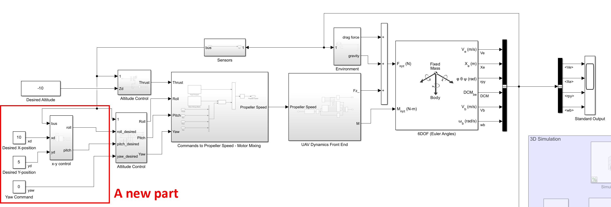 

x-y control 서브시스템 내부를 보면 아래와 같다.

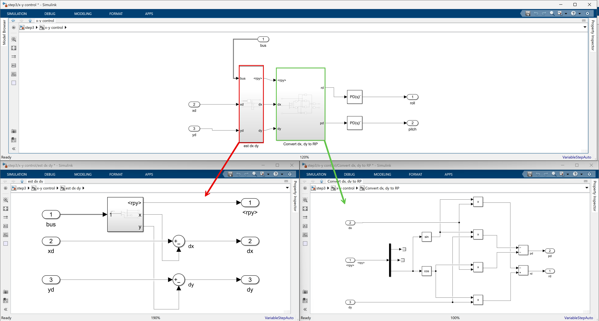 

"est dx dy"는 센서로부터 얻은 값과의 차이값을 통해 지구 고정 X 축으로 움직임 요구량과 Y 축으로 움직임 요구량을 계산해주는 과정이고, "Convert dx, dy to RP" 서브시스템에서는 yaw 각도를 기준으로 지구 고정 축으로 돌려 놓기 위한 회전행렬과 계산해주는 과정을 보여주고 있다. 그 뒤에 desired roll, pitch (rd, pd로 적혀있음)에 대해 PD 제어를 한번 더 수행해주는 것을 알 수 있다. 다만 여기서는 PD 제어기에 saturation이 걸려있으며, 이는 너무 갑작스런 자세 변경을 막고 있는 부분이다.

이제 X=10, Y = 5, Z = -10의 위치에 놓기 위한 제어 시뮬레이션을 수행해보면 아래와 같은 결과를 얻을 수 있다.

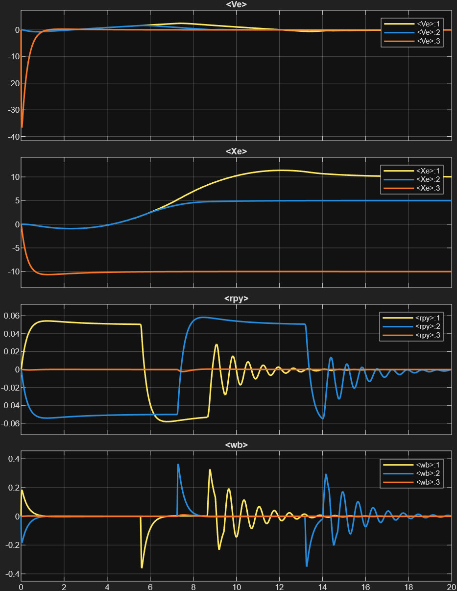 

Ve 값에서 볼 수 있듯이 처음에는 빠르게 호버링을 시작하고 최종적으로 Xe 값에서 볼 수 있듯이 원하는 위치인 10, 5, -10의 위치에 옮겨가는 것을 볼 수 있다. rpy 등에서는 자세를 순간적으로 제어해가면서 위치를 좀 더 세밀하게 잡는 것을 확인할 수 있다. 3D Animation으로 보면 아래와 같다.

<video width = "100%" loop autoplay muted controls>
  <source src = "../../images/uav101/no03_PIDControl/step3X10Y5Z-10.mp4">    
</video>

어느정도 비행체가 잘 움직이는 것 같다. 다음 시간에는 좀 더 실제에 가깝게 제어기도 튜닝하고, 비행체의 파라미터도 조정해보도록 할 것이다.

## 6. 시뮬링크로 쿼드콥터 제어 모델 구축하기

요약하면, 이러한 모든 제어 원리들을 시뮬링크 모델로 구현하는 것은 다음과 같은 단계를 따른다:
* 이전 모듈에서 완성된 쿼드콥터 모델을 연다.
* 원하는 추력, 롤, 피치, 요를 프로펠러 속도로 변환하는 **모터 믹싱 행렬**을 생성한다.
* 추력 제어를 위한 **FF+PD 컨트롤러**를 구현한다.
* 요, 피치, 롤 제어를 위한 **PD 컨트롤러**를 각각 구현한다.
* X-Y 위치 제어를 위한 **회전 행렬 기반 컨트롤러**를 통합한다.

이렇게 구축된 모델은 입력되는 명령과 시스템의 상태 피드백을 사용하여 원하는 프로펠러 속도를 생성하고, 이를 쿼드콥터 모델에 입력하여 비행을 시뮬레이션할 수 있게 된다. 시뮬레이션 결과는 쿼드콥터가 원하는 위치에 도달하는 것을 보여주지만, 튜닝되지 않은 매개변수로 인해 일부 진동이 발생할 수 있다.

## 마무리

쿼드콥터의 제어는 중력 상쇄를 위한 기본 추력, 자세 제어를 위한 모먼트/반작용 토크, 그리고 이 모든 것을 프로펠러 명령으로 변환하는 모터 믹싱 알고리즘과 좌표 변환의 유기적인 조합으로 이루어진다. 시뮬링크와 같은 도구를 통해 이러한 복잡한 제어 원리를 시각적이고 체계적으로 모델링함으로써, 우리는 쿼드콥터가 하늘에서 안정적으로 비행하는 놀라운 능력을 이해하고 구현할 수 있게 된다.