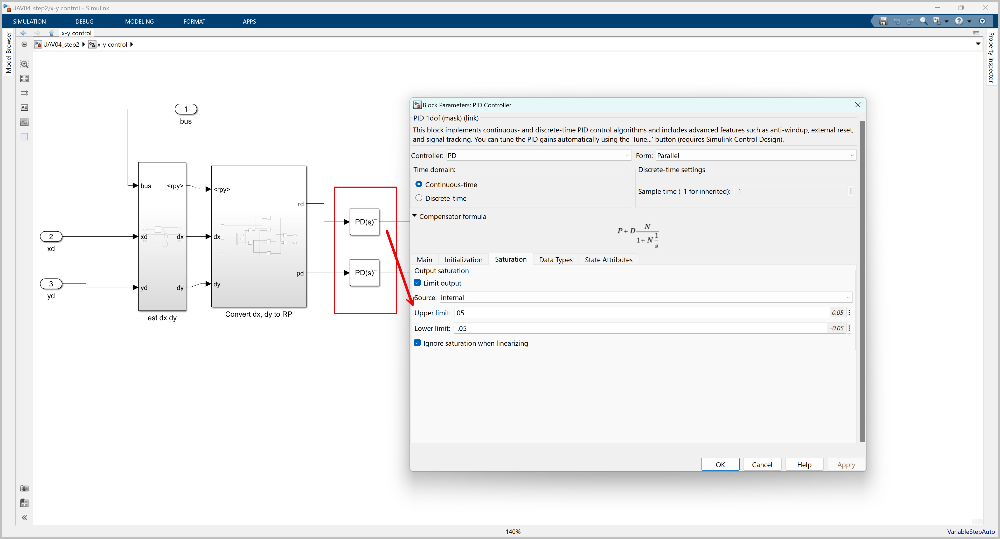

<style>
r { color: Red }
o { color: Orange }
g { color: Green }
</style>

해당 포스팅은 아래 영상의 설명을 기반으로 하였으며, Google Gemini의 도움을 받아 작성되었습니다.

<p align = "center"><iframe width="560" height="315" src="https://www.youtube.com/embed/c5p6yPz7-l4?si=yz7EE_wNHz7EELAl" title="YouTube video player" frameborder="0" allow="accelerometer; autoplay; clipboard-write; encrypted-media; gyroscope; picture-in-picture; web-share" referrerpolicy="strict-origin-when-cross-origin" allowfullscreen></iframe>
</p>

이 포스팅에서 사용된 시뮬링크 모델들은 이전과 동일하게 아래 링크에서 받으실 수 있습니다.

[**Quadcopter\_Lessons**](https://kr.mathworks.com/matlabcentral/fileexchange/115770-quadcopter_lessons?s_tid=prof_contriblnk)

# 쿼드콥터 PID 제어기 튜닝: 시뮬링크로 배우는 안정적인 비행

쿼드콥터가 하늘에서 안정적이고 반응성 있게 움직이려면, 단순히 제어기를 설계하는 것을 넘어 **정확한 튜닝**이 필수적이다. PID(비례-적분-미분) 제어기는 쿼드콥터 제어의 핵심이지만, 각 제어기의 계수(P, I, D 값)를 어떻게 설정하느냐에 따라 비행 성능이 크게 달라진다. 이번 글에서는 시뮬링크(Simulink) 환경에서 쿼드콥터의 PID 제어기를 어떻게 튜닝하는지 자세히 알아본다.

## 학습 목표

이 모듈을 완료하면 다음을 수행할 수 있다:

  * PID 제어기의 다양한 변형(P, PI, PID 등)과 각각의 장단점을 나열할 수 있다.
  * PID 제어기가 모델 움직임에 미치는 영향을 분석하여 비교할 수 있다.
  * PID 제어기를 수동으로 튜닝할 수 있다.
  * PID 튜너 앱을 활용하여 PID 제어기를 튜닝할 수 있다.
  * 튜닝된 제어기의 다양한 조건에서의 성능을 설명할 수 있다.

## 1\. PID 튜닝 배경 지식

### 1.1. PID 제어 요소별 장단점 (P, I, D)

PID 제어기는 비례(P), 적분(I), 미분(D) 세 가지 평행한 요소로 구성된다.

  * **비례(Proportional) 항**: 현재 오차에 비례하는 힘을 가해 목표값으로 빠르게 접근하도록 한다. 이득을 높이면 반응 속도가 빨라지지만, 오버슈트나 진동이 발생할 수 있다.
  * **적분(Integral) 항**: 시간에 따른 오차의 누적을 보정하여 정상 상태(steady state)에서의 오차(bias)를 제거하고 목표값에 정확히 도달하도록 돕는다. 하지만 너무 높은 적분 이득은 시스템의 응답 속도를 늦추고 불안정성을 증가시킬 수 있다.
  * **미분(Derivative) 항**: 오차의 변화율(속도)에 비례하는 힘을 가해 과도한 오버슈트(overshoot)를 방지하고 시스템을 안정화시킨다. 노이즈에 민감하게 반응할 수 있다는 단점이 있다.

### 1.2. 제어 시스템 개요

제어 시스템은 일반적으로 `플랜트(Plant)`와 `컨트롤러(Controller)`로 구성된 블록 다이어그램으로 표현될 수 있다. 여기서 '플랜트'는 쿼드콥터 본체(물리적 특성)와 같은 물리적인 시스템을 의미하며, '컨트롤러'는 플랜트의 움직임을 조절하는 제어 알고리즘이다.

### 1.3. PID 제어기 방정식

PID 제어의 출력은 다음과 같은 시간 영역 방정식으로 표현된다:

$$y=k_p \;u\left(t\right)+k_i \int u\left(t\right)\;\textrm{dt}+k_d \frac{\mathrm{d}}{\mathrm{d}t}u\left(t\right)$$

여기서:

  * $y$는 제어기 출력이다.
  * $u(t)$는 현재 오차($e(t)$)이다.
  * $k\_p$는 비례 이득, $k\_i$는 적분 이득, $k\_d$는 미분 이득이다.

비례 항은 상태 변수 $y$를 명령에 의해 정의된 목표 값으로 유도하고, 미분 항은 오버슈트를 방지하며, 적분 항은 목표 상태에 도달했을 때 필요한 정상 상태 제어기 출력을 보정하는 데 필요하다.

### 1.4. 예시 및 핵심 트레이드오프

Z축 방향으로 움직이는 쿼드콥터를 예로 들어 PID 제어의 특성을 이해할 수 있다.

**P-제어 (비례 제어)**

적분 항($k\_i=0$)과 미분 항($k\_d=0$)이 없는 P-제어만 사용할 경우, 쿼드콥터는 목표 고도($-5$ 미터) 주변에서 진동하다가 서서히 안정화된다. 하지만 목표 고도에 정확히 도달하지 못하고 오프셋(offset)이 발생할 수 있다. 속도가 최대일 때 목표 고도를 통과하는 경향을 보인다.

```matlab
% Controller Example: P-Control
z0=0; v0=0; kdrag=0.05; kp=20.0; kd=0.; ki=0.; m=1.; g=9.81;

kp=34;    % Your proportional control term

% State Equations
dwdt=@(t,w,z,v)z;
dzdt=@(t,w,z,v)v;
dvdt=@(t,w,z,v)g-kdrag*v*abs(v)+kp*(-5-z)+ki*(-5*t-w)+kd*(0-v);

dxdt=@(t,x)[dwdt(t,x(1),x(2),x(3)) ; dzdt(t,x(1),x(2),x(3)) ; dvdt(t,x(1),x(2),x(3))]
```

```matlab
x0=[0;z0;v0];

tspan=[0,30];
[t,x]=ode45(dxdt,tspan,x0);

plot(t,x(:,2));grid on;xlabel('t (sec)');ylabel('z (m)');
```

<center><br></center>

**PD-제어 (비례-미분 제어)**

P-제어의 진동을 줄이기 위해 미분 항을 포함하면 PD-제어가 된다. 미분 제어는 쿼드콥터의 속도에 비례하고 움직임 방향에 반대되는 힘을 추가하여 진동을 효과적으로 제거한다.

```matlab
clear;
% Controller Example: PD-Control
z0=0; v0=0; kdrag=0.05; ki=0.; m=1. ; g=9.81;

kp=34;    % Your proportional control term
kd=13;    % Your derivative control term

% State Equations
dwdt=@(t,w,z,v)z;
dzdt=@(t,w,z,v)v;
dvdt=@(t,w,z,v)g-kdrag*v*abs(v)+kp*(-5-z)+ki*(-5*t-w)+kd*(0-v);

dxdt=@(t,x)[dwdt(t,x(1),x(2),x(3)) ; dzdt(t,x(1),x(2),x(3)) ; dvdt(t,x(1),x(2),x(3))]
```

```matlab
x0=[0;z0;v0];

tspan=[0,30];
[t,x]=ode45(dxdt,tspan,x0);

plot(t,x(:,2));grid on;xlabel('t (sec)');ylabel('z (m)');
```

<center><br></center>


진동은 사라지지만, 여전히 목표 고도에 정확히 도달하지 못하고 오프셋이 발생할 수 있다. 이는 쿼드콥터가 목표 고도에 도달하고 속도가 0이 되면 제어력이 0이 되어 중력을 상쇄하지 못하고 다시 떨어지기 때문이다.

**PID-제어 (비례-적분-미분 제어)**

PD-제어의 정상 상태 오프셋을 극복하기 위해 적분 항을 추가하면 완전한 PID-제어가 된다. 적분 항은 시간이 지남에 따라 누적되는 오차를 보정하여 목표 값에 정확히 도달하도록 돕는다.

```matlab
clear;
% Controller Example: PD-Control
z0=0; v0=0; kdrag=0.05; m=1.; g=9.81;

kp=34;    % Your proportional control term
kd=13;    % Your derivative control term
ki=7;     % Your integral control term

% State Equations
dwdt=@(t,w,z,v)z;
dzdt=@(t,w,z,v)v;
dvdt=@(t,w,z,v)g-kdrag*v*abs(v)+kp*(-5-z)+ki*(-5*t-w)+kd*(0-v);

dxdt=@(t,x)[dwdt(t,x(1),x(2),x(3)) ; dzdt(t,x(1),x(2),x(3)) ; dvdt(t,x(1),x(2),x(3))]
```

```matlab
x0=[0;z0;v0];

tspan=[0,30];
[t,x]=ode45(dxdt,tspan,x0);

plot(t,x(:,2));grid on;xlabel('t (sec)');ylabel('z (m)');
```

<center><br></center>

이 시뮬레이션에서는 목표 고도인 -5m에 매우 가깝게 도달하는 것을 확인할 수 있다.

## 2\. 쿼드콥터 PID 제어기 튜닝 실습

시뮬링크에서 PID 컨트롤러를 사용하고 튜닝하는 과정은 매우 사용자 친화적이다.

추가로, 영상에서 나오는 모델들을 step by step으로 구성한 Simulink 모델들은 여기서 받을 수 있습니다. (step1~step3)

👉[**Simulink Model 받으러 가기**](https://github.com/angeloyeo/Quadcopter_Lessons/tree/main/UAV_Quadcopter_Lessons/UAV_04_ControlTuning/SimulinkModels){:target="_blank"}

### 2.1. 쿼드콥터 제어 모델 초기 설정

튜닝을 시작하기 전에, 먼저 쿼드콥터 제어 모델의 전체적인 구조를 이해하는 것이 중요하다. 쿼드콥터 제어 모델에는 다음과 같은 PID 제어기들이 포함된다:

  * 고도 변수 Z를 제어하는 고도 제어 블록 (PID 제어)
  * 롤, 피치, 요 각각에 대한 3개의 PID 제어를 포함하는 자세 제어 블록 (오일러 각)
  * X 및 Y 위치를 제어하는 2개의 PID 제어

따라서 총 6개의 PID 제어기를 튜닝해야 한다.

쿼드콥터의 6가지 공간 자유도(전역 좌표 X, Y, Z 및 오일러 각 $\phi, \theta, \psi$)를 모두 조절해야 하지만, 실제로 제어할 수 있는 지점은 4개의 프로펠러 회전 속도뿐이다. 롤과 피치 각도가 0이 아니면 한 장소에 호버링할 수 없듯이, X-Y 평면에서의 움직임은 롤 또는 피치 각도를 유도해야만 가능하다. 이러한 특성 때문에 X-Y 위치를 제어하기 전에 **고도 및 자세(롤, 피치, 요) 제어기를 먼저 튜닝**해야 한다.

튜닝을 용이하게 하기 위해, 시뮬링크 모델에서 X-Y 위치 제어를 자세 제어(롤, 피치)에서 일시적으로 분리하는 것으로 시작한다. 특정 연결 라인을 제거하고, 롤, 피치, 요에는 상수 명령을, 고도에는 기존의 원하는 고도 명령을 적용한다.

### 2.2. 초기 시뮬레이션 결과 분석

step1 모델에서와 같이 X-Y 제어를 분리한 상태에서 모델을 실행하면, 쿼드콥터의 초기 비행 특성을 확인할 수 있다. 

<center><br></center>

오일러 각(롤, 피치, 요)과 Z축(고도) 값의 시뮬레이션 결과를 통해, 원하는 값에 도달하기는 하지만 반응 시간이 느리거나 요(Yaw) 축에서 오버슈트(overshoot)가 발생하는 등의 문제점을 발견할 수 있다. 이러한 초기 결과는 어떤 제어기를 먼저 튜닝해야 할지, 그리고 어떤 문제가 있는지 파악하는 데 중요한 단서가 된다.

### 2.3. 자세 제어기 튜닝 (요, 피치, 롤)

가장 먼저 쿼드콥터의 자세를 제어하는 요(Yaw), 피치(Pitch), 롤(Roll) 컨트롤러를 튜닝한다.

  * **수동 튜닝**: 각 제어기의 비례 상수(P gain)를 증가시켜 반응 속도를 빠르게 만들고, 미분 상수(D gain)를 변경하여 오버슈트를 조절할 수 있다. 과도하게 높이면 오버슈트가 발생하거나 시스템이 불안정해질 수 있다. 

영상에서는 Yaw 값의 PD Controller에 대해 P 값을 1에서 1.5로 바꾸게 되는데, 이렇게 했을 때 Yaw의 시계열이 아래와 같이 변하는 것을 알 수 있었다. P 값이 커지면서 더 빠르면서 aggressive하게 yaw 값이 바뀌는 것을 알 수 있다.

<center><br></center>

  * **PID 튜너 앱 활용**: 시뮬링크의 PID 블록 내에 있는 **"Tune" 버튼**을 활용하는 것이 매우 유용하다. 이 자동 튜닝 알고리즘은 슬라이더를 통해 반응 시간과 과도 응답(오버슈트 등)을 직관적으로 조절할 수 있게 해준다. 자동 튜닝을 통해 요 제어에 대한 최적화된 비례 및 미분 계수를 얻을 수 있다. 얻은 계수들은 피치 및 롤 제어기에도 유사하게 적용하여 일관성을 유지한다.

영상에서는 Attitude Controller의 경우 조금 더 빠른 응답속도와 robust 한 반응을 얻도록 튜닝했다. 

<center><br></center>

### 2.4. 고도 제어기 튜닝

자세 제어기 튜닝이 완료되면, 고도 제어기를 튜닝한다. 고도 제어기 역시 "Tune" 버튼을 사용하여 튜닝할 수 있으며, 여기서는 과도 응답 시 오버슈트를 최소화하는 데 중점을 둔다. 안정적으로 원하는 고도에 도달하고 유지하는 것이 목표이다.


### 2.5. X-Y 제어 재연결 및 추가 조정

Attitude, altitude에 대한 모든 개별 제어기 튜닝이 완료되었으므로 이제 X-Y 제어기를 다시 연결한다. 이는 롤, 피치, 요에 대한 상수 명령을 제거하고, X-Y 컨트롤러의 출력을 자세 컨트롤러의 입력으로 다시 연결하는 것을 의미한다.

X-Y 제어가 재연결된 상태에서 시뮬레이션을 실행했을 때 X, Y, Z 위치가 최종적으로 목표에 도달하긴 하지만 정착하는 데 오랜 시간이 걸리거나 이전보다 심한 진동이 발생하는 것을 알 수 있다.

<center><br></center>

3D Animation은 아래와 같다.

<center>
<video width = "100%" loop autoplay muted controls>
  <source src = "../../images/uav101/no04_PIDControllerTuning/step2Initial.mp4">    
</video>
</center>

이는 X-Y 컨트롤러의 출력(롤 및 피치 명령)에 설정된 **포화 한계(saturation limits)** 가 너무 작을 수 있기 때문이다.

<center><br></center>

  * **포화 한계 조정**: 롤 및 피치 출력의 포화 한계를 점진적으로 증가시키면서 시뮬레이션을 다시 실행한다. 포화 한계를 늘리면 쿼드콥터가 더 큰 기울기 각도를 가질 수 있게 되어, 원하는 위치로 더 빠르게 이동할 수 있지만, 과도하게 늘리면 불안정해질 수도 있다.

saturation limit을 [-0.05, 0.05]에서 [-0.1, 0.1]로 바꿔보면 약간의 변화는 보이더라도 눈에 띄는 차이는 없어 보인다. 

<center><br></center>

이번엔 Roll Pitch 값을 조정하는 PID 제어기를 튜닝해보자면 아래와 같이 튜닝되는 것을 알 수 있다. (정답은 없고, 이정도로 튜닝 되는구나 하는 식으로 튜닝하면 될 것 같다.)

<center><br></center>

제어기를 튜닝한 후의 시뮬레이션 결과는 다음과 같다.

<center><br></center>

<center>
<video width = "100%" loop autoplay muted controls>
  <source src = "../../images/uav101/no04_PIDControllerTuning/step2RollPitchControllerTuned.mp4">    
</video>
</center>

## 3\. PID 제어 성능 평가 및 물리적 한계

컨트롤러를 튜닝한 후에는 강건성(Robustness)을 판단하기 위해 몇 가지 항목을 추가적으로 확인해볼 수 있다.

### 3.1. 프로펠러 속도 제한

시뮬레이션에서 높은 초기 속도, 특히 Z 방향에서의 속도 피크는 물리적으로 실현 불가능한 경우가 많다. 실제 프로펠러는 특정 최대 속도 이상으로 회전할 수 없으며, 역방향으로 회전하는 것도 일반적으로는 불가능하다.

이러한 물리적 한계를 모델에 반영하기 위해 쿼드콥터 모델 내의 **"Propeller Speed Limiter"** 기능을 조정한다. 프로펠러 속도 제한을 현실적인 범위로 조정하면 (예: -300에서 300까지를 -10에서 0으로) 초기 속도 피크가 현저히 줄어들고, X, Y, Z 위치에 대한 전체적인 응답이 훨씬 더 부드러워진다.

### 3.2. 실제 환경 고려 사항

지금까지 모든 튜닝은 상태 데이터가 완벽하게 알려져 있다는 가정 하에 진행되었다. 그러나 실제 구현에서는 측정 오류가 발생할 수 있고, 환경이 정적이지 않을 수 있다(예: 바람). 이러한 모든 요소들은 제어 시스템과 상호 작용하며, PID를 튜닝할 때 성능과 강건성 사이의 트레이드오프를 강요하게 된다.

향후 센서에 대한 학습에서는 다음을 배울 수 있다:

  * 모델 시스템에 외부 힘을 적용하고 PID 제어 성능을 확인한다.
  * 특정 조건에서 안정성을 향상시키기 위해 PID 컨트롤러 중 하나를 다시 튜닝한다.

## 4\. 추가 연습: 비행 경로 설계

모든 PID 제어기가 튜닝되었다면, 쿼드콥터 모델과 제어 시스템이 완성된 것이다. 이제 입력은 전역 기준 좌표계에서의 원하는 X, Y, Z 위치와 해당 프레임에 대한 요(Yaw) 각도가 된다. 본질적으로 쿼드콥터에게 공간 내의 특정 위치와 방향으로 이동하도록 명령하는 것이다. 모델과 컨트롤러는 최종 위치와 방향에서 호버링하는 것을 목표로 한다.

간단한 비행 경로를 생성하려면, 시퀀스 명령을 통해 통과하고 싶은 일련의 지점(또는 상태)을 지정해야 한다. 이는 시뮬링크에서 쉽게 구현할 수 있다.

## 마무리

쿼드콥터의 PID 제어기 튜닝은 단순히 이론적인 계산을 넘어, 실제 시뮬레이션을 통해 시스템의 반응을 관찰하고 조정하는 반복적인 과정이다. 각 제어기(고도, 롤, 피치, 요)의 독립적인 튜닝, 그리고 X-Y 제어의 통합 및 물리적 한계 반영까지, 이 모든 단계는 쿼드콥터가 안정적이고 정확하게 비행할 수 있도록 하는 데 필수적이다. 시뮬링크의 자동 튜닝 기능과 직관적인 슬라이더는 이러한 복잡한 튜닝 과정을 훨씬 효율적으로 만들어준다.

쿼드콥터의 제어는 중력 상쇄를 위한 기본 추력, 자세 제어를 위한 모먼트/반작용 토크, 그리고 이 모든 것을 프로펠러 명령으로 변환하는 모터 믹싱 알고리즘과 좌표 변환의 유기적인 조합으로 이루어진다. 시뮬링크와 같은 도구를 통해 이러한 복잡한 제어 원리를 시각적이고 체계적으로 모델링함으로써, 우리는 쿼드콥터가 하늘에서 안정적으로 비행하는 놀라운 능력을 이해하고 구현할 수 있게 된다.